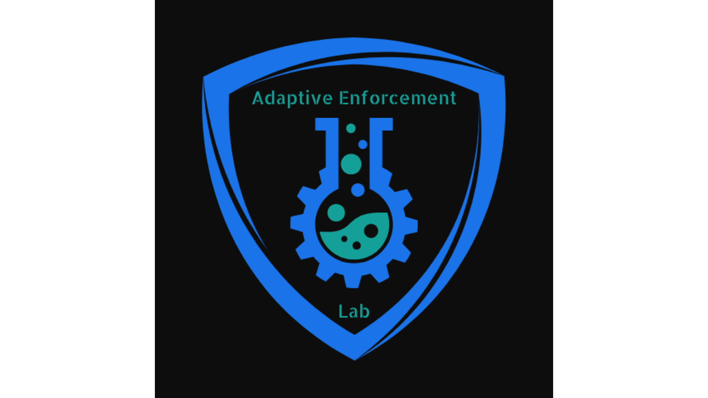

# Brand Identity

<!-- markdownlint-disable MD033 -->
<figure markdown="span">
  { width="400" }
</figure>
<!-- markdownlint-enable MD033 -->

## The Name

### Adaptive

Security threats evolve constantly. Static defenses become obsolete. **Adaptive** reflects our commitment to controls that respond to changing conditions—adjusting to new threats, scaling with growth, and learning from incidents.

### Enforcement

Policy without enforcement is theater. **Enforcement** is the core of what we do—turning security intentions into executable controls that actively prevent violations rather than merely detecting them after the fact.

### Lab

A **lab** is where experimentation, testing, and refinement happen. We develop, validate, and iterate on security patterns in controlled environments before they become production standards. It's a space for rigorous exploration, not untested theory.

## The Logo Elements

### The Shield

The outer shield represents **protection and defense**—the fundamental purpose of security. Its rounded, modern form signals that defense doesn't mean rigidity; it adapts to what it protects.

### The Gear

The cogwheel symbolizes **automation and engineering**. Security at scale requires mechanical precision—repeatable processes, automated controls, and systems that work without constant human intervention.

### The Flask

The laboratory flask represents **experimentation and the scientific method**. We test hypotheses, measure outcomes, and refine our approaches based on evidence. The bubbles rising through the flask suggest active processes and continuous iteration.

### The Integration

The flask integrated with the gear shows that **experimentation and automation are inseparable**. The lab work feeds directly into the machinery of enforcement. Ideas become controls; theories become pipelines.

## Color Palette

| Color | Hex | Usage |
|-------|-----|-------|
| Shield Blue | `#2196F3` | Primary brand, protection elements |
| Lab Teal | `#26A69A` | Experimentation, growth, success states |
| Dark Background | `#121212` | Contrast, focus, professional tone |

## Usage

The logo works on both light and dark backgrounds. The shield blue provides strong contrast while the teal accents draw attention to the experimental core of our identity.
