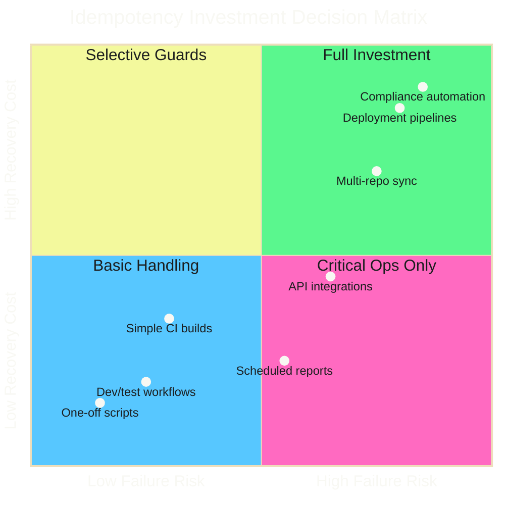

# Idempotent Automation: Why Reruns Shouldn't Scare You

Your workflow failed at step 47 of 50. Do you fix the issue and rerun from the beginning, or do you manually complete the remaining steps?

!!! failure "The Nervousness Test"

    If that question makes you nervous, your automation isn't idempotent. And that's a problem.

This post breaks down what idempotency means for CI/CD pipelines, when you need it, when you don't, and how to decide.

<!-- more -->

---

## What Is Idempotency?

!!! abstract "Definition"

    An operation is idempotent if running it multiple times produces the same result as running it once.

In automation terms: rerunning your workflow shouldn't create duplicates, corrupt state, or fail because "it already ran."

```bash
# Idempotent: Running twice produces same result
mkdir -p /tmp/mydir    # Creates dir if missing, no-op if exists

# Not idempotent: Running twice fails or creates duplicates
mkdir /tmp/mydir       # Fails if directory exists
```

For CI/CD pipelines, idempotency means:

- Reruns don't create duplicate PRs
- Reruns don't create duplicate commits
- Reruns don't corrupt data
- Partial failures can be recovered by rerunning

---

## The Rerun Scenario

Workflows fail. Networks timeout. APIs return 500s. Rate limits hit. Runners crash.

When failure happens, you have three options:

1. **Rerun from beginning** - Only safe if workflow is idempotent
2. **Manual intervention** - Fix state by hand, then continue
3. **Abandon and start fresh** - Delete partial state, try again later

!!! success "The Scalable Choice"

    Safe reruns are the only scalable choice. Manual intervention and abandoning runs require human effort, don't scale, and introduce errors.

---

## Pros and Cons at a Glance

| Pros | Cons |
|------|------|
| [Safe Reruns](#safe_reruns) - Click rerun, walk away | [Implementation Complexity](#implementation_complexity) - Every op needs guards |
| [Partial Failure Recovery](#partial_failure_recovery) - Matrix jobs retry cleanly | [Performance Overhead](#performance_overhead) - Extra API calls add up |
| [Simplified Debugging](#simplified_debugging) - Debug without changing state | [Hidden Failures](#hidden_failures) - Silent skips mask real errors |
| [Scheduled Job Safety](#scheduled_job_safety) - Handle duplicate triggers | [State Consistency Challenges](#state_consistency_challenges) - Detecting state is hard |
| [Reduced Cognitive Load](#reduced_cognitive_load) - System tracks state | [Not Always Possible](#not_always_possible) - Some ops can't be idempotent |

---

## Pros of Idempotent Automation

### Safe Reruns

The primary benefit. When something fails, you click "Re-run jobs" and walk away. No fear. No manual state inspection. No "did it already do X?" questions.

```yaml
# Safe to rerun: checks before acting
- name: Create PR if not exists
  run: |
    EXISTING=$(gh pr list --head $BRANCH --json number --jq 'length')
    if [ "$EXISTING" -eq 0 ]; then
      gh pr create --title "Update" --body "Automated update"
    else
      echo "PR already exists, skipping creation"
    fi
```

### Partial Failure Recovery

Matrix jobs processing 40 repositories. Job 37 fails due to rate limiting. With idempotent operations, you rerun the entire matrix. The 36 successful repos detect "no changes needed" and skip. Job 37 retries and succeeds.

Without idempotency, you'd need to figure out which repos succeeded, exclude them, and run only the failures.

### Simplified Debugging

When operations are idempotent, you can add logging, rerun, and see exactly what happens without changing state. Debug freely.

```yaml
- name: Debug and retry
  run: |
    set -x  # Enable debug output
    # Safe to rerun with debugging enabled
    ./idempotent-script.sh
```

### Scheduled Job Safety

Cron-triggered workflows might run twice due to GitHub Actions quirks, overlapping schedules, or manual triggers during scheduled windows. Idempotent operations handle this gracefully.

### Reduced Cognitive Load

Engineers don't need to track "did this already run?" or maintain mental models of partial state. The system handles it.

---

## Cons of Idempotent Automation

### Implementation Complexity

Every operation needs guards. Create-if-not-exists. Update-or-create. Check-before-act. This adds code, conditions, and potential bugs in the guard logic itself.

```yaml
# Simple but not idempotent
- run: git commit -m "Update"

# Idempotent but more complex
- run: |
    if [ -n "$(git status --porcelain)" ]; then
      git commit -m "Update"
    else
      echo "No changes to commit"
    fi
```

### Performance Overhead

Checking "does this already exist?" before every operation adds API calls, database queries, or filesystem checks. For high-volume operations, this overhead accumulates.

```yaml
# Fast but not idempotent
- run: gh pr create ...

# Slower but idempotent (extra API call)
- run: |
    if ! gh pr list --head $BRANCH --json number | jq -e 'length > 0'; then
      gh pr create ...
    fi
```

### Hidden Failures

!!! warning "Silent Skips Can Mask Real Failures"

    When operations silently skip because "already done," you might miss actual failures. Did the PR not get created because it exists, or because the creation failed and the error was swallowed?

```yaml
# Dangerous: masks errors
- run: |
    gh pr create ... || echo "PR might already exist"

# Better: explicit state checking
- run: |
    if gh pr list --head $BRANCH --json number | jq -e 'length > 0'; then
      echo "PR exists"
    else
      gh pr create ...  # Fails loudly if creation fails
    fi
```

### State Consistency Challenges

Idempotency assumes you can reliably detect current state. But what if:

- The PR exists but was closed?
- The file exists but has wrong content?
- The branch exists but diverged?

Naive idempotency checks might skip operations that actually need to run.

### Not Always Possible

!!! danger "Inherently Non-Idempotent Operations"

    Some operations can't be made idempotent:

    - Sending notifications (can't unsend)
    - Incrementing counters (can't detect if already incremented)
    - Time-sensitive operations (state changes between check and act)

---

## Decision Matrix

Use this matrix to decide how much idempotency investment makes sense:



| Factor | Low Priority (0 pts) | High Priority (1 pt) |
|--------|---------------------|----------------------|
| **Failure frequency** | Rarely fails | Fails often (network, APIs, rate limits) |
| **Recovery cost** | Quick manual fix | Hours of manual intervention |
| **Operation count** | Single operation | Many operations (matrix, loops) |
| **Schedule** | Manual trigger only | Cron/scheduled runs |
| **Criticality** | Nice-to-have | Business critical |
| **State complexity** | Simple/stateless | Complex state across systems |

### Scoring Guide

**0-2 points**: Minimal idempotency. Basic error handling sufficient.

**3-4 points**: Selective idempotency. Make critical operations idempotent, accept some manual recovery.

**5-6 points**: Full idempotency. Invest in comprehensive guards and state management.

---

## Idempotency Patterns

### Pattern 1: Check-Before-Act

The most common pattern. Check if the target state exists before attempting to create it.

```bash
# Branch management
if git ls-remote --heads origin "$BRANCH" | grep -q "$BRANCH"; then
  git checkout -B "$BRANCH" "origin/$BRANCH"  # Reset to remote
else
  git checkout -b "$BRANCH"  # Create new
fi
```

**Pros**: Simple, explicit, easy to debug.
**Cons**: Race conditions possible between check and act.

### Pattern 2: Create-or-Update (Upsert)

Use APIs or commands that handle both cases atomically.

```bash
# GitHub CLI handles create-or-update for some operations
gh release create v1.0.0 --notes "Release" --target main || \
gh release edit v1.0.0 --notes "Release"
```

**Pros**: Atomic, no race conditions.
**Cons**: Not all APIs support upsert semantics.

### Pattern 3: Force Overwrite

Don't check - just overwrite. Safe when overwriting with identical content is acceptable.

```bash
# Force push to update branch (idempotent if content same)
git push --force-with-lease origin "$BRANCH"
```

**Pros**: Simple, no check overhead.
**Cons**: Destructive if used incorrectly, loses history.

### Pattern 4: Unique Identifiers

Generate deterministic IDs so duplicate operations target the same resource.

```bash
# Deterministic branch name from content hash
BRANCH="update-$(sha256sum file.txt | cut -c1-8)"
```

**Pros**: Natural deduplication.
**Cons**: ID generation logic can be complex.

### Pattern 5: Tombstone/Marker Files

Leave markers indicating operations completed.

```bash
MARKER=".completed-$RUN_ID"
if [ -f "$MARKER" ]; then
  echo "Already completed"
  exit 0
fi

# Do work...

touch "$MARKER"
```

**Pros**: Works for any operation type.
**Cons**: Markers can get out of sync, need cleanup.

---

## Real-World Example: File Distribution

A workflow distributing files to 40 repositories needs idempotency at multiple levels. For the complete implementation, see the [File Distribution Use Case](../../operator-manual/github-actions/use-cases/file-distribution/index.md) in the Operator Manual.

### Branch Level

```bash
# Idempotent branch preparation
if git ls-remote --heads origin "$BRANCH" | grep -q "$BRANCH"; then
  git checkout -B "$BRANCH" "origin/$BRANCH"
else
  git checkout -b "$BRANCH"
fi
```

### Change Detection Level

```bash
# Idempotent change detection (handles tracked AND untracked files)
if [ -z "$(git status --porcelain)" ]; then
  echo "has_changes=false" >> "$GITHUB_OUTPUT"
else
  echo "has_changes=true" >> "$GITHUB_OUTPUT"
fi
```

### Commit Level

```bash
# Only commit if changes exist
if [ "$HAS_CHANGES" == "true" ]; then
  git add .
  git commit -m "Update from central repo"
fi
```

### PR Level

```bash
# Only create PR if none exists
EXISTING=$(gh pr list --head "$BRANCH" --base "$DEFAULT_BRANCH" --json number --jq 'length')
if [ "$EXISTING" -eq 0 ]; then
  gh pr create --title "Automated update" --body "From central repo"
else
  echo "PR already exists"
fi
```

### Push Level

```bash
# Force push to handle diverged branches
git push --force-with-lease -u origin "$BRANCH"
```

!!! tip "The Result"

    The entire workflow can be rerun at any point. Failed repos retry cleanly. Successful repos skip efficiently.

---

## When NOT to Invest in Idempotency

### One-Off Scripts

If you're running something once and throwing away the code, don't over-engineer.

### Fast Manual Recovery

If fixing a failed run takes 30 seconds manually, spending hours on idempotency guards isn't worth it.

### Truly Unique Operations

Some things should only happen once. User signup, payment processing, audit log entries. These need different patterns (exactly-once semantics, transaction logs).

### Development/Testing

Local development scripts don't need production-grade idempotency. Optimize for iteration speed.

---

## Testing Idempotency

!!! info "The Ultimate Test"

    Run your workflow twice in a row. Does the second run:

    1. Complete without errors?
    2. Produce the same end state?
    3. Not create duplicates?
    4. Run reasonably fast (not re-doing expensive work)?

```bash
# Idempotency test script
./workflow.sh
FIRST_RESULT=$?

./workflow.sh
SECOND_RESULT=$?

if [ $FIRST_RESULT -eq 0 ] && [ $SECOND_RESULT -eq 0 ]; then
  echo "Basic idempotency check passed"
else
  echo "Workflow is not idempotent"
fi
```

---

## The Cache Problem (Cliffhanger)

There's one thing we haven't addressed: caches.

GitHub Actions caches persist between workflow runs. Your idempotent workflow might depend on cached dependencies, build artifacts, or intermediate state. What happens when:

- The cache expires mid-workflow?
- A rerun uses a different cache key?
- Cache contents become stale or corrupted?

True idempotency means surviving not just reruns, but reruns with different cache states. Your workflow that "worked fine on rerun" might fail spectacularly when the cache misses.

This deserves its own deep dive.

!!! question "The Cache Test"

    If you deleted all caches and reran your workflow, would it still produce the same result?

    If you're not sure, you have work to do.

---

## Conclusion

Idempotent automation isn't free. It requires upfront investment in guards, checks, and state management. But for workflows that run frequently, fail occasionally, and touch multiple systems, that investment pays dividends.

The decision matrix helps you calibrate. Not every script needs bulletproof idempotency. But your critical cross-repo automation? Your scheduled compliance checks? Your deployment pipelines?

Make them idempotent. Then reruns won't scare you.

---

*Your workflow failed at step 47. You fixed the bug, clicked rerun, and went to lunch. When you came back, everything was green. That's the power of idempotent automation.*
