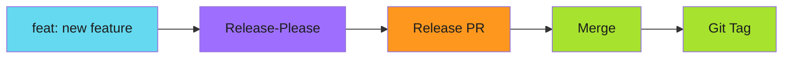
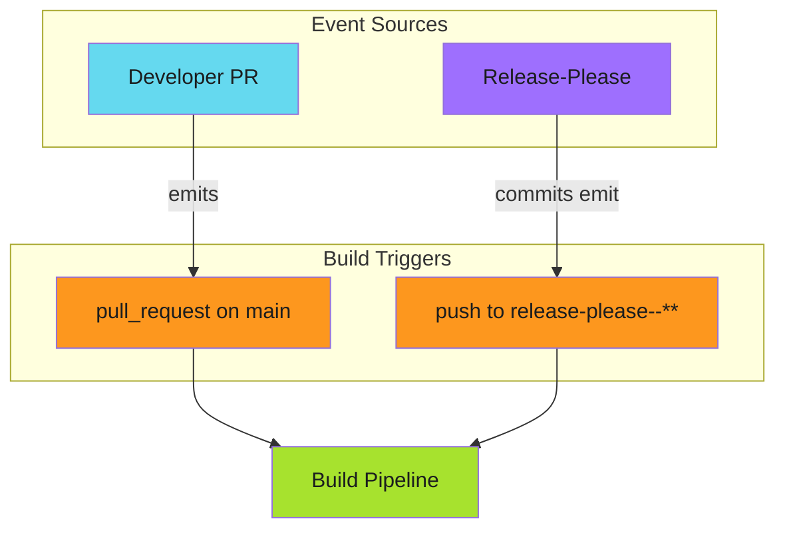
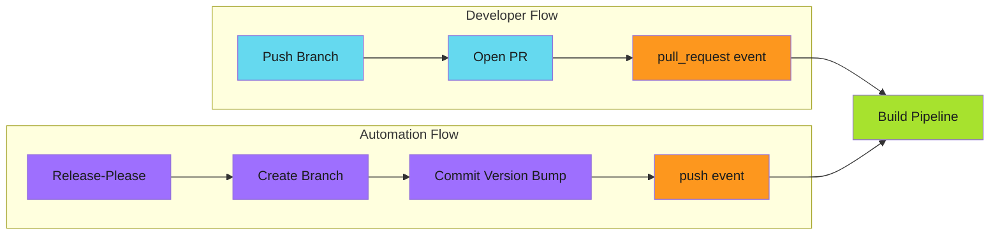

# Why Release-Please PRs Don't Trigger Your Builds

!!! warning "Update: There's a Better Way"

    The dual-trigger pattern described below is a **workaround**, not the real fix.
    See [The Real Fix for Release-Please Triggers](./2025-12-02-the-real-fix-for-release-please-triggers.md)
    for the proper solution using GitHub App tokens.

The release-please PR looked perfect. Clean changelog. Proper version bump. Ready to merge.

One problem: the build pipeline never ran. Branch protection blocked the merge. No required checks had passed, because no checks had started.

This is the story of a GitHub Actions limitation that wastes hours of debugging time, and the pattern that fixes it in two lines of YAML.

<!-- more -->

---

## The Setup

[Release-please](https://github.com/marketplace/actions/release-please-action) automates version management. It reads your conventional commits, generates changelogs, and creates release PRs. When those PRs merge, it tags releases.



The workflow trigger was standard:

```yaml
on:
  pull_request:
    branches: [main]
```

Every PR should trigger the build. Simple.

---

## The Mystery

Regular PRs triggered builds. Release-please PRs did not.

The difference? How the PR was created.

When a developer pushes a branch and opens a PR through the GitHub UI, the `pull_request` event fires. When release-please creates a PR using the GitHub API with `GITHUB_TOKEN`, the event does not fire.

!!! warning "The GITHUB_TOKEN Limitation"

    Actions triggered by `GITHUB_TOKEN` [don't emit workflow events](https://docs.github.com/en/actions/security-guides/automatic-token-authentication#using-the-github_token-in-a-workflow). This is a security measure to prevent recursive workflow triggers.

The consequence: release-please can create the most beautiful PR in the world, and your CI pipeline will completely ignore it.

---

## The Red Herring

First instinct: use a Personal Access Token. If `GITHUB_TOKEN` is the problem, replace it.

This works. But PATs come with [their own problems](../../secure/github-apps/index.md#why_use_a_core_app):

- Tied to individual user accounts (revoked when someone leaves)
- No granular permission control
- Difficult to audit across repositories

There's a simpler solution.

---

## The Discovery

Here's what's often missed: release-please doesn't just create PRs. It also commits to the PR branch. And commits emit `push` events, even when made by `GITHUB_TOKEN`.

| Action | Event Emitted with GITHUB_TOKEN |
| -------- | -------------------------------- |
| Create PR | No |
| Commit to branch | Yes |
| Update PR | No |
| Push to branch | Yes |

The PR creation is silent. The branch push is not.

---

## The Fix

Two lines of YAML:

```yaml
on:
  pull_request:
    branches: [main]
  push:
    branches:
      - 'release-please--**'
```



- Regular PRs trigger on `pull_request`
- Release-please branches trigger on `push`

No PAT required. No special permissions. Just understanding which events actually fire.

---

## The Branch Pattern

Release-please uses a specific branch naming convention: `release-please--*`. The double-dash is intentional. For monorepos with multiple components, it becomes `release-please--branches--component-name`.

The glob pattern `release-please--**` catches both:

- `release-please--branches--main` (simple repos)
- `release-please--branches--main--component-name` (monorepos)

!!! tip "Check Your Release-Please Version"

    The branch naming convention changed between releases. Verify your version's pattern by checking what branches release-please actually creates.

---

## The Cascade Effect

This discovery solved another problem: change detection.

Modern monorepo pipelines detect which components changed and only build what's affected:

```yaml
jobs:
  detect-changes:
    outputs:
      backend_needs_build: ${{ steps.changes.outputs.backend_any_changed == 'true' }}
      frontend_needs_build: ${{ steps.changes.outputs.frontend_any_changed == 'true' }}
```

But release-please PRs often bump version files across multiple components. Without the build running, I couldn't verify that version bumps didn't break anything.

With the dual-trigger pattern, release-please PRs now:

1. Trigger the build pipeline
2. Run change detection
3. Build only affected components
4. Report status for branch protection

---

## Protected Branches and Documentation Tools

One more trap: tools that auto-commit documentation changes.

Helm-docs regenerates README files from chart values. If it runs on the main branch and finds outdated docs, it tries to push a commit. On a protected branch, that fails.

The fix: run documentation generators on PR branches only.

```yaml
- name: Generate docs
  run: helm-docs

- name: Commit changes
  if: github.ref_name != 'main'
  run: |
    git add .
    git diff --staged --quiet || git commit -m "docs: update generated docs"
    git push
```

The conditional ensures docs update on PR branches (where builds run) but skip the commit on main (where protection rules apply).

---

## The Pattern



The pattern generalizes beyond release-please. Any automation that creates PRs via API needs a secondary trigger.

- Dependabot PRs use `pull_request_target` (different security model)
- GitHub Apps can trigger events if given proper permissions
- Bot accounts with PATs trigger events normally

For release-please specifically, the dual-trigger approach is cleanest.

---

## Deep Dive

This post covers the core problem and fix. For complete implementation guides:

| Guide | Description |
| ------- | ------------- |
| [Release-Please Setup](../../build/release-pipelines/release-please/index.md) | Configuration, changelog sections, monorepo patterns |
| [Change Detection](../../build/release-pipelines/change-detection.md) | Skip unnecessary builds, cascade dependencies |
| [Workflow Triggers](../../build/release-pipelines/workflow-triggers.md) | GITHUB_TOKEN limitations, alternative approaches |
| [Protected Branches](../../build/release-pipelines/protected-branches.md) | Working with branch protection rules |

---

## Checklist

If your release-please PRs aren't triggering builds:

1. Add `push` trigger for `release-please--**` branches
2. Verify branch protection requires the correct status check
3. Ensure documentation generators skip commits on protected branches
4. Test by merging a conventional commit and watching the PR

---

*The release-please PR now triggers builds. Branch protection passes. Changelogs generate automatically. And I stopped wondering why perfectly good PRs sat blocked for hours.*
