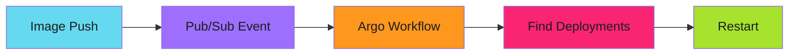
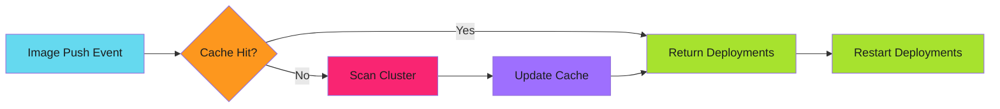
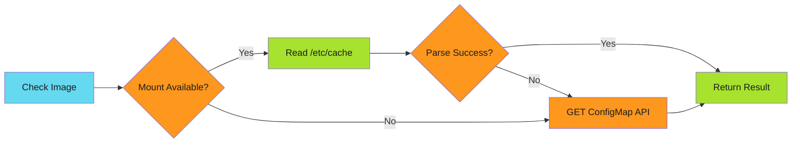

# From 5 Seconds to 5 Milliseconds: The Evolution of Event-Driven Deployment Automation

Every time someone pushed a container image, my Kubernetes API server winced. The workflow that was supposed to be "instant" took 5-10 seconds and hammered the cluster with requests.

This is the story of how I turned that into 5 milliseconds with zero API calls.

<!-- more -->

---

## The Problem

The requirement was simple: when a new container image is pushed to Google Artifact Registry, automatically restart the deployments using that image.



That red "Find Deployments" step? That's where the pain lived.

---

## V1: The Bash Script Era

The first implementation was straightforward. Three Argo Workflow templates chained together:

```yaml
templates:
  - name: get-deployments
    script:
      image: google/cloud-sdk:latest
      source: |
        apt-get -qq -y install jq
        kubectl get deployments -o json -A | jq '...' > /tmp/deployments.json

  - name: select-candidates
    script:
      source: |
        jq --arg IMAGE "${IMAGE}" 'map(select(.image==$IMAGE))' /tmp/deployments.json

  - name: trigger-restart
    script:
      source: |
        kubectl rollout restart deployment $NAME -n $NAMESPACE
```

!!! failure "The Problems"

    1. **Cluster scan every time**: `kubectl get deployments -A` fetched ALL deployments
    2. **Cold start penalty**: `apt-get install jq` on every run
    3. **Mutex bottleneck**: Only one workflow could run at a time
    4. **Three container images**: google/cloud-sdk, bash-utils, bitnami/kubectl

For a cluster with hundreds of deployments, this meant:

- 500KB-2MB of data transferred per image push
- 5-10 seconds of wall clock time
- API server load that scaled with cluster size

---

## The Breaking Point

The mutex was the first thing to go. It was there to prevent race conditions, but it created a queue. Image pushes during a deployment spike would back up, sometimes taking minutes to clear.

Removing it helped concurrency but exposed a worse problem: the API server was now getting hammered by parallel cluster scans.

!!! quote "The Realization"

    I was asking "which deployments use this image?" hundreds of times a day, but the answer only changed when deployments were created or modified, maybe a few times per week.

This was a classic case for caching.

---

## V2: The Go CLI with ConfigMap Cache

Instead of scanning the cluster on every request, I built a cache:



The cache is a simple hash map stored in a Kubernetes ConfigMap:

```json
{
  "images": {
    "registry/app:v1.2.3": [
      {"name": "api", "namespace": "production"},
      {"name": "api", "namespace": "staging"}
    ]
  }
}
```

A Go CLI replaced the bash scripts:

```bash
workflows check --image "registry/app:v1.2.3" --rebuild
```

!!! success "Results"

    - **Lookup time**: 50-200ms (down from 5-10s)
    - **API calls**: 1 GET ConfigMap (down from 100+)
    - **Data transfer**: 50-200KB (down from 500KB-2MB)

But I wasn't done.

---

## V3: The Volume Mount Optimization

Reading the ConfigMap still required an API call. What if I could eliminate that too?

Kubernetes can mount ConfigMaps as volumes. The kubelet syncs them automatically. If I mount the cache as a file, the workflow can read it directly from disk.

```yaml
volumes:
  - name: cache-volume
    configMap:
      name: deployment-image-cache
      optional: true

volumeMounts:
  - name: cache-volume
    mountPath: /etc/cache
    readOnly: true
```

The CLI now has a two-tier access pattern:



!!! success "Final Results"

    | Metric | V1 (Bash) | V2 (API Cache) | V3 (Mount Cache) |
    |--------|-----------|----------------|------------------|
    | Latency | 5-10s | 50-200ms | 1-5ms |
    | API calls | 100+ | 1 | 0 |
    | Data transfer | 2MB | 200KB | 0 bytes |

---

## Lessons Learned

!!! abstract "Key Takeaways"

    1. **Cache aggressively**: If the answer changes rarely, don't recompute it
    2. **Use Kubernetes primitives**: ConfigMaps are free, Redis is not
    3. **Mount over API**: Volume mounts eliminate network round-trips
    4. **[Graceful degradation](../../patterns/error-handling/graceful-degradation/index.md)**: Always have a fallback (mount → API → rebuild)
    5. **Measure first**: I didn't know the cluster scan was slow until I measured

---

## What's Next

This pattern, using ConfigMaps as a cache layer with volume mounts for zero-API reads, is applicable beyond deployment automation. I'm documenting it as a reusable engineering pattern.

!!! success "Related Content"

    - **[ConfigMap as Cache Pattern](2025-12-03-configmap-cache-zero-api.md)**: Deep dive into the zero-API lookup pattern
    - **[Event-Driven Deployments with Argo](2025-12-14-event-driven-deployments-argo.md)**: Full architecture with Argo Events, Workflows, and production patterns
    - **[Go CLI Architecture](../../build/go-cli-architecture/index.md)**: Building Kubernetes-native orchestration tools
    - **[Cache Considerations](../../patterns/efficiency/idempotency/caches.md)**: Cache-resilient idempotency patterns

---

*The Kubernetes API server stopped wincing. The workflows that took 5 seconds now take 5 milliseconds. And I learned that the best optimization is often just not doing the work at all.*
