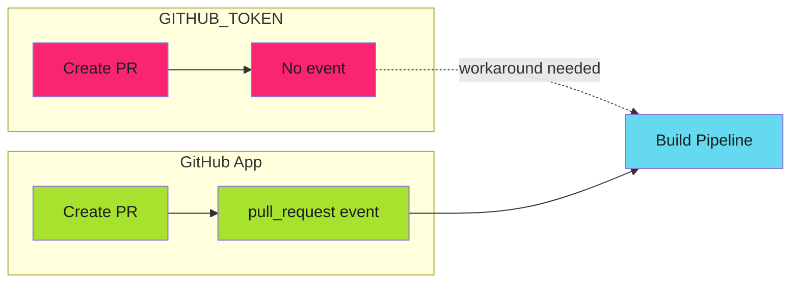

# The Real Fix for Release-Please Triggers

A few days ago I wrote about [why release-please PRs don't trigger builds](./2025-11-28-why-release-please-prs-dont-trigger-builds.md) and proposed a dual-trigger pattern as the fix. Today I discovered that pattern is a workaround with side effects. Here's the actual solution.

<!-- more -->

---

## The Workaround I Documented

The [previous post](./2025-11-28-why-release-please-prs-dont-trigger-builds.md) explained that `GITHUB_TOKEN` actions don't emit workflow events, and proposed adding a secondary `push` trigger:

```yaml
on:
  pull_request:
    branches: [main]
  push:
    branches:
      - 'release-please--**'
```

This works. Release-please commits trigger `push` events, so the build runs.

But it's solving the wrong problem.

---

## The Actual Problem

The issue isn't that we need a different trigger. The issue is that `GITHUB_TOKEN` is the wrong authentication mechanism for release-please.

GitHub Apps are treated as separate actors. When a GitHub App creates a PR, the `pull_request` event fires normally. No workarounds needed.



---

## The Real Fix

Generate a GitHub App token and pass it to release-please:

```yaml
jobs:
  release-please:
    runs-on: ubuntu-latest
    permissions:
      contents: write
      pull-requests: write
    steps:
      - name: Generate App Token
        id: app-token
        uses: actions/create-github-app-token@v2
        with:
          app-id: ${{ secrets.CORE_APP_ID }}
          private-key: ${{ secrets.CORE_APP_PRIVATE_KEY }}
          owner: your-org

      - uses: googleapis/release-please-action@v4
        id: release
        with:
          token: ${{ steps.app-token.outputs.token }}
          config-file: release-please-config.json
          manifest-file: .release-please-manifest.json
```

That's it. The PR now triggers `pull_request` events like any developer-created PR.

---

## Why Not a PAT?

Personal Access Tokens also work, but they're the wrong tool:

- Tied to individual user accounts
- Revoked when the user leaves
- Broader permissions than needed
- Manual rotation required

GitHub Apps are [the proper solution](../../operator-manual/github-actions/github-app-setup/index.md) for machine-to-machine authentication.

---

## The Duplicate Trigger Problem

If you implemented my original workaround and then add the GitHub App fix, you'll get duplicate workflow runs:

1. `pull_request` event fires (GitHub App works correctly)
2. `push` event fires (workaround still active)

The fix: remove the workaround.

```yaml
on:
  pull_request:
    branches: [main]
    types: [opened, synchronize, reopened]
  # push trigger for release-please branches - REMOVED
  # No longer needed with GitHub App token
  workflow_dispatch:
```

---

## Before and After

| Aspect | Dual-Trigger Workaround | GitHub App Token |
|--------|------------------------|------------------|
| Event type | `push` | `pull_request` |
| PR context available | Limited | Full |
| Duplicate runs risk | Yes, if both triggers exist | No |
| Setup complexity | Low | Medium (one-time App setup) |
| Authentication model | Default token | Proper machine identity |

---

## When to Use the Workaround

The dual-trigger pattern still has a place:

- **No GitHub App available** - Teams without org-level App access
- **Quick testing** - Validating the concept before proper setup
- **Simple repos** - Where the complexity isn't justified

But for production pipelines, use the GitHub App approach.

---

## Updated Documentation

The [Release Pipelines guide](../../operator-manual/github-actions/use-cases/release-pipelines/index.md) has been updated to reflect this. The dual-trigger pattern is now documented as a fallback, not the primary solution.

---

## Lessons Learned

1. **Workarounds become technical debt** - The dual-trigger pattern solved the symptom, not the cause
2. **Question the constraint** - Instead of "how do I trigger on push?", ask "why isn't pull_request working?"
3. **GitHub Apps are underutilized** - They solve many authentication edge cases cleanly

---

*The build pipeline now runs on `pull_request` events. No workarounds. No duplicate runs. Just proper authentication.*
