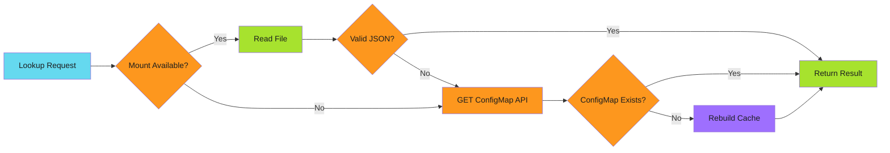

# Zero-API Lookups: ConfigMap as a Cache Pattern

The cluster scan was killing performance. Every image push meant querying the API server for all deployments. 5-10 seconds of latency. Hundreds of API calls per day asking the same question.

The answer changed maybe once a week, but I was asking every five minutes.

This is the pattern that fixed it.

<!-- more -->

---

## The Discovery

I'd already built a cache. A Go CLI that maintained a ConfigMap mapping images to deployments. Lookups went from 5-10 seconds to 50-200ms. Massive improvement.

But it still required an API call. One GET request per lookup. Not terrible, but not zero.

Then someone mentioned volume mounts.

---

## The Pattern

Kubernetes can mount ConfigMaps as files. The kubelet syncs them automatically. If the cache is mounted as a volume, the workflow reads from disk, not the API.

```yaml
volumes:
  - name: cache-volume
    configMap:
      name: deployment-image-cache
      optional: true

volumeMounts:
  - name: cache-volume
    mountPath: /etc/cache
    readOnly: true
```

The cache becomes a file at `/etc/cache/cache.json`:

```json
{
  "images": {
    "us-docker.pkg.dev/project/repo/app:v1.2.3": [
      {"name": "api", "namespace": "production"},
      {"name": "api", "namespace": "staging"}
    ],
    "us-docker.pkg.dev/project/repo/worker:v2.0.1": [
      {"name": "worker", "namespace": "production"}
    ]
  }
}
```

Read it like any file:

```go
func readCache(mountPath string) (*Cache, error) {
    data, err := os.ReadFile(filepath.Join(mountPath, "cache.json"))
    if err != nil {
        return nil, fmt.Errorf("reading cache file: %w", err)
    }

    var cache Cache
    if err := json.Unmarshal(data, &cache); err != nil {
        return nil, fmt.Errorf("parsing cache: %w", err)
    }

    return &cache, nil
}
```

Zero API calls. Sub-millisecond reads.

---

## The Fallback Strategy

Volume mounts can fail. The ConfigMap might not exist yet. The mount might not sync in time.

Two-tier access pattern handles this:



Implementation:

```go
func GetDeployments(image string, cachePath string, client kubernetes.Interface) ([]Deployment, error) {
    // Try volume mount first
    if cache, err := readCache(cachePath); err == nil {
        if deployments, found := cache.Images[image]; found {
            return deployments, nil
        }
        // Image not in cache, trigger rebuild
        return rebuildCache(client)
    }

    // Fallback to API
    cache, err := getConfigMapCache(client)
    if err != nil {
        // Cache doesn't exist, rebuild from cluster scan
        return rebuildCache(client)
    }

    if deployments, found := cache.Images[image]; found {
        return deployments, nil
    }

    // Image not tracked, rebuild cache
    return rebuildCache(client)
}
```

This pattern aligns with [Graceful Degradation](../../patterns/error-handling/graceful-degradation/index.md): optimize for the happy path (mount), but survive all failure modes.

---

## The Cache Update Problem

Reads are fast. Writes are where it gets interesting.

The volume mount is read-only, so the workflow can't write to it directly. Updates must go through the API:

```go
func updateCache(client kubernetes.Interface, cache *Cache) error {
    data, err := json.MarshalIndent(cache, "", "  ")
    if err != nil {
        return fmt.Errorf("marshaling cache: %w", err)
    }

    cm := &corev1.ConfigMap{
        ObjectMeta: metav1.ObjectMeta{
            Name:      "deployment-image-cache",
            Namespace: "automation",
        },
        Data: map[string]string{
            "cache.json": string(data),
        },
    }

    _, err = client.CoreV1().ConfigMaps("automation").Update(
        context.Background(), cm, metav1.UpdateOptions{},
    )
    return err
}
```

Kubernetes syncs the change to all volume mounts. Typically within seconds, but not instant.

---

## Trade-offs

This pattern isn't free.

### Staleness Window

The volume mount syncs periodically, not immediately. Updates take 1-30 seconds to propagate. If consistency is critical within seconds, this pattern won't work.

For my use case (image-to-deployment mapping), staleness was acceptable. The mapping only changed when deployments were created or modified. A 10-second delay was fine.

### ConfigMap Size Limits

ConfigMaps max out at 1MB. A large cluster with thousands of deployments and images could exceed this.

My cache tracked ~200 images and ~300 deployments. Total size: ~50KB. Plenty of headroom.

If you hit the limit, consider:

- Multiple ConfigMaps (shard by namespace or image prefix)
- More aggressive pruning (remove stale entries)
- Different storage (custom resource, external cache)

### RBAC Complexity

The workflow needs read access to the ConfigMap. In namespaced setups, this requires cluster-scoped roles or cross-namespace access.

```yaml
apiVersion: rbac.authorization.k8s.io/v1
kind: ClusterRole
metadata:
  name: cache-reader
rules:
  - apiGroups: [""]
    resources: ["configmaps"]
    verbs: ["get"]
    resourceNames: ["deployment-image-cache"]
```

---

## When to Use This Pattern

**Good fit:**

- Data changes infrequently (hours/days)
- Read-heavy access pattern
- Sub-100ms latency requirements
- API rate limiting concerns
- Data size under 1MB

**Poor fit:**

- Strong consistency required (seconds matter)
- Data changes frequently (minutes)
- Large datasets (>500KB)
- Single-reader scenarios (API is simpler)

---

## Results

| Metric | Before (API) | After (Mount) |
| -------- | -------------- | --------------- |
| Latency | 50-200ms | 1-5ms |
| API calls | 1 per lookup | 0 |
| Data transfer | 50-200KB | 0 bytes |
| Failure modes | API down = fail | Mount → API → rebuild |

The transformation from [5 seconds to 5 milliseconds](2025-11-29-from-5-seconds-to-5-milliseconds.md) started with caching. This pattern completed it.

---

## Implementation Checklist

If you're building this:

1. **Design the cache structure** - JSON works, but consider your query patterns
2. **Implement the fallback chain** - Mount → API → rebuild
3. **Set up RBAC** - Volume mounts need read access to the ConfigMap
4. **Handle staleness** - Define acceptable delay for your use case
5. **Monitor cache size** - ConfigMaps have 1MB limits
6. **Test failure modes** - Missing ConfigMap, invalid JSON, mount not ready
7. **Rebuild strategy** - When to refresh the cache (time-based, event-driven, on-miss)

---

## Deep Dive

The pattern lives in production. For implementation details:

!!! info "Related Documentation"

    - **[Event-Driven Deployments with Argo](2025-12-14-event-driven-deployments-argo.md)**: Full architecture using this cache pattern
    - **[Cache Considerations](../../patterns/efficiency/idempotency/caches.md)**: Cache resilience and idempotency
    - **[Graceful Degradation](../../patterns/error-handling/graceful-degradation/index.md)**: Designing fallback strategies

---

*Zero API calls. Millisecond lookups. The Kubernetes API server doesn't even notice anymore.*
