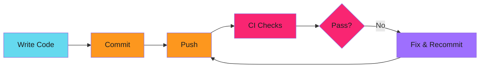
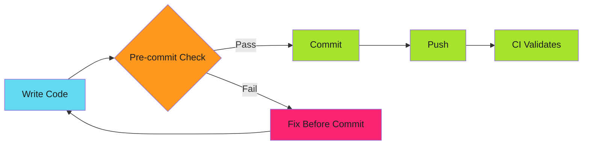

# Pre-commit Hooks as Security Gates: Enforcement Before Commit

The Terraform config was already committed. Three pull requests deep before anyone noticed. Now it's in git history. Audit logs show violations. The team is explaining how vendor lock-in crept in.

Pre-commit hooks stop this before it starts.

<!-- more -->

---

## The Problem with Post-Commit Detection

CI catches security issues after they're committed. By then:

- Code is in git history (even if the PR never merges)
- Secrets, if committed, are already exposed (we later added TruffleHog scanning to catch this—see [OpenSSF Certification](2025-12-17-openssf-badge-two-hours.md))
- Audit trails show violations happened
- Fixing requires force-push or explanation



The violation already happened at step B. Everything after is damage control.

---

## Shift Left to Pre-Commit

Move enforcement to the commit boundary:



Violations never enter git history. CI becomes validation, not discovery.

---

## Real-World Example: Vendor-Neutral Enforcement

Adaptive Enforcement Lab maintains vendor-neutral documentation. The policy:

| Forbidden | Preferred | Rationale |
| --------- | --------- | --------- |
| Docker | OCI, Containerfile, podman | Vendor-neutral standards |
| Terraform | Crossplane, CNRM, Pulumi | Kubernetes-native IaC |
| AWS-specific | GCP or cloud-agnostic | Avoid vendor lock-in |

This isn't documentation. It's enforced.

---

## When NOT to Use This

Pre-commit hooks add friction. Use them for:

- **Security policies** (secrets, forbidden tech)
- **Compliance requirements** (audit trails, vendor rules)
- **Destructive mistakes** (large files, sensitive data)

Don't use them for:

- **Formatting** (prettier, gofmt run these automatically)
- **Linting** (too slow, devs will disable)
- **Style preferences** (code review is better)

The rule: if developers bypass the hook regularly, it shouldn't be a hook.

---

## The --no-verify Debate

```bash
git commit --no-verify -m "emergency fix"
```

This bypasses all hooks. Should you allow it?

**Arguments for:**

- Emergency hotfixes need speed
- Developers own their commits
- CI is the real gate

**Arguments against:**

- Secrets committed in emergencies
- "Just this once" becomes habit
- Audit compliance requires prevention

The compromise: allow `--no-verify`. But CI must run the same checks. The hook is convenience. CI is enforcement.

---

## Measuring Effectiveness

Track violations caught:

```go
func logViolation(v Violation) {
    // Send to metrics system
    metrics.Increment("forbidden_tech.blocked", map[string]string{
        "technology": v.Technology,
        "file":       filepath.Ext(v.File),
    })
}
```

Dashboards show:

- Which rules catch the most violations
- Which file types are riskiest
- When developers bypass hooks (CI violations vs. pre-commit blocks)

---

## Implementation Checklist

Building your own security gates:

1. **Define forbidden patterns** - What are you blocking?
2. **Regex or AST?** - Regex for simple cases, parse for languages
3. **Exception strategy** - Path-based, inline suppression, or both
4. **Error messages** - Link to policy docs, suggest alternatives
5. **CI integration** - Same tool runs locally and in CI
6. **Metrics** - Track blocks, bypasses, false positives
7. **Maintenance** - Review patterns quarterly, update for new risks

---

## Related Patterns

Pre-commit hooks are one layer. The full stack:

!!! info "Defense in Depth"

    - **Pre-commit hooks**: Block at commit boundary (this post)
    - **Branch protection**: Require reviews, status checks
    - **CI validation**: Automated policy enforcement
    - **Audit trails**: Log all policy checks
    - **SDLC hardening**: Build security into pipelines (coming soon)

See [Pre-commit Hooks That Don't Make You Wait](2025-12-10-pre-commit-hooks-binary-releases.md) for implementation details.

---

*The Terraform config never makes it to git history. The Docker reference gets caught at commit time. The audit shows zero violations. Prevention works.*

For implementation details, see **[Pre-commit Hooks Implementation Guide](../../enforce/pre-commit-hooks/pre-commit-hooks-patterns.md)**.
