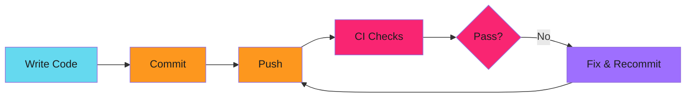
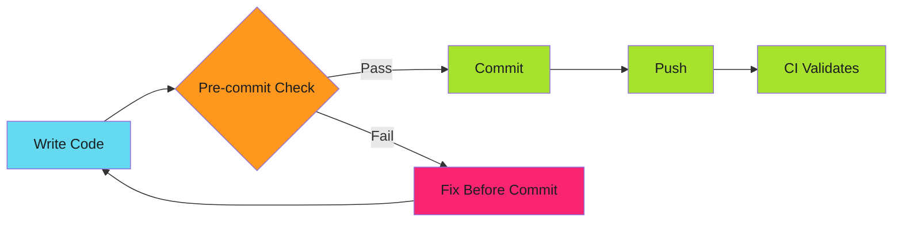

# Pre-commit Hooks as Security Gates: Enforcement Before Commit

The Terraform config was already committed. Three pull requests deep before anyone noticed. Now it's in git history, audit logs show violations, and the team is explaining why vendor lock-in crept into a vendor-neutral codebase.

Pre-commit hooks stop this before it starts.

<!-- more -->

---

## The Problem with Post-Commit Detection

CI catches security issues after they're committed. By then:

- Code is in git history (even if the PR never merges)
- Secrets, if committed, are already exposed
- Audit trails show violations happened
- Fixing requires force-push or explanation



The violation already happened at step B. Everything after is damage control.

---

## Shift Left to Pre-Commit

Move enforcement to the commit boundary:



Violations never enter git history. CI becomes validation, not discovery.

---

## Real-World Example: Vendor-Neutral Enforcement

Adaptive Enforcement Lab maintains vendor-neutral documentation. The policy:

| Forbidden | Preferred | Rationale |
|-----------|-----------|-----------|
| Docker | OCI, Containerfile, podman | Vendor-neutral standards |
| Terraform | Crossplane, CNRM, Pulumi | Kubernetes-native IaC |
| AWS-specific | GCP or cloud-agnostic | Avoid vendor lock-in |

This isn't documentation. It's enforced.

---

## Implementation: Pattern Detection Hook

### The Hook Definition

```yaml
# .pre-commit-hooks.yaml
- id: forbidden-tech
  name: Block Forbidden Technologies
  description: Enforce vendor-neutral technology choices
  entry: forbidden-tech-check
  language: golang
  files: \.(md|yaml|yml|sh|tf|Dockerfile|Containerfile)$
  pass_filenames: true
```

### The Detection Logic

```go
package main

import (
    "bufio"
    "fmt"
    "os"
    "regexp"
    "strings"
)

var forbiddenPatterns = map[string][]string{
    "Docker": {
        `(?i)\bdocker\s+build\b`,
        `(?i)\bdocker\s+push\b`,
        `(?i)\bFROM\s+.*docker\.io`,
        `(?i)Docker\s+Hub`,
    },
    "Terraform": {
        `(?i)\bterraform\s+(init|plan|apply)`,
        `(?i)\.tf$`,
        `(?i)terraform\s+{`,
    },
    "AWS-specific": {
        `(?i)\baws_\w+\b`,
        `(?i)AWS::\w+`,
        `(?i)\.amazonaws\.com`,
    },
}

var exceptions = map[string]bool{
    "docs/migration-guides/": true,  // Historical reference
    "CHANGELOG.md":           true,  // Release notes
}

func checkFile(path string) ([]Violation, error) {
    // Check exceptions
    for exception := range exceptions {
        if strings.Contains(path, exception) {
            return nil, nil
        }
    }

    file, err := os.Open(path)
    if err != nil {
        return nil, err
    }
    defer file.Close()

    var violations []Violation
    scanner := bufio.NewScanner(file)
    lineNum := 0

    for scanner.Scan() {
        lineNum++
        line := scanner.Text()

        for tech, patterns := range forbiddenPatterns {
            for _, pattern := range patterns {
                re := regexp.MustCompile(pattern)
                if re.MatchString(line) {
                    violations = append(violations, Violation{
                        File:       path,
                        Line:       lineNum,
                        Technology: tech,
                        Match:      re.FindString(line),
                    })
                }
            }
        }
    }

    return violations, scanner.Err()
}

type Violation struct {
    File       string
    Line       int
    Technology string
    Match      string
}

func main() {
    if len(os.Args) < 2 {
        fmt.Fprintln(os.Stderr, "Usage: forbidden-tech-check <files...>")
        os.Exit(1)
    }

    var allViolations []Violation

    for _, path := range os.Args[1:] {
        violations, err := checkFile(path)
        if err != nil {
            fmt.Fprintf(os.Stderr, "Error checking %s: %v\n", path, err)
            os.Exit(2)
        }
        allViolations = append(allViolations, violations...)
    }

    if len(allViolations) > 0 {
        fmt.Fprintln(os.Stderr, "")
        fmt.Fprintln(os.Stderr, "FORBIDDEN TECHNOLOGY DETECTED")
        fmt.Fprintln(os.Stderr, "")

        for _, v := range allViolations {
            fmt.Fprintf(os.Stderr, "  %s:%d - %s: %s\n",
                v.File, v.Line, v.Technology, v.Match)
        }

        fmt.Fprintln(os.Stderr, "")
        fmt.Fprintln(os.Stderr, "See content policies: README.md")
        fmt.Fprintln(os.Stderr, "")

        os.Exit(1)
    }
}
```

---

## The Developer Experience

### When It Works

```bash
$ git commit -m "Add deployment guide"
Block Forbidden Technologies................................Passed
[main abc123d] Add deployment guide
 1 file changed, 42 insertions(+)
```

Clean commits. No friction.

### When It Catches Something

```bash
$ git commit -m "Add docker build script"
Block Forbidden Technologies................................Failed
- hook id: forbidden-tech
- exit code: 1

FORBIDDEN TECHNOLOGY DETECTED

  scripts/build.sh:12 - Docker: docker build
  scripts/build.sh:15 - Docker: docker push

See content policies: README.md
```

The commit is blocked. Fix it first.

---

## Defense in Depth: Hook + CI

Pre-commit hooks are local. Developers can bypass with `--no-verify`. Defense in depth requires CI validation:

```yaml
# .github/workflows/security-gates.yml
name: Security Gates

on: [pull_request]

jobs:
  forbidden-tech:
    runs-on: ubuntu-latest
    steps:
      - uses: actions/checkout@v4

      - name: Run pre-commit checks
        uses: pre-commit/action@v3.0.0
        with:
          extra_args: forbidden-tech --all-files
```

Same tool, same rules. Local enforcement with CI backstop.

---

## Managing Legitimate Exceptions

Not all mentions are violations. Migration guides reference old tech. Troubleshooting docs quote error messages.

### Path-Based Exceptions

```go
var exceptions = map[string]bool{
    "docs/migration-guides/":     true,
    "docs/troubleshooting/":      true,
    "CHANGELOG.md":               true,
}
```

### Inline Suppression

```yaml
# pre-commit-suppress: forbidden-tech
FROM docker.io/library/python:3.11
```

Parse comments to skip specific lines:

```go
if strings.Contains(line, "pre-commit-suppress: forbidden-tech") {
    continue
}
```

### Exception Reporting

Log exceptions for audit:

```go
if isException(path) {
    fmt.Fprintf(os.Stdout, "EXCEPTION: %s (allowed path)\n", path)
}
```

---

## Patterns to Detect

### Secrets

```go
secretPatterns := []string{
    `(?i)(password|passwd|pwd)\s*[=:]\s*[^\s]+`,
    `(?i)(api[_-]?key|apikey)\s*[=:]\s*[^\s]+`,
    `-----BEGIN\s+(RSA\s+)?PRIVATE\sKEY-----`,
    `ghp_[a-zA-Z0-9]{36}`,  // GitHub token
}
```

### Hardcoded URLs

```go
hardcodedURLs := []string{
    `https?://(?!example\.com|localhost)[\w\-\.]+\.\w+/[\w\-\.]+`,
}
```

### Debugging Code

```go
debugPatterns := []string{
    `console\.log\(`,
    `fmt\.Println\(`,
    `print\(.*\)`,
}
```

---

## When NOT to Use This

Pre-commit hooks add friction. Use them for:

- **Security policies** (secrets, forbidden tech)
- **Compliance requirements** (audit trails, vendor rules)
- **Destructive mistakes** (large files, sensitive data)

Don't use them for:

- **Formatting** (prettier, gofmt run these automatically)
- **Linting** (too slow, devs will disable)
- **Style preferences** (code review is better)

The rule: if developers bypass the hook regularly, it shouldn't be a hook.

---

## The --no-verify Debate

```bash
git commit --no-verify -m "emergency fix"
```

This bypasses all hooks. Should you allow it?

**Arguments for:**

- Emergency hotfixes need speed
- Developers own their commits
- CI is the real gate

**Arguments against:**

- Secrets committed in emergencies
- "Just this once" becomes habit
- Audit compliance requires prevention

The compromise: allow `--no-verify`, but CI must run the same checks. The hook is convenience, CI is enforcement.

---

## Measuring Effectiveness

Track violations caught:

```go
func logViolation(v Violation) {
    // Send to metrics system
    metrics.Increment("forbidden_tech.blocked", map[string]string{
        "technology": v.Technology,
        "file":       filepath.Ext(v.File),
    })
}
```

Dashboards show:

- Which rules catch the most violations
- Which file types are riskiest
- When developers bypass hooks (CI violations vs. pre-commit blocks)

---

## Implementation Checklist

Building your own security gates:

1. **Define forbidden patterns** - What are you blocking?
2. **Regex or AST?** - Regex for simple cases, parse for languages
3. **Exception strategy** - Path-based, inline suppression, or both
4. **Error messages** - Link to policy docs, suggest alternatives
5. **CI integration** - Same tool runs locally and in CI
6. **Metrics** - Track blocks, bypasses, false positives
7. **Maintenance** - Review patterns quarterly, update for new risks

---

## Related Patterns

Pre-commit hooks are one layer. The full stack:

!!! info "Defense in Depth"

    - **Pre-commit hooks**: Block at commit boundary (this post)
    - **Branch protection**: Require reviews, status checks
    - **CI validation**: Automated policy enforcement
    - **Audit trails**: Log all policy checks
    - **SDLC hardening**: Build security into pipelines (coming soon)

See [Pre-commit Hooks That Don't Make You Wait](2025-12-10-pre-commit-hooks-binary-releases.md) for implementation details.

---

*The Terraform config never makes it to git history. The Docker reference gets caught at commit time. And the audit shows zero violations, because prevention works.*
