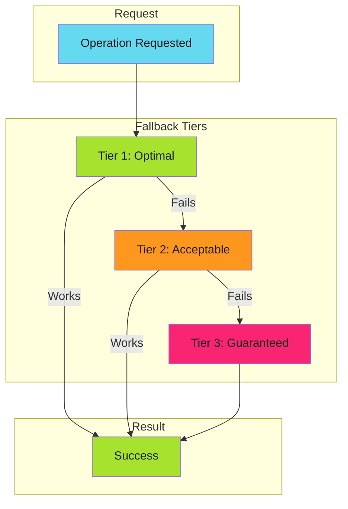

# The Art of Failing Gracefully: Tiered Fallbacks for CI/CD

My workflow reads deployment mappings from a ConfigMap mounted as a volume. Five milliseconds, zero API calls. But what happens when the mount fails?

The answer isn't "return an error." It's "try the next thing."

<!-- more -->

---

## The Three-Tier Pattern

!!! abstract "The Core Principle"
    Degrade performance, not availability. Every operation should have a guaranteed fallback.

Every robust system I've built follows the same structure:



- **Tier 1**: Fast, cheap, preferred
- **Tier 2**: Slower, costlier, reliable
- **Tier 3**: Expensive but always works

The key insight: **degrade performance, not availability**.

---

## Real Numbers

In [From 5 Seconds to 5 Milliseconds](2025-11-29-from-5-seconds-to-5-milliseconds.md), I documented how a ConfigMap cache transformed deployment automation. But the story doesn't end at "use a cache." The real pattern is the fallback chain:

| Tier | Method | Latency | API Calls |
|------|--------|---------|-----------|
| 1 | Volume mount | 1-5ms | 0 |
| 2 | API call | 50-200ms | 1 |
| 3 | Cluster scan | 5-10s | 100+ |

When Tier 1 works (99% of the time), the system flies. When it doesn't, the system still works. That's the difference between a cache optimization and a reliability pattern.

---

## The Code Pattern

```go
func GetDeployments(image string) ([]Deployment, error) {
    // Tier 1: Try volume mount
    if data, err := os.ReadFile("/etc/cache/deployments.json"); err == nil {
        metrics.RecordTier("mount")
        return parseDeployments(data, image)
    }

    // Tier 2: Try API call
    if data, err := k8s.GetConfigMap("deployment-cache"); err == nil {
        metrics.RecordTier("api")
        return parseDeployments(data, image)
    }

    // Tier 3: Rebuild from cluster scan
    metrics.RecordTier("rebuild")
    return scanClusterForImage(image)
}
```

Notice the `metrics.RecordTier()` calls. You need to know which tier is serving traffic. If Tier 1 starts failing, you want to know before your users notice the latency spike.

---

## Fail Fast vs Degrade Gracefully

!!! tip "Decision Rule"
    Fail fast on **precondition failures**. Degrade gracefully on **runtime failures**.

These patterns aren't opposites. They solve different problems:

| Scenario | Pattern | Why |
|----------|---------|-----|
| Invalid input | Fail Fast | User error, report immediately |
| Missing config | Fail Fast | Can't continue safely |
| Cache miss | Graceful Degradation | Expensive path still works |
| Network timeout | Graceful Degradation | Infrastructure issue, retry |

**Decision rule**: Fail fast on **precondition failures**. Degrade gracefully on **runtime failures**.

Preconditions are things that *should* be true before you start. Runtime failures are things that *might* go wrong during execution.

---

## The Anti-Patterns

I've seen these kill systems:

### Silent Degradation

```go
// Dangerous: no observability
if data, _ := cache.Get(); data != nil {
    return data
}
return fetchFromAPI()  // Who knows we're degraded?
```

If Tier 1 silently fails for a week, you'll only notice when someone asks why the system is slow. By then, you've been burning API quota and adding latency for thousands of requests.

### No Guaranteed Tier

```go
// Dangerous: can fail completely
if cfg := cache.Get(); cfg != nil {
    return cfg
}
return api.FetchConfig()  // What if API is also down?
```

Every chain needs a final tier that **cannot fail**. A static default. A hardcoded fallback. Something that always returns a valid response, even if it's stale or incomplete.

### Expensive Default

```yaml
# Wasteful: always does the expensive thing
- run: npm ci
- uses: actions/cache/save@v4
```

If you're always running Tier 3 and then caching the result, you've inverted the pattern. The point is to *avoid* the expensive path, not run it every time.

---

## Implementation Checklist

Before shipping graceful degradation:

1. **Define all tiers** before writing code
2. **Identify the guaranteed tier** that always succeeds
3. **Instrument each tier** with metrics and logs
4. **Alert on tier shifts** (Tier 1 failure rate > 5%)
5. **Test fallback paths in CI**, not just production
6. **Document expected latencies** per tier
7. **Set SLOs per tier** (Tier 1: p99 < 10ms)

---

## Further Reading

The full pattern documentation is in the Developer Guide:

- [Graceful Degradation Pattern](../../developer-guide/error-handling/graceful-degradation/index.md) - Complete implementation guide
- [Cache Considerations](../../developer-guide/efficiency-patterns/idempotency/caches.md) - Cache-resilient strategies

---

## Related

- [Should Work ≠ Does Work](2025-12-08-always-works-qa-methodology.md) - Verification methodology
- [CLI UX Patterns for AI Agents](2025-12-07-cli-ux-patterns-for-ai-agents.md) - Error messages that guide fixes

---

*The best systems don't avoid failure. They survive it.*
