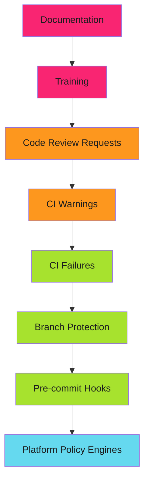

# How to Harden Your SDLC Before the Audit Comes

The email arrived on a Monday. "SOC 2 audit in 30 days. Need evidence of secure development practices."

We had policies. Documentation. Training slides. None of it mattered.

Auditors don't want to hear what you say you do. They want to see what the system forces you to do.

<!-- more -->

## The Confrontation

The auditor opened our GitHub organization. First question: "Show me how you enforce code review."

I pointed to our documentation: "All code must be reviewed before merge."

"I see the policy. Show me the enforcement."

That's when I realized documentation doesn't prove anything. A PDF that says "we require reviews" could have been written yesterday. Or ignored for months.

The auditor needed proof that controls were:

1. **Automated** - Can't be bypassed
2. **Logged** - Every action is traceable
3. **Continuous** - Applied consistently over time

They wanted to see the machine that makes good practices inevitable, not the document that asks nicely.

!!! warning "The Audit Reality"
    Documentation proves intent. Enforcement proves compliance. Auditors want evidence that controls can't be bypassed, not promises that they won't be.

---

## The Hierarchy of Enforcement

We learned enforcement comes in layers:



Red and orange layers? "Best effort." Green and blue? Actual enforcement.

Auditors only care about what can't be bypassed.

## What We Built

In 30 days, we transformed from documentation to enforcement. Here's what actually worked.

### Branch Protection: Policies as Code

We turned "code must be reviewed" into a GitHub configuration that prevents merging without approval.

```yaml
required_pull_request_reviews:
  required_approving_review_count: 1
  dismiss_stale_reviews: true
  require_code_owner_reviews: true
enforce_admins: true
```

No exceptions. Not even for administrators.

The auditor pointed to the `enforce_admins` setting. "This is what I need to see."

See [Branch Protection Enforcement](../../enforce/branch-protection/branch-protection.md) for full implementation.

### Status Checks: CI as Gatekeeper

We made CI failures block merges. No green checkmarks, no deployment.

```yaml
required_status_checks:
  strict: true
  contexts:
    - "tests"
    - "security-scan"
    - "lint"
```

Untested code can't merge. Vulnerable containers can't deploy. The pipeline decides, not developers.

See [Required Status Checks](../../enforce/status-checks/index.md) for patterns.

### Pre-commit Hooks: First Defense

Secrets detection before code enters git history:

```bash
$ git commit -m "Add config"
TruffleHog.........................................................Failed

Found verified result:
Detector Type: AWS
File: deploy/config.yaml
```

The commit was blocked. The secret never entered git history.

Pre-commit hooks are bypassable (`--no-verify`), so we also validate in CI. Defense in depth.

See [Pre-commit Security Gates](2025-12-04-pre-commit-security-gates.md) and [Pre-commit Hooks Guide](../../enforce/pre-commit-hooks/pre-commit-hooks.md).

### GitHub Apps: Authentication Without People

Personal Access Tokens tied to individuals fail audits. What happens when Mark leaves? Whose token is this?

GitHub Apps solved it:

```yaml
- name: Generate App Token
  uses: actions/create-github-app-token@v2
  with:
    app-id: ${{ secrets.APP_ID }}
    private-key: ${{ secrets.PRIVATE_KEY }}
```

Token lifecycle independent of employees. Scoped permissions. Full audit trail.

The auditor approved immediately.

See [GitHub Apps for Machine Authentication](../../secure/github-apps/index.md) for migration guide.

### Signed Commits: Non-Repudiation

Anyone can set `git config user.name "Mark Cheret"`. GPG signatures can't be forged without the private key.

```bash
$ git log --show-signature
gpg: Good signature from "Mark Cheret <mark@example.com>"
```

Branch protection can require signatures. Unsigned commits can't be pushed.

See [Commit Signing](../../enforce/commit-signing/commit-signing.md) for setup.

### SBOM Generation: Supply Chain Visibility

"Show me what's in your production containers."

We generated SBOMs for every build:

```yaml
- name: Generate SBOM
  uses: anchore/sbom-action@v0
  with:
    image: app:${{ github.sha }}
    format: cyclonedx-json
    output-file: sbom.json
```

Auditor could verify: No GPL licenses. No HIGH CVEs. Dependencies matched versions.

These same practices earned our readability project OpenSSF Best Practices certification. Read about the [2-hour documentation sprint](2025-12-17-openssf-badge-two-hours.md).

**Supply Chain Defense Stack:**

- [SBOM Generation](../../secure/sbom/sbom-generation.md) and [Zero-Vulnerability Pipelines](2025-12-15-zero-vulnerability-pipelines.md) - Scan and attest
- [The Score That Wouldn't Move](2025-12-18-scorecard-stuck-at-eight.md) - SLSA provenance journey from 8/10 to 10/10
- [Sixteen Alerts Overnight](2025-12-20-sixteen-alerts-overnight.md) - OpenSSF Scorecard compliance in practice

### Runtime Enforcement: Kyverno

SDLC doesn't end at CI/CD. It extends to runtime.

Kyverno enforces policies in Kubernetes clusters:

```yaml
apiVersion: kyverno.io/v1
kind: ClusterPolicy
metadata:
  name: require-resource-limits
spec:
  validationFailureAction: Enforce
  rules:
    - name: check-limits
      match:
        resources:
          kinds: [Pod]
      validate:
        message: "CPU and memory limits required"
        pattern:
          spec:
            containers:
              - resources:
                  limits:
                    memory: "?*"
                    cpu: "?*"
```

Pods without resource limits get rejected. Policy runs in the cluster, not just CI.

See [Policy-as-Code with Kyverno](2025-12-13-policy-as-code-kyverno.md) for end-to-end enforcement.

## The Evidence Collection

Auditors sampled March 2025. "Show me PRs merged that month."

We ran an API query:

```bash
gh api 'repos/org/repo/pulls?state=closed&base=main' \
  --jq '.[] | select(.merged_at | startswith("2025-03")) |
    {number, title, reviews, merged_at}'
```

The response showed:

- Every PR number
- Review counts
- Merge timestamps
- Reviewer identities

Machine-readable. Verifiable. Irrefutable.

We had monthly archives of branch protection configs, workflow runs, and SBOMs. The audit trail was complete.

See [Audit Evidence Collection](../../enforce/audit-compliance/audit-evidence.md) for retention strategies.

## The Transformation

| Control | Before (Documentation) | After (Enforcement) |
| ------- | ---------------------- | ------------------- |
| Code review | "All code must be reviewed" | Branch protection requires 1+ approval |
| Testing | "Run tests before merge" | Required status check blocks merge |
| Secrets | "Don't commit secrets" | Pre-commit hook blocks commits |
| Dependencies | "Track what we use" | SBOM generated per build |
| Authentication | PAT in Mark's name | GitHub App with scoped permissions |
| Authorship | Git author field | Signed commits required |
| Runtime | "Follow deployment standards" | Kyverno enforces policies in-cluster |

The right column survives audit scrutiny. The left doesn't.

## The 90-Day Roadmap

We didn't do this in 30 days. We should have started months earlier.

Here's the phased approach that works:

### Month 1: Foundation

- Week 1: Branch protection on production branches
- Week 2: Required status checks (tests, lint)
- Week 3: GitHub App setup
- Week 4: Evidence archive automation

### Month 2: Hardening

- Week 5: Secrets detection (pre-commit + CI)
- Week 6: Signed commits required
- Week 7: SBOM generation
- Week 8: Complete PAT migration

### Month 3: Validation

- Week 9: Vulnerability scanning
- Week 10: Kyverno deployment
- Week 11: Audit simulation
- Week 12: Remediation and runbook

See [Implementation Roadmap](../../enforce/implementation-roadmap/index.md) for detailed timelines.

---

## Common Objections We Heard

### "This slows down development."

Slowdowns happen when controls catch real issues. That's the point.

Fast merges with vulnerabilities cost more than slow merges with validation.

### "We trust our developers."

Auditors don't trust anybody. They trust systems.

Controls protect developers from mistakes and prove diligence when incidents happen.

### "Emergency hotfixes need exceptions."

Fine. Document the exception. Log the bypass. Require post-merge review.

The audit trail should show: "Bypass used 3 times in 2024. All reviewed within 24 hours."

Not: "We bypass whenever it's convenient."

## The Audit Result

Day 18. The auditor closed their laptop.

"Controls are automated and provably enforced. Branch protection verified. Status checks logged. Evidence collection continuous. Zero findings."

We passed.

Not because of our documentation. Because we built systems that make security inevitable.

## Where to Start

If an audit email lands tomorrow, start here:

1. **[Branch Protection](../../enforce/branch-protection/branch-protection.md)** - Turn policies into enforcement
2. **[Required Status Checks](../../enforce/status-checks/index.md)** - CI as gatekeeper
3. **[GitHub Apps](../../secure/github-apps/index.md)** - Replace PATs
4. **[Evidence Collection](../../enforce/audit-compliance/audit-evidence.md)** - Start archiving now

The full stack includes pre-commit hooks, commit signing, SBOMs, and runtime policy enforcement with Kyverno.

See the [SDLC Hardening section](../../enforce/index.md) for complete implementation guides.

## Related Patterns

The full defense stack:

- **[Pre-commit Security Gates](2025-12-04-pre-commit-security-gates.md)** - Block at commit time
- **[Zero-Vulnerability Pipelines](2025-12-15-zero-vulnerability-pipelines.md)** - Block vulnerable images
- **[Policy-as-Code with Kyverno](2025-12-13-policy-as-code-kyverno.md)** - Runtime admission control
- **[Environment Progression Testing](2025-12-16-environment-progression-testing.md)** - Validate before production

*The Monday email became a 90-day transformation. Documentation was replaced with automation. Controls were proven, not promised. The audit passed. Security became inevitable.*
