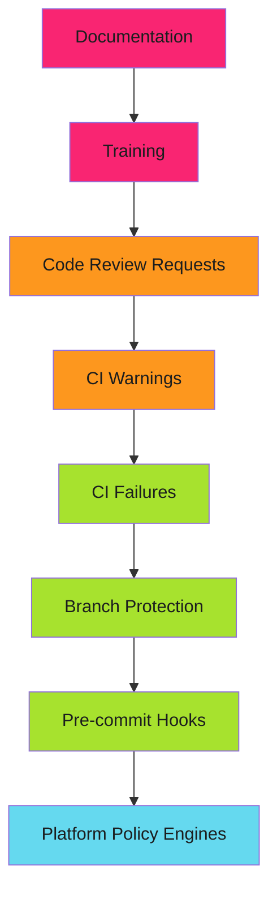

# How to Harden Your SDLC Before the Audit Comes

The email arrived on a Monday. "SOC 2 audit in 30 days. Need evidence of secure development practices."

We had policies. Documentation. Training slides. None of it mattered.

Auditors don't want to hear what you say you do. They want to see what the system forces you to do.

<!-- more -->

---

## What Auditors Actually Check

The auditor opened our GitHub organization. First question: "Show me how you enforce code review."

I pointed to our documentation: "All code must be reviewed before merge."

"I see the policy. Show me the enforcement."

That's when I realized documentation doesn't prove anything. A PDF that says "we require reviews" could have been written yesterday. Or ignored for months.

!!! warning "Documentation Is Not Evidence"

    Auditors need proof that controls are:

    1. **Automated** - Can't be bypassed
    2. **Logged** - Every action is traceable
    3. **Continuous** - Applied consistently over time

They want to see the machine that makes good practices inevitable, not the document that asks nicely.

---

## The Enforcement Hierarchy

From weakest to strongest:



Auditors care about the green and blue layers. Everything else is "best effort."

---

## Pattern 1: Branch Protection as Policy Enforcement

GitHub branch protection turns policies into hard requirements.

### Before (Documentation)

> "All code must be reviewed by at least one other engineer before merging to main."

Provable? No. A developer could merge their own PR. The policy says they shouldn't, but nothing stops them.

### After (Enforcement)

```yaml
# Enforced via GitHub branch protection rules
branch_protection:
  required_pull_request_reviews:
    required_approving_review_count: 1
    dismiss_stale_reviews: true
    require_code_owner_reviews: true

  required_status_checks:
    strict: true
    contexts:
      - "ci/tests"
      - "security/scan"

  enforce_admins: true
  required_linear_history: true
```

Now it's impossible to merge without review. The audit trail shows:
- Who reviewed
- When they reviewed
- What status checks passed
- No exceptions (even for admins)

!!! success "Audit Evidence"

    Point the auditor to branch protection settings. Show the API response. The configuration is proof.

---

## Pattern 2: Required Status Checks as Validation Gates

Branch protection can require CI checks to pass. This turns "you should test" into "untested code cannot merge."

### The Status Check Contract

```yaml
# .github/workflows/required-checks.yml
name: Required Checks

on:
  pull_request:
    branches: [main]

jobs:
  tests:
    runs-on: ubuntu-latest
    steps:
      - uses: actions/checkout@v4
      - name: Run tests
        run: make test

  security-scan:
    runs-on: ubuntu-latest
    steps:
      - uses: actions/checkout@v4
      - name: Container scan
        run: |
          trivy image --severity HIGH,CRITICAL --exit-code 1 \
            gcr.io/project/app:${{ github.sha }}

  lint:
    runs-on: ubuntu-latest
    steps:
      - uses: actions/checkout@v4
      - name: Lint
        run: golangci-lint run
```

Configure branch protection to require these checks. Code that fails tests, has HIGH CVEs, or doesn't pass linting cannot merge.

The audit trail is automatic:
- GitHub stores check results
- Logs show what was scanned
- Timestamps prove continuous enforcement

---

## Pattern 3: Pre-commit Hooks as First Defense

CI catches issues after commit. Pre-commit hooks catch them before.

### Secrets Detection

```yaml
# .pre-commit-config.yaml
repos:
  - repo: https://github.com/trufflesecurity/trufflehog
    rev: v3.63.0
    hooks:
      - id: trufflehog
        name: TruffleHog
        entry: trufflehog filesystem --fail --no-update
        language: system
```

A developer tries to commit AWS credentials:

```bash
$ git commit -m "Add deployment config"
TruffleHog.........................................................Failed
- hook id: trufflehog

Found verified result:
Detector Type: AWS
File: deploy/config.yaml
```

The commit is blocked. The secret never enters git history.

!!! info "Defense in Depth"

    Pre-commit hooks are local and bypassable. Always validate in CI too.

    See [Pre-commit Hooks as Security Gates](2025-12-04-pre-commit-security-gates.md) for full implementation.

---

## Pattern 4: GitHub Apps for Machine Authentication

Personal Access Tokens fail audits. They're tied to individuals who leave. Rotation is manual. Scope is too broad.

### The PAT Problem

```yaml
# FAILS AUDIT
- uses: actions/create-release@v1
  with:
    token: ${{ secrets.MARK_GITHUB_TOKEN }}
```

Questions this raises:
- What happens when Mark leaves?
- Who can rotate Mark's token?
- What else can this token do?
- How do we audit its use across repositories?

### GitHub App Solution

```yaml
# PASSES AUDIT
- name: Generate App Token
  id: app-token
  uses: actions/create-github-app-token@v2
  with:
    app-id: ${{ secrets.RELEASE_APP_ID }}
    private-key: ${{ secrets.RELEASE_APP_PRIVATE_KEY }}
    owner: adaptive-enforcement-lab

- uses: actions/create-release@v1
  with:
    token: ${{ steps.app-token.outputs.token }}
```

This answers every question:
- Token lifecycle independent of employees
- Scoped to specific permissions (read/write releases)
- Rotation via private key management
- Full audit trail of app actions

See the [GitHub App Setup Guide](../../operator-manual/github-actions/github-app-setup/index.md) for implementation.

---

## Pattern 5: Signed Commits for Non-Repudiation

Who actually authored this commit? Can they deny it?

### Unsigned Commits (Weak Evidence)

```bash
$ git log --pretty=format:"%h %an %s"
abc123d Mark Cheret Add feature
```

Anyone can set `user.name` to "Mark Cheret." This proves nothing.

### Signed Commits (Strong Evidence)

```bash
$ git log --show-signature
commit abc123d (HEAD -> main)
gpg: Signature made Thu Dec 12 10:23:45 2025 PST
gpg: using RSA key ABCD1234
gpg: Good signature from "Mark Cheret <mark@example.com>"
Author: Mark Cheret <mark@example.com>
```

The commit is cryptographically signed. Mark can't deny authorship. Forging it requires stealing his private key.

Enforcement:

```yaml
# Branch protection
required_signatures: true
```

Unsigned commits cannot be pushed.

---

## Pattern 6: SBOM Generation for Supply Chain Security

Auditors care about supply chain attacks. You need to prove what's in your containers.

```yaml
# .github/workflows/build.yml
- name: Build container
  run: |
    buildah bud -t app:${{ github.sha }} .

- name: Generate SBOM
  uses: anchore/sbom-action@v0
  with:
    image: app:${{ github.sha }}
    format: cyclonedx-json
    output-file: sbom.json

- name: Upload SBOM
  uses: actions/upload-artifact@v4
  with:
    name: sbom
    path: sbom.json
```

The SBOM (Software Bill of Materials) lists every dependency. Auditors can verify:
- No GPL-licensed code in proprietary software
- No libraries with known HIGH CVEs
- Dependencies match declared versions

This artifact is permanent. Even if the container is deleted, the SBOM proves what was in it.

---

## Evidence Collection Strategy

Auditors need to sample random time periods and verify controls were active.

### What They Ask For

"Show me code reviews from March 2025."

**Bad answer**: "Here's our documentation from March."

**Good answer**: GitHub API query:

```bash
gh api \
  'repos/org/repo/pulls?state=closed&base=main' \
  --jq '.[] | select(.merged_at | startswith("2025-03")) |
    {number, title, reviews: .requested_reviewers | length,
     merged: .merged_at}'
```

The API returns:
- PR numbers
- Review counts
- Merge timestamps
- Reviewer identities

This is machine-readable evidence that controls were active.

### Retention Strategy

GitHub retains data, but for due diligence, archive key evidence:

```yaml
# .github/workflows/audit-archive.yml
name: Audit Evidence Archive

on:
  schedule:
    - cron: '0 0 1 * *'  # Monthly

jobs:
  archive:
    runs-on: ubuntu-latest
    steps:
      - name: Export branch protection
        run: |
          gh api repos/org/repo/branches/main/protection \
            > evidence/branch-protection-$(date +%Y-%m).json

      - name: Export merged PRs
        run: |
          gh api 'repos/org/repo/pulls?state=closed&base=main' \
            > evidence/merged-prs-$(date +%Y-%m).json

      - name: Upload to compliance storage
        run: |
          gsutil cp evidence/*.json gs://audit-evidence/
```

---

## The Before/After Comparison

| Control | Documentation Approach | Enforcement Approach |
|---------|------------------------|----------------------|
| Code review | "All code must be reviewed" | Branch protection requires 1+ approval |
| Testing | "Run tests before merge" | Required status check blocks merge |
| Secrets | "Don't commit secrets" | Pre-commit hook blocks commits |
| Dependencies | "Track what we use" | SBOM generated per build |
| Authentication | PAT in Mark's name | GitHub App with scoped permissions |
| Authorship | Git author field | Signed commits required |

The right column survives audit scrutiny. The left doesn't.

---

## Implementation Roadmap

You can't harden everything at once. Prioritize controls by risk and audit importance.

### Month 1: Foundation

1. **Enable branch protection** on main/production branches
2. **Require status checks** for tests and linting
3. **Set up GitHub App** for automation authentication
4. **Archive first month** of evidence (PRs, checks, protections)

### Month 2: Hardening

5. **Add secrets detection** (pre-commit + CI)
6. **Require signed commits** on protected branches
7. **Generate SBOMs** for all container builds
8. **Document exception process** (when to use `--no-verify`, admin overrides)

### Month 3: Validation

9. **Audit simulation** - Pull evidence like an auditor would
10. **Remediation process** - Fix gaps found in simulation
11. **Runbook creation** - How to respond to audit requests
12. **Team training** - Why these controls exist, how to work with them

---

## Common Objections

### "This slows down development"

Slowdowns happen when controls catch real issues. That's the point.

Fast merges with security issues cost more than slow merges with validation.

### "We trust our developers"

Auditors don't trust anybody. They trust systems.

Controls protect developers from mistakes and prove diligence when incidents happen.

### "Emergency hotfixes need exceptions"

Fine. Document the exception process. Require post-merge review. Log every use.

The audit trail should show: "Emergency bypass used 3 times in 2024. All reviewed within 24 hours."

Not: "We bypass controls whenever it's convenient."

---

## Measuring Success

Track control effectiveness:

```yaml
# Weekly report
security_metrics:
  pre_commit_blocks: 12        # Secrets caught before commit
  ci_failures: 8               # High CVEs blocked
  unsigned_commits_rejected: 3 # Branch protection enforced
  prs_without_review: 0        # Zero exceptions
```

Green numbers prove controls work. Auditors like green numbers.

---

## When the Auditor Arrives

You're ready when you can say:

!!! success "Audit Readiness Checklist"

    - [ ] Branch protection enforced on all production branches
    - [ ] Required status checks configured and passing
    - [ ] GitHub Apps replace PATs for automation
    - [ ] Pre-commit hooks deployed (secrets, policy enforcement)
    - [ ] Signed commits required
    - [ ] SBOM generation integrated
    - [ ] Evidence archive process running
    - [ ] Exception process documented
    - [ ] Metrics dashboard showing control effectiveness

Then you open GitHub, run API queries, and show the machine that makes security inevitable.

---

## Related Patterns

SDLC hardening is a stack of enforcement layers:

!!! info "Full Defense Stack"

    - **Pre-commit hooks**: [Security Gates](2025-12-04-pre-commit-security-gates.md) - Block at commit time
    - **GitHub Apps**: [Setup Guide](../../operator-manual/github-actions/github-app-setup/index.md) - Proper authentication
    - **Branch Protection**: Required reviews and status checks
    - **CI/CD**: Automated validation (tests, scans, SBOM)
    - **Policy-as-Code**: [Kyverno Admission Control](2025-12-13-policy-as-code-kyverno.md) - Enforce at deployment time
    - **Container Security**: [Zero-Vulnerability Pipelines](2025-12-15-zero-vulnerability-pipelines.md) - Block vulnerable images
    - **Progressive Deployment**: [Environment Progression](2025-12-16-environment-progression-testing.md) - Test before production
    - **Evidence Collection**: Audit trails and retention

See the [Roadmap](../../roadmap.md) for upcoming security patterns.

---

*The audit completed in 18 days. Zero findings. The auditor's notes: "Controls are automated and provably enforced." That's the only review that matters.*
