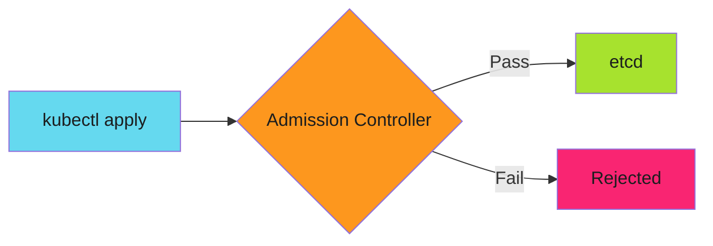

# Policy-as-Code with Kyverno: Kubernetes Validation at Admission Time

The deployment had no resource limits. Memory leaked. The node crashed. Three pods died.

The developer missed the requirement. Code review missed it. CI passed. Tests skip resource checks.

Admission control stops this. Before etcd. Before production. Before damage.

<!-- more -->

---

## The Problem with Documentation

README says "all deployments need resource limits." Nobody reads it. People forget. New hires miss it.

Documentation doesn't enforce.



Admission controllers validate before persistence. No limits? Rejected. No labels? Rejected. Wrong registry? Rejected.

Policy becomes code, not documentation.

!!! tip "Prevention at the Gate"
    Admission Controllers enforce policies before etcd. They block violations at the API boundary. Production never sees them.

---

## OPA vs Kyverno

Two options for Kubernetes policy enforcement:

### Open Policy Agent (OPA)

- **Language**: Rego (purpose-built policy language)
- **Scope**: General-purpose (K8s, APIs, cloud services, application logic)
- **Learning curve**: Steeper (new language, abstract concepts)
- **Use case**: Multi-platform policy enforcement across entire stack

### Kyverno

- **Language**: YAML + JMESPath (no new language to learn)
- **Scope**: Kubernetes-focused (admission control, CLI validation, mutations, generation)
- **Learning curve**: Gentler (if you know K8s YAML, you know Kyverno)
- **Use case**: Kubernetes policy enforcement with built-in K8s intelligence

**Both run in admission control, CI/CD, and local development.** The choice depends on scope:

- **Choose OPA** if you need policies across multiple platforms (databases, APIs, cloud IAM, service mesh)
- **Choose Kyverno** if your policies are Kubernetes-specific and you want native K8s resource awareness

Neither is "more powerful"—they target different problems.

---

## Shift Left: CI/CD and Local Validation

Kyverno isn't just runtime admission control. It runs **anywhere**:

### Local Development

Test policies before committing:

```bash
# Install Kyverno CLI
brew install kyverno

# Validate manifests locally
kyverno apply policy.yaml --resource deployment.yaml

# Test against all manifests in a directory
kyverno apply policies/ --resource manifests/
```

Developer catches violations **before** pushing to CI. Faster feedback loop.

### CI/CD Pipeline

Block deployments with policy violations:

```yaml
- name: Validate with Kyverno
  run: |
    kyverno apply policies/ --resource k8s/
    if [ $? -ne 0 ]; then
      echo "Policy violations detected. Fix before merging."
      exit 1
    fi
```

PR can't merge with policy violations. Same policies, different enforcement points.

### Kyverno Playground

Experiment without installing anything: **[playground.kyverno.io](https://playground.kyverno.io/)**

- Write policies in browser
- Test against sample resources
- Share examples with team
- Learn policy syntax interactively

!!! tip "Three Enforcement Points"
    Run the same Kyverno policies in three places: locally (fast feedback), CI/CD (PR gate), and runtime (final defense). Each layer catches what developers miss.

---

## Implementation Guide

Kyverno enforces policies at multiple layers:

- **[Kyverno Basics](../../developer-guide/sdlc-hardening/policy-as-code/kyverno/index.md)** - Installation, validation policies, audit vs enforce modes
- **[Policy Patterns](../../developer-guide/sdlc-hardening/policy-as-code/kyverno/policy-patterns.md)** - Resource limits, image provenance, required labels, mutations
- **[Testing and Exceptions](../../developer-guide/sdlc-hardening/policy-as-code/kyverno/testing-approaches.md)** - Policy testing, exception management, troubleshooting
- **[CI/CD Integration](../../developer-guide/sdlc-hardening/policy-as-code/kyverno/ci-cd-integration.md)** - Pre-deploy validation, monitoring, policy lifecycle

---

## The Stack

Policy enforcement is layered. **Kyverno runs at three of these layers**:

1. **Pre-commit hooks** - Block forbidden tech before commit
2. **Local validation** - `kyverno apply` in developer workflow
3. **CI validation** - Kyverno CLI fails PR builds
4. **Admission control** - Kyverno blocks at Kubernetes API
5. **Runtime enforcement** - Pod Security Standards, Network Policies

Same policies. Different enforcement points. Each layer catches what previous layers miss.

See [How to Harden Your SDLC Before the Audit Comes](2025-12-12-harden-sdlc-before-audit.md) for the full stack.

---

## Related Patterns

Policy-as-code is part of defense in depth:

- **[Pre-commit Hooks as Security Gates](2025-12-04-pre-commit-security-gates.md)** - Block at commit time
- **[SDLC Hardening](2025-12-12-harden-sdlc-before-audit.md)** - Build security into pipelines
- Zero-Vulnerability Container Pipelines (coming soon)

---

*The deployment without resource limits never reached etcd. Kyverno rejected it at admission. The node never crashed. The incident never happened.*
