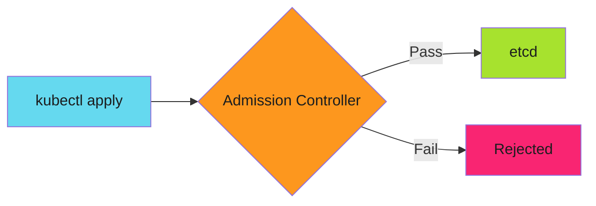

# Policy-as-Code with Kyverno: Kubernetes Validation at Admission Time

The deployment reached production with no resource limits. Memory leaked. The node crashed. Three other pods died.

The developer didn't know limits were required. The code review missed it. CI passed because tests don't check resource configs.

Admission controllers stop this at the boundary. Before etcd. Before production. Before the incident.

<!-- more -->

---

## The Problem with Documentation

README says "all deployments must have resource limits." Nobody reads it. Or they read it and forget. Or they're new and don't know it exists.

Documentation doesn't enforce anything.



Admission controllers validate resources before they're persisted. No limits? Rejected. No labels? Rejected. Wrong image registry? Rejected.

Policy becomes code, not documentation.

---

## OPA vs Kyverno

Two main options for policy enforcement:

**Open Policy Agent (OPA)**
- General-purpose policy engine
- Rego language (new language to learn)
- Works everywhere (K8s, CI/CD, APIs)
- More powerful, more complex

**Kyverno**
- Kubernetes-native
- YAML policies (same as manifests)
- Built for K8s admission control
- Simpler learning curve

For Kubernetes-only enforcement, Kyverno wins on simplicity.

---

## Basic Kyverno Policy

Require resource limits on all deployments:

```yaml
apiVersion: kyverno.io/v1
kind: ClusterPolicy
metadata:
  name: require-resource-limits
spec:
  validationFailureAction: Enforce
  background: true
  rules:
    - name: check-resource-limits
      match:
        any:
          - resources:
              kinds:
                - Deployment
      validate:
        message: "Resource limits are required for all containers"
        pattern:
          spec:
            template:
              spec:
                containers:
                  - resources:
                      limits:
                        memory: "?*"
                        cpu: "?*"
```

Try to deploy without limits:

```bash
$ kubectl apply -f deployment.yaml
Error from server: admission webhook "validate.kyverno.svc-fail" denied the request:

policy Deployment/default/api for resource violation:

require-resource-limits:
  check-resource-limits: validation error: Resource limits are required for all containers
```

Deployment blocked. Policy enforced.

---

## Image Provenance

Only allow images from approved registries:

```yaml
apiVersion: kyverno.io/v1
kind: ClusterPolicy
metadata:
  name: restrict-image-registries
spec:
  validationFailureAction: Enforce
  rules:
    - name: validate-registries
      match:
        any:
          - resources:
              kinds:
                - Pod
      validate:
        message: "Images must come from gcr.io or pkg.dev registries"
        pattern:
          spec:
            containers:
              - image: "gcr.io/* | *.pkg.dev/*"
```

Blocks Docker Hub, public registries, unverified sources.

---

## Required Labels

Enforce labeling standards for cost allocation and observability:

```yaml
apiVersion: kyverno.io/v1
kind: ClusterPolicy
metadata:
  name: require-labels
spec:
  validationFailureAction: Enforce
  rules:
    - name: check-labels
      match:
        any:
          - resources:
              kinds:
                - Deployment
                - StatefulSet
                - DaemonSet
      validate:
        message: "Required labels: team, environment, cost-center"
        pattern:
          metadata:
            labels:
              team: "?*"
              environment: "production | staging | development"
              cost-center: "?*"
```

No cost-center label? Deployment fails.

---

## Mutation Policies

Kyverno can also modify resources automatically:

```yaml
apiVersion: kyverno.io/v1
kind: ClusterPolicy
metadata:
  name: add-default-network-policy
spec:
  rules:
    - name: add-network-policy
      match:
        any:
          - resources:
              kinds:
                - Namespace
      generate:
        kind: NetworkPolicy
        name: default-deny
        namespace: "{{request.object.metadata.name}}"
        data:
          spec:
            podSelector: {}
            policyTypes:
              - Ingress
              - Egress
```

Every new namespace automatically gets a default-deny network policy. Security by default.

---

## Testing Policies

Test before production using Kyverno CLI:

```bash
# Install kyverno CLI
brew install kyverno

# Test policy against manifest
kyverno apply policy.yaml --resource deployment.yaml

# Expected output
Applying 1 policy to 1 resource...
policy require-resource-limits -> resource Deployment/default/api failed
```

Integration test in CI:

```yaml
# .github/workflows/policy-test.yml
- name: Test Kyverno policies
  run: |
    for policy in policies/*.yaml; do
      kyverno apply $policy \
        --resource manifests/valid/ \
        || exit 1

      ! kyverno apply $policy \
        --resource manifests/invalid/ \
        || exit 1
    done
```

Valid manifests must pass. Invalid must fail.

---

## Exception Management

Not every rule applies everywhere:

```yaml
apiVersion: kyverno.io/v1
kind: ClusterPolicy
metadata:
  name: require-resource-limits
spec:
  validationFailureAction: Enforce
  rules:
    - name: check-resource-limits
      match:
        any:
          - resources:
              kinds:
                - Deployment
      exclude:
        any:
          - resources:
              namespaces:
                - kube-system
                - monitoring
      validate:
        message: "Resource limits required"
        pattern:
          spec:
            template:
              spec:
                containers:
                  - resources:
                      limits:
                        memory: "?*"
```

System namespaces excluded. Application namespaces enforced.

---

## Audit Mode vs Enforce Mode

Roll out policies in audit mode first:

```yaml
spec:
  validationFailureAction: Audit  # Log violations, don't block
```

Check logs for violations:

```bash
kubectl get policyreport -A

NAMESPACE   NAME                          PASS   FAIL   WARN   ERROR   SKIP
default     polr-ns-default              12     3      0      0       0
production  polr-ns-production           45     1      0      0       0
```

Fix violations. Then switch to Enforce:

```yaml
spec:
  validationFailureAction: Enforce  # Block violations
```

---

## Real Policies from Production

### Prevent Privilege Escalation

```yaml
apiVersion: kyverno.io/v1
kind: ClusterPolicy
metadata:
  name: disallow-privilege-escalation
spec:
  validationFailureAction: Enforce
  rules:
    - name: check-privilege-escalation
      match:
        any:
          - resources:
              kinds:
                - Pod
      validate:
        message: "Privilege escalation is not allowed"
        pattern:
          spec:
            containers:
              - securityContext:
                  allowPrivilegeEscalation: false
```

### Require Read-Only Root Filesystem

```yaml
apiVersion: kyverno.io/v1
kind: ClusterPolicy
metadata:
  name: require-ro-rootfs
spec:
  validationFailureAction: Enforce
  rules:
    - name: check-ro-rootfs
      match:
        any:
          - resources:
              kinds:
                - Pod
      validate:
        message: "Root filesystem must be read-only"
        pattern:
          spec:
            containers:
              - securityContext:
                  readOnlyRootFilesystem: true
```

### Drop All Capabilities

```yaml
apiVersion: kyverno.io/v1
kind: ClusterPolicy
metadata:
  name: drop-all-capabilities
spec:
  validationFailureAction: Enforce
  rules:
    - name: check-capabilities
      match:
        any:
          - resources:
              kinds:
                - Pod
      validate:
        message: "All capabilities must be dropped"
        pattern:
          spec:
            containers:
              - securityContext:
                  capabilities:
                    drop:
                      - ALL
```

---

## Policy Lifecycle

**Phase 1: Inventory**

Identify what should be policy:
- Recurring code review feedback
- Production incidents (no limits, wrong registry)
- Compliance requirements (pod security standards)
- Security best practices (drop capabilities, read-only fs)

**Phase 2: Audit**

Deploy policies in audit mode:
- Log violations without blocking
- Measure scope (how many resources fail?)
- Identify legitimate exceptions
- Communicate with teams

**Phase 3: Remediation**

Fix existing violations:
- Update manifests
- Add required labels
- Set resource limits
- Change image registries

**Phase 4: Enforce**

Switch to enforce mode:
- New resources must comply
- Exceptions documented
- Policy violations block deployment

**Phase 5: Maintain**

Ongoing policy management:
- Review policy reports monthly
- Update policies for new requirements
- Remove obsolete policies
- Track compliance metrics

---

## Integration with CI/CD

Pre-flight validation before kubectl apply:

```yaml
# .github/workflows/deploy.yml
jobs:
  validate:
    runs-on: ubuntu-latest
    steps:
      - uses: actions/checkout@v4

      - name: Install Kyverno CLI
        run: |
          curl -LO https://github.com/kyverno/kyverno/releases/download/v1.11.0/kyverno-cli_v1.11.0_linux_x86_64.tar.gz
          tar -xzf kyverno-cli_v1.11.0_linux_x86_64.tar.gz
          sudo mv kyverno /usr/local/bin/

      - name: Validate against policies
        run: |
          kyverno apply policies/ \
            --resource manifests/ \
            --policy-report

      - name: Upload policy report
        uses: actions/upload-artifact@v4
        with:
          name: policy-report
          path: policy-report.yaml
```

Catch violations before deploy, not after.

---

## Monitoring and Alerting

Track policy violations in Prometheus:

```yaml
# ServiceMonitor for Kyverno metrics
apiVersion: monitoring.coreos.com/v1
kind: ServiceMonitor
metadata:
  name: kyverno
spec:
  selector:
    matchLabels:
      app: kyverno
  endpoints:
    - port: metrics
```

Alert on spike in violations:

```yaml
alert: HighPolicyViolationRate
expr: rate(kyverno_policy_results_total{result="fail"}[5m]) > 10
annotations:
  summary: "High rate of policy violations"
```

---

## Common Pitfalls

### Pitfall 1: Too Strict Too Fast

Rolling out strict policies in enforce mode causes deployment failures. Start with audit.

### Pitfall 2: Forgetting Background Processing

```yaml
spec:
  background: true  # Apply to existing resources, not just new ones
```

Without this, existing violations persist.

### Pitfall 3: No Exception Process

Teams need a path for legitimate exceptions. Document it.

### Pitfall 4: Regex in Policies

Complex regex patterns are hard to test and maintain. Keep patterns simple.

---

## The Stack

Policy enforcement is layered:

1. **Pre-commit hooks** - Block forbidden tech before commit
2. **CI validation** - Kyverno CLI tests manifests
3. **Admission control** - Kyverno blocks invalid resources
4. **Runtime enforcement** - Pod Security Standards, Network Policies

Each layer catches what previous layers miss.

See [How to Harden Your SDLC Before the Audit Comes](2025-12-12-harden-sdlc-before-audit.md) for the full stack.

---

## Related Patterns

Policy-as-code is part of defense in depth:

- **[Pre-commit Hooks as Security Gates](2025-12-04-pre-commit-security-gates.md)** - Block at commit time
- **[SDLC Hardening](2025-12-12-harden-sdlc-before-audit.md)** - Build security into pipelines
- Zero-Vulnerability Container Pipelines (coming soon)

---

*The deployment without resource limits never reached etcd. Kyverno rejected it at admission. The node never crashed. The incident never happened.*
