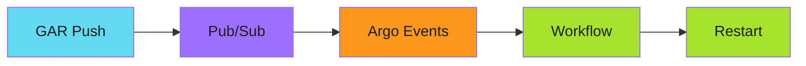
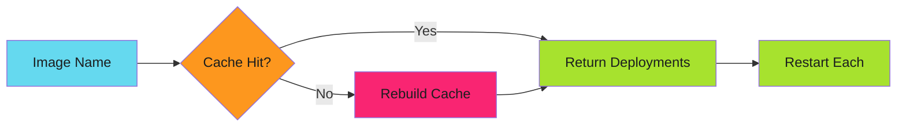

# Event-Driven Deployments with Argo: The Journey to Zero-Latency Automation

The [From 5 Seconds to 5 Milliseconds](2025-11-29-from-5-seconds-to-5-milliseconds.md) post showed how caching eliminated cluster scans. But that was only half the story. The real magic happens in how events flow through the system.

This is that story.

<!-- more -->

---

## The Polling Problem

I remember watching Jenkins poll SCM every minute. Every sixty seconds, a request. Usually returning "no changes." Sometimes multiple jobs polling the same repo at the same time.

ArgoCD syncs on a timer. Flux polls Git repositories. Every CD tool I'd used was fundamentally reactive to a clock, not to reality.

The waste bothered me. Not the compute cycles—those are cheap. The latency. The best-case response time is half your poll interval. Push at the wrong moment and you wait almost a full interval for the system to notice.

But what really broke me was scale. More repositories meant more API calls. The polling load grew linearly with the number of things you wanted to watch. At some point, you're spending more resources asking "anything new?" than actually doing the work.

---

## The Shift to Events

Google Artifact Registry publishes events to Pub/Sub when images are pushed. The notification exists. The information is already flowing. Why would I poll for something that's being announced?

That question changed everything.

Instead of asking "has anything changed?" every minute, I could say "tell me when something changes." The system would react in milliseconds, not minutes. And the load would scale with events, not time.

---

## Building the Pipeline

The architecture emerged piece by piece:

**Artifact Registry** publishes to **Pub/Sub** on every image push. **Argo Events** subscribes and normalizes the event. An **Argo Workflow** executes the restart logic.

Simple in concept. The devil was in the details.

---

## The EventSource Discovery

Argo Events has an EventSource abstraction that connects to external systems. The Pub/Sub integration worked out of the box—mostly.

The first version silently dropped events. No errors, no logs. Just... nothing happened.

The problem? JSON parsing. GAR events have a specific structure. The EventSource needed `jsonBody: true` to parse them correctly. One missing line in the configuration meant complete silence.

I spent two hours staring at logs before finding it. The events were arriving, being marked as delivered, and getting discarded because they couldn't be parsed.

!!! tip "Lesson Learned"
    When debugging event pipelines, check every stage. Silent failures at the parsing layer look identical to events never arriving.

---

## The NATS EventBus Revelation

Between EventSource and Sensor sits the EventBus. Initially I used the default Jetstream configuration. Events flowed. Life was good.

Then I restarted a pod during an image push storm.

Events vanished. Not delivered late—gone. The EventBus wasn't persisting them. When the subscriber reconnected, the events it missed were already garbage collected.

The fix was persistence. NATS with storage. Events survive pod restarts. The system recovers from failures without losing work.

!!! warning "The Hidden Danger"
    Default EventBus configurations optimize for simplicity, not reliability. Production deployments need persistence.

---

## The Cache Integration

The workflow receives an image name. It needs to find deployments using that image.

The naive approach: scan the cluster. That's what V1 did. It took 5-10 seconds and hammered the API server.

The cache integration was the breakthrough. Mount the ConfigMap as a volume. Read the deployment list from disk. Zero API calls. Millisecond lookups.

The cache rebuilds on miss. Most of the time, it hits. The rare misses trigger a full scan, but that's acceptable because they're rare.

---

## The Failure Modes

Every distributed system fails. The question is how.

**Network partitions** between components cause delays, not data loss. NATS buffers events until they can be delivered.

**Workflow failures** get retried with exponential backoff. Transient API rate limits resolve themselves.

**Cache staleness** is handled by rebuild-on-miss. The system self-heals.

**Persistent failures** go to a dead letter queue. I can inspect, fix, and replay them later. Nothing gets silently dropped.

The first version had none of this. Events that failed just... failed. I'd notice hours later when a deployment wasn't updated. Building in observability and recovery was as important as building the happy path.

---

## The Results

From image push to deployment restart:

| Phase | V1 (Polling) | V2 (Events) |
|-------|--------------|-------------|
| Detection | 30-60s | <1s |
| Lookup | 5-10s | <5ms |
| Restart | 1-2s | 1-2s |
| **Total** | **36-72s** | **<3s** |

But the real win wasn't latency. It was resource usage.

The polling approach scaled with time and cluster size. More deployments meant more polling. More frequently you wanted updates, more load on the API server.

The event-driven approach scales with events. No changes? No work. A burst of image pushes? A burst of workflows. The system does exactly as much work as there is work to do.

---

## What I'd Do Differently

If I were starting over:

**Start with events.** Don't build a polling system and migrate later. The architectural assumptions are different enough that retrofitting is painful.

**Design for observability first.** The event pipeline had three components before I added metrics. That was a mistake. I couldn't tell where failures were happening.

**Test failure modes early.** Kill pods during event processing. Inject network latency. Break things before production breaks them for you.

---

## What's Next

This blog post tells the story. The implementation details—YAML manifests, Go code, RBAC configurations—live in the developer guide:

!!! info "Deep Dives"

    - **[Argo Events Setup Guide](../../operator-manual/argo-events/setup/index.md)**: EventSource, EventBus, and Sensor configuration
    - **[ConfigMap as Cache Pattern](../../developer-guide/efficiency-patterns/idempotency/caches.md)**: Volume mounts for zero-API reads
    - **[Argo Workflows Patterns](../../developer-guide/argo-workflows/index.md)**: WorkflowTemplate design and error handling

See the [Roadmap](../../roadmap.md) for upcoming patterns and operator manual entries.

---

*From image push to deployment restart in under 3 seconds. No polling. No manual steps. Just events flowing through a purpose-built pipeline.*
