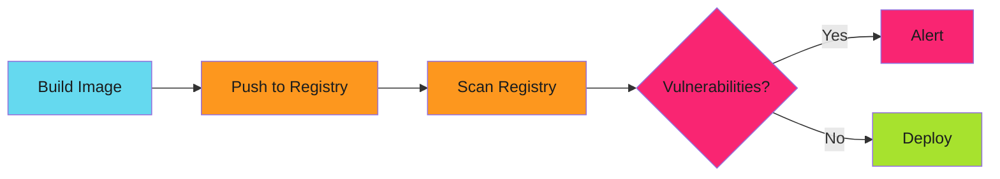
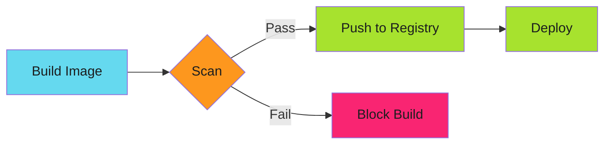

# Zero-Vulnerability Container Pipelines: Scanning Before Build

The container was already in production when the CVE dropped. CRITICAL severity. Remote code execution. The image was still tagged `latest` in the registry.

Nobody knew which deployments used it. The scan happened after push. The vulnerability lived in production for six hours.

This is the pattern that stops CVEs before they reach the registry.

<!-- more -->

---

## The Problem with Post-Push Scanning

Most container security looks like this:



Vulnerable image is already in the registry. Alert fires. Developer gets a ticket. Days later, maybe it gets fixed.

Meanwhile, the vulnerable image is available for deployment.

---

## Shift Left: Scan Before Push



Vulnerable image never reaches the registry. CI fails. Developer fixes it before merge.

Zero vulnerable images in production.

---

## Trivy Integration

Trivy scans container images for vulnerabilities:

```yaml
# .github/workflows/build.yml
name: Build and Scan

on:
  pull_request:
    branches: [main]

jobs:
  build-and-scan:
    runs-on: ubuntu-latest
    steps:
      - uses: actions/checkout@v4

      - name: Build image
        run: |
          buildah bud -t app:${{ github.sha }} .

      - name: Scan for vulnerabilities
        uses: aquasecurity/trivy-action@master
        with:
          image-ref: app:${{ github.sha }}
          format: 'table'
          exit-code: '1'
          severity: 'CRITICAL,HIGH'

      - name: Push image (only if scan passes)
        if: success()
        run: |
          buildah push app:${{ github.sha }} \
            gcr.io/project/app:${{ github.sha }}
```

HIGH or CRITICAL vulnerability? Build fails. Image never pushes.

---

## Severity Thresholds

Not all vulnerabilities block builds:

| Severity | Action | Rationale |
|----------|--------|-----------|
| CRITICAL | Block | Remote exploits, privilege escalation |
| HIGH | Block | Significant security impact |
| MEDIUM | Warn | Log but don't block |
| LOW | Ignore | Noise, minimal risk |

Configure in trivy:

```yaml
- name: Scan with Trivy
  run: |
    trivy image \
      --severity CRITICAL,HIGH \
      --exit-code 1 \
      app:${{ github.sha }}
```

---

## Base Image Strategy

The base image determines 80% of your vulnerabilities.

**Bad: Default OS base**

```dockerfile
FROM ubuntu:22.04
RUN apt-get update && apt-get install -y python3
COPY app.py /app/
CMD ["python3", "/app/app.py"]
```

Trivy findings: 47 vulnerabilities (12 HIGH, 2 CRITICAL)

**Better: Minimal base**

```dockerfile
FROM python:3.11-slim
COPY app.py /app/
CMD ["python3", "/app/app.py"]
```

Trivy findings: 18 vulnerabilities (3 HIGH, 0 CRITICAL)

**Best: Distroless**

```dockerfile
FROM gcr.io/distroless/python3
COPY app.py /app/
CMD ["/app/app.py"]
```

Trivy findings: 0 vulnerabilities

Distroless images contain only your app and runtime dependencies. No shell, no package manager, minimal attack surface.

---

## Multi-Stage Builds for Clean Finals

Build dependencies don't belong in runtime images:

```dockerfile
# Build stage
FROM golang:1.21 AS builder
WORKDIR /build
COPY . .
RUN go build -o app .

# Runtime stage
FROM gcr.io/distroless/base-debian12
COPY --from=builder /build/app /app
ENTRYPOINT ["/app"]
```

Builder stage: 200+ packages, build tools, headers
Runtime stage: Just the binary

Trivy scan targets the runtime stage only.

---

## Exception Management

Not every HIGH vulnerability is exploitable in your context:

```yaml
# .trivyignore
# CVE-2023-12345: DoS in HTTP library
# We don't expose HTTP directly, behind Envoy proxy
# Re-evaluate when library updates
CVE-2023-12345

# CVE-2023-67890: Privilege escalation in sudo
# Distroless image has no sudo
CVE-2023-67890
```

Document WHY each exception exists. Review quarterly.

---

## SBOM Generation

Software Bill of Materials proves what's in your images:

```yaml
- name: Generate SBOM
  uses: anchore/sbom-action@v0
  with:
    image: app:${{ github.sha }}
    format: cyclonedx-json
    output-file: sbom.json

- name: Upload SBOM
  uses: actions/upload-artifact@v4
  with:
    name: sbom-${{ github.sha }}
    path: sbom.json
```

SBOM lists every package, version, license. Critical for:

- Audit compliance
- Supply chain security
- Vulnerability response (which images have log4j?)

See [SDLC Hardening](2025-12-12-harden-sdlc-before-audit.md) for audit integration.

---

## Continuous Scanning

Images safe today might be vulnerable tomorrow when new CVEs drop:

```yaml
# .github/workflows/scan-registry.yml
name: Continuous Scan

on:
  schedule:
    - cron: '0 6 * * *'  # Daily at 6am

jobs:
  scan-registry:
    runs-on: ubuntu-latest
    steps:
      - name: Scan all production images
        run: |
          for image in $(gcloud container images list --repository=gcr.io/project); do
            trivy image \
              --severity CRITICAL,HIGH \
              --exit-code 0 \
              --format json \
              --output scan-results.json \
              $image

            # Parse results, file issues for vulnerabilities
            if jq -e '.Results[].Vulnerabilities | length > 0' scan-results.json; then
              gh issue create \
                --title "Vulnerabilities in $image" \
                --body "$(cat scan-results.json)"
            fi
          done
```

New CVE drops? Issue created automatically. Team knows which images need rebuilds.

---

## Grype as Alternative

Grype offers similar functionality with different tradeoffs:

```yaml
- name: Scan with Grype
  uses: anchore/scan-action@v3
  with:
    image: app:${{ github.sha }}
    fail-build: true
    severity-cutoff: high
```

**Trivy vs Grype:**

| Feature | Trivy | Grype |
|---------|-------|-------|
| Speed | Faster | Slower |
| Database | Multiple sources | Anchore feeds |
| License scanning | Yes | Yes |
| Config scanning | Yes (K8s, Terraform) | No |
| Maintainer | Aqua Security | Anchore |

Both work. Trivy has broader scanning (not just containers).

---

## Policy Enforcement with Kyverno

Verify scanned images in admission control:

```yaml
apiVersion: kyverno.io/v1
kind: ClusterPolicy
metadata:
  name: require-scanned-images
spec:
  validationFailureAction: Enforce
  rules:
    - name: check-image-signature
      match:
        any:
          - resources:
              kinds:
                - Pod
      verifyImages:
        - imageReferences:
            - "gcr.io/project/*"
          attestors:
            - entries:
                - keys:
                    publicKeys: |-
                      -----BEGIN PUBLIC KEY-----
                      ...
                      -----END PUBLIC KEY-----
```

Only signed, scanned images can deploy.

See [Policy-as-Code with Kyverno](2025-12-13-policy-as-code-kyverno.md) for admission control patterns.

---

## Breaking Builds Without Breaking Teams

Developers hate blocked builds. Make it easy to fix:

**1. Show exact vulnerability**

```yaml
- name: Scan and report
  run: |
    trivy image \
      --format table \
      --severity CRITICAL,HIGH \
      app:${{ github.sha }} \
      | tee scan-results.txt

    if [ $? -ne 0 ]; then
      echo "::error::Vulnerabilities found. See scan results above."
      echo "::notice::Fix by updating base image or pinning versions."
      exit 1
    fi
```

**2. Suggest fix**

```text
❌ Build failed: CRITICAL vulnerability CVE-2023-12345 in libssl

Fix options:
1. Update base image: python:3.11-slim → python:3.11.7-slim
2. Pin package version in requirements.txt
3. Add to .trivyignore with justification

Documentation: https://...
```

**3. Document exception process**

Make it clear when `.trivyignore` is acceptable and when it's not.

---

## Metrics and Dashboards

Track vulnerability prevention:

```yaml
# Export to Prometheus
- name: Export metrics
  run: |
    trivy image \
      --format json \
      app:${{ github.sha }} \
      > results.json

    CRITICAL=$(jq '[.Results[].Vulnerabilities[] | select(.Severity=="CRITICAL")] | length' results.json)
    HIGH=$(jq '[.Results[].Vulnerabilities[] | select(.Severity=="HIGH")] | length' results.json)

    curl -X POST metrics-endpoint \
      -d "vulnerabilities{severity=\"critical\"} $CRITICAL"
    curl -X POST metrics-endpoint \
      -d "vulnerabilities{severity=\"high\"} $HIGH"
```

Dashboard shows:

- Vulnerabilities blocked per week
- Time to remediate HIGH findings
- Exception count (rising = problem)
- Base image update lag

---

## The Before/After Comparison

| Aspect | Post-Push Scanning | Pre-Push Scanning |
|--------|-------------------|-------------------|
| When found | After in registry | Before push |
| Vulnerable images | Can be deployed | Never reach registry |
| Developer feedback | Days later (ticket) | Immediate (CI failure) |
| Audit evidence | "We scan regularly" | "Vulnerable images blocked" |
| Response time | Hours to days | Seconds (auto-fail) |

---

## Implementation Checklist

Rolling out zero-vulnerability pipelines:

1. **Choose scanner** - Trivy or Grype
2. **Select base images** - Distroless where possible
3. **Set severity threshold** - CRITICAL + HIGH to start
4. **Integrate in CI** - Scan before push
5. **Document exceptions** - `.trivyignore` with rationale
6. **Generate SBOMs** - Every build
7. **Continuous scanning** - Daily registry scans
8. **Track metrics** - Vulnerabilities blocked, remediation time
9. **Team training** - How to fix findings, when to ignore

---

## Common Pitfalls

### Pitfall 1: Scanning After Push

Defeats the purpose. Scan before push, not after.

### Pitfall 2: Trusting `latest` Tags

```dockerfile
FROM python:latest  # Which version? When scanned?
```

Pin versions:

```dockerfile
FROM python:3.11.7-slim  # Explicit, scannable
```

### Pitfall 3: Ignoring MEDIUM Severity

MEDIUM today might be HIGH tomorrow. Track them.

### Pitfall 4: No Exception Review

Exceptions accumulate. Review quarterly. Remove stale ignores.

---

## The Full Stack

Container security is layered:

1. **Base image selection** - Start with minimal images
2. **Build-time scanning** - Block before push (this post)
3. **Admission control** - [Kyverno](2025-12-13-policy-as-code-kyverno.md) verifies images
4. **Runtime security** - Pod Security Standards, AppArmor, seccomp
5. **Continuous scanning** - Catch new CVEs in existing images

Each layer complements the others.

---

## Related Patterns

Zero-vulnerability pipelines fit into broader SDLC hardening:

- **[SDLC Hardening](2025-12-12-harden-sdlc-before-audit.md)** - Build security into pipelines
- **[Policy-as-Code with Kyverno](2025-12-13-policy-as-code-kyverno.md)** - Admission control for images
- **[Pre-commit Hooks as Security Gates](2025-12-04-pre-commit-security-gates.md)** - Catch issues before commit

---

*The CRITICAL CVE never reached production. Trivy blocked the build. The developer updated the base image. The pipeline turned green. Zero vulnerabilities deployed.*
