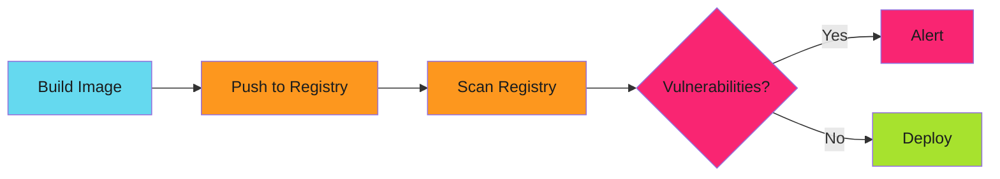
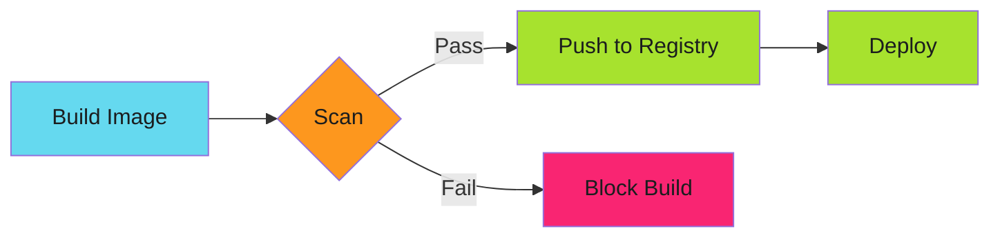

# Zero-Vulnerability Container Pipelines: Scanning Before Build

The CVE dropped. The container was in production. CRITICAL severity. Remote code execution. Tagged `latest`.

Nobody knew which deployments used it. Scanning happened post-push. The flaw lived in production six hours.

This is the pattern that stops CVEs before they reach the registry.

<!-- more -->

---

## The Problem with Post-Push Scanning

Most container security looks like this:



Vulnerable image is in the registry. Alert fires. Developer gets a ticket. Days pass. Maybe it gets fixed.

The vulnerable image remains available for deployment.

---

## Shift Left: Scan Before Push



Vulnerable image never reaches the registry. CI fails. Developer fixes it before merge.

Zero vulnerable images in production.

!!! warning "Prevention Beats Detection"
    Scanning after push means vulnerable images already exist in the registry. Shift left to block them at build time, before they can reach production.

---

## Trivy Integration

Trivy scans container images for vulnerabilities:

```yaml
# .github/workflows/build.yml
name: Build and Scan

on:
  pull_request:
    branches: [main]

jobs:
  build-and-scan:
    runs-on: ubuntu-latest
    steps:
      - uses: actions/checkout@v4

      - name: Build image
        run: |
          buildah bud -t app:${{ github.sha }} .

      - name: Scan for vulnerabilities
        uses: aquasecurity/trivy-action@master
        with:
          image-ref: app:${{ github.sha }}
          format: 'table'
          exit-code: '1'
          severity: 'CRITICAL,HIGH'

      - name: Push image (only if scan passes)
        if: success()
        run: |
          buildah push app:${{ github.sha }} \
            gcr.io/project/app:${{ github.sha }}
```

HIGH or CRITICAL vulnerability? Build fails. Image never pushes.

---

## Severity Thresholds

Not all vulnerabilities block builds:

| Severity | Action | Rationale |
| -------- | ------ | --------- |
| CRITICAL | Block | Remote exploits, privilege escalation |
| HIGH | Block | Significant security impact |
| MEDIUM | Warn | Log but don't block |
| LOW | Ignore | Noise, minimal risk |

Configure in trivy:

```yaml
- name: Scan with Trivy
  run: |
    trivy image \
      --severity CRITICAL,HIGH \
      --exit-code 1 \
      app:${{ github.sha }}
```

---

## Base Image Strategy

The base image determines 80% of your vulnerabilities.

### Default OS base (Bad)

```dockerfile
FROM ubuntu:22.04
RUN apt-get update && apt-get install -y python3
COPY app.py /app/
CMD ["python3", "/app/app.py"]
```

Trivy findings: 47 vulnerabilities (12 HIGH, 2 CRITICAL)

### Minimal base (Better)

```dockerfile
FROM python:3.11-slim
COPY app.py /app/
CMD ["python3", "/app/app.py"]
```

Trivy findings: 18 vulnerabilities (3 HIGH, 0 CRITICAL)

### Distroless (Best)

```dockerfile
FROM gcr.io/distroless/python3
COPY app.py /app/
CMD ["/app/app.py"]
```

Trivy findings: 0 vulnerabilities

Distroless images contain only your app and runtime dependencies. No shell, no package manager, minimal attack surface.

---

## Multi-Stage Builds for Clean Finals

Build dependencies don't belong in runtime images:

---

For complete implementation details including Trivy configuration, SBOM generation, and CI/CD integration, see **[Zero-Vulnerability Container Scanning Guide](../../secure/vulnerability-scanning/vulnerability-scanning.md)**.

---

## Related Patterns

- **[SDLC Hardening](2025-12-12-harden-sdlc-before-audit.md)** - Build security into pipelines
- **[Pre-commit Security Gates](2025-12-04-pre-commit-security-gates.md)** - Block at commit time
- **[Policy-as-Code with Kyverno](2025-12-13-policy-as-code-kyverno.md)** - Runtime admission control

---

*The critical vulnerability never shipped. Trivy caught it at build time. The image was blocked. Production stayed secure.*
