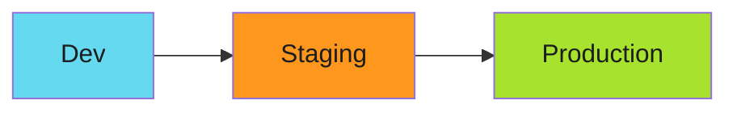
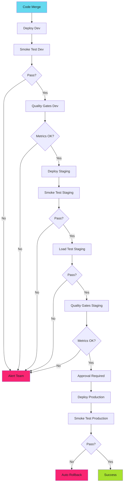

# Environment Progression Testing: Dev → Stage → Prod Validation

The deployment worked in dev. Passed all unit tests. Code review approved. Merged to main.

Production exploded.

The config that worked locally referenced a dev-only secret. The database migration that passed in testing hit a production-scale table lock. The feature flag was on in staging, off in prod.

Environmental differences killed us.

<!-- more -->

---

## The Illusion of "It Works on My Machine"

Every environment is different:



| Aspect | Dev | Staging | Production |
|--------|-----|---------|------------|
| Scale | 1 pod | 3 pods | 50 pods |
| Data | Synthetic | Sanitized prod copy | Real data |
| Secrets | Shared dev keys | Staging keys | Prod keys |
| Network | Permissive | Restricted | Locked down |
| Load | Developer testing | Automated tests | Real traffic |

Code that passes in dev can fail spectacularly in production because the environments aren't equivalent.

---

## Progressive Deployment Strategy

Test in each environment sequentially:

```yaml
# .github/workflows/deploy.yml
name: Progressive Deployment

on:
  push:
    branches: [main]

jobs:
  deploy-dev:
    runs-on: ubuntu-latest
    steps:
      - uses: actions/checkout@v4
      - name: Deploy to dev
        run: kubectl apply -f manifests/ -n development
      - name: Smoke test dev
        run: ./scripts/smoke-test.sh https://dev.example.com

  deploy-staging:
    needs: deploy-dev
    runs-on: ubuntu-latest
    steps:
      - uses: actions/checkout@v4
      - name: Deploy to staging
        run: kubectl apply -f manifests/ -n staging
      - name: Smoke test staging
        run: ./scripts/smoke-test.sh https://staging.example.com

  deploy-production:
    needs: deploy-staging
    runs-on: ubuntu-latest
    environment: production  # Requires approval
    steps:
      - uses: actions/checkout@v4
      - name: Deploy to production
        run: kubectl apply -f manifests/ -n production
      - name: Smoke test production
        run: ./scripts/smoke-test.sh https://example.com
```

Dev fails? No staging deploy. Staging fails? No production deploy.

---

## Smoke Tests That Matter

Smoke tests validate critical paths:

```bash
#!/usr/bin/env bash
# scripts/smoke-test.sh

set -euo pipefail

URL=$1

echo "Testing $URL"

# Health check
if ! curl -sf "$URL/healthz" > /dev/null; then
    echo "❌ Health check failed"
    exit 1
fi

# API responds
if ! curl -sf "$URL/api/version" | jq -e '.version' > /dev/null; then
    echo "❌ API version check failed"
    exit 1
fi

# Database connectivity
if ! curl -sf "$URL/api/db-status" | jq -e '.connected == true' > /dev/null; then
    echo "❌ Database connection failed"
    exit 1
fi

# Critical feature works
RESPONSE=$(curl -sf -X POST "$URL/api/test-action" -d '{"test": true}')
if ! echo "$RESPONSE" | jq -e '.success == true' > /dev/null; then
    echo "❌ Critical action failed"
    exit 1
fi

echo "✅ All smoke tests passed"
```

Not comprehensive tests. Just "is it alive and basically working?"

---

## Namespace Strategy

One cluster, multiple namespaces:

```yaml
# Namespace isolation
apiVersion: v1
kind: Namespace
metadata:
  name: development
  labels:
    environment: dev
---
apiVersion: v1
kind: Namespace
metadata:
  name: staging
  labels:
    environment: staging
---
apiVersion: v1
kind: Namespace
metadata:
  name: production
  labels:
    environment: prod
```

NetworkPolicies enforce isolation:

```yaml
apiVersion: networking.k8s.io/v1
kind: NetworkPolicy
metadata:
  name: deny-cross-environment
  namespace: production
spec:
  podSelector: {}
  policyTypes:
    - Ingress
    - Egress
  ingress:
    - from:
        - namespaceSelector:
            matchLabels:
              environment: prod
```

Production pods can't talk to dev pods. Environment boundaries enforced.

---

## Configuration Management

Same manifests, different configs:

```yaml
# base/deployment.yaml
apiVersion: apps/v1
kind: Deployment
metadata:
  name: api
spec:
  replicas: 1  # Override per environment
  template:
    spec:
      containers:
        - name: api
          image: gcr.io/project/api:IMAGE_TAG
          env:
            - name: DATABASE_URL
              valueFrom:
                secretKeyRef:
                  name: db-credentials
                  key: url
```

Kustomize overlays for each environment:

```yaml
# overlays/dev/kustomization.yaml
bases:
  - ../../base
namePrefix: dev-
namespace: development
replicas:
  - name: api
    count: 1
images:
  - name: gcr.io/project/api
    newTag: latest

# overlays/production/kustomization.yaml
bases:
  - ../../base
namePrefix: prod-
namespace: production
replicas:
  - name: api
    count: 10
images:
  - name: gcr.io/project/api
    newTag: v1.2.3  # Pinned version
```

Deploy:

```bash
kubectl apply -k overlays/dev
kubectl apply -k overlays/production
```

---

## Progressive Rollout with Argo CD

Argo CD automates the progression:

```yaml
# Application for dev
apiVersion: argoproj.io/v1alpha1
kind: Application
metadata:
  name: api-dev
spec:
  source:
    repoURL: https://github.com/org/manifests
    path: overlays/dev
  destination:
    namespace: development
  syncPolicy:
    automated:
      prune: true
      selfHeal: true

# Application for production
apiVersion: argoproj.io/v1alpha1
kind: Application
metadata:
  name: api-production
spec:
  source:
    repoURL: https://github.com/org/manifests
    path: overlays/production
  destination:
    namespace: production
  syncPolicy:
    automated:
      prune: false  # Manual approval required
      selfHeal: true
  syncOptions:
    - CreateNamespace=false
```

Dev auto-syncs. Production requires approval.

---

## Load Testing in Staging

Staging should simulate production load:

```yaml
# .github/workflows/load-test.yml
jobs:
  load-test:
    needs: deploy-staging
    runs-on: ubuntu-latest
    steps:
      - name: Run k6 load test
        run: |
          k6 run --vus 100 --duration 5m loadtest.js

# loadtest.js
import http from 'k6/http';
import { check, sleep } from 'k6';

export default function() {
  const res = http.get('https://staging.example.com/api/health');

  check(res, {
    'status is 200': (r) => r.status === 200,
    'response time < 500ms': (r) => r.timings.duration < 500,
  });

  sleep(1);
}
```

Staging handles 100 concurrent users for 5 minutes? Production probably can too.

---

## Database Migrations

Test migrations in staging with production-scale data:

```yaml
jobs:
  migrate-staging:
    needs: deploy-staging
    runs-on: ubuntu-latest
    steps:
      - name: Backup staging DB
        run: |
          pg_dump -h staging-db > backup.sql

      - name: Run migration
        run: |
          kubectl exec -n staging deploy/api -- /app/migrate

      - name: Verify migration
        run: |
          kubectl exec -n staging deploy/api -- /app/verify-schema

      - name: Smoke test after migration
        run: ./scripts/smoke-test.sh https://staging.example.com

  migrate-production:
    needs: migrate-staging
    environment: production
    runs-on: ubuntu-latest
    steps:
      - name: Backup production DB
        run: |
          pg_dump -h prod-db > backup-$(date +%Y%m%d).sql
          gsutil cp backup-*.sql gs://backups/

      - name: Run migration
        run: |
          kubectl exec -n production deploy/api -- /app/migrate
```

Migration works in staging? Confidence for production.

---

## Rollback Strategy

Every deployment needs a rollback plan:

```bash
# Rollback script
#!/usr/bin/env bash

NAMESPACE=$1
DEPLOYMENT=$2
REVISION=${3:-1}  # Default to previous revision

echo "Rolling back $DEPLOYMENT in $NAMESPACE to revision -$REVISION"

kubectl rollout undo deployment/$DEPLOYMENT \
  -n $NAMESPACE \
  --to-revision=$(($(kubectl rollout history deployment/$DEPLOYMENT -n $NAMESPACE | wc -l) - REVISION))

# Wait for rollback
kubectl rollout status deployment/$DEPLOYMENT -n $NAMESPACE

# Verify with smoke test
./scripts/smoke-test.sh https://$NAMESPACE.example.com
```

Automate rollback on smoke test failure:

```yaml
- name: Deploy to production
  run: kubectl apply -f manifests/ -n production

- name: Smoke test
  id: smoke
  run: ./scripts/smoke-test.sh https://example.com

- name: Rollback on failure
  if: failure() && steps.smoke.conclusion == 'failure'
  run: kubectl rollout undo deployment/api -n production
```

---

## Feature Flags for Progressive Rollout

Enable features progressively across environments:

```yaml
# Dev: all features on
feature_flags:
  new_ui: true
  beta_api: true
  experimental_cache: true

# Staging: beta features on
feature_flags:
  new_ui: true
  beta_api: true
  experimental_cache: false

# Production: stable features only
feature_flags:
  new_ui: true
  beta_api: false
  experimental_cache: false
```

New feature works in dev and staging before production sees it.

---

## Monitoring Across Environments

Track metrics in each environment:

```yaml
# Prometheus queries
# Dev error rate
rate(http_requests_total{namespace="development",status=~"5.."}[5m])

# Staging error rate
rate(http_requests_total{namespace="staging",status=~"5.."}[5m])

# Production error rate
rate(http_requests_total{namespace="production",status=~"5.."}[5m])
```

Alert when staging error rate spikes. Fix before production deploy.

---

## The Gatekeeper Pattern

Automated gates between environments:

```yaml
jobs:
  deploy-dev:
    steps:
      - run: deploy to dev
      - run: smoke test

  quality-gate-dev:
    needs: deploy-dev
    steps:
      - name: Check error rate
        run: |
          ERROR_RATE=$(curl -s prometheus/query?query=rate | jq '.value')
          if (( $(echo "$ERROR_RATE > 0.01" | bc -l) )); then
            echo "Error rate too high: $ERROR_RATE"
            exit 1
          fi

      - name: Check response time
        run: |
          P95=$(curl -s prometheus/query?query=p95 | jq '.value')
          if (( $(echo "$P95 > 500" | bc -l) )); then
            echo "P95 response time too high: $P95ms"
            exit 1
          fi

  deploy-staging:
    needs: quality-gate-dev
    steps:
      - run: deploy to staging
```

Metrics bad in dev? Staging doesn't deploy.

---

## The Full Progression



---

## Common Pitfalls

### Pitfall 1: Skipping Environments

"Just this once, deploy directly to prod." Never ends well.

### Pitfall 2: Staging Too Different from Production

Staging with 1 pod doesn't catch production race conditions at 50 pods.

### Pitfall 3: No Rollback Plan

If you can't rollback in 60 seconds, your deployment strategy is incomplete.

### Pitfall 4: Manual Smoke Tests

Automated smoke tests or they don't happen consistently.

---

## Implementation Checklist

Building environment progression:

1. **Define environments** - Dev, staging, production at minimum
2. **Namespace isolation** - NetworkPolicies enforce boundaries
3. **Configuration management** - Kustomize overlays or Helm values
4. **Smoke tests** - Automated validation at each stage
5. **Quality gates** - Metrics thresholds between environments
6. **Load testing** - Staging simulates production load
7. **Rollback automation** - Auto-rollback on smoke test failure
8. **Feature flags** - Progressive enablement across environments
9. **Monitoring** - Per-environment dashboards
10. **Approval gates** - Manual approval before production

---

## Related Patterns

Environment progression fits into SDLC hardening:

- **[SDLC Hardening](2025-12-12-harden-sdlc-before-audit.md)** - Build security into pipelines
- **[Zero-Vulnerability Pipelines](2025-12-15-zero-vulnerability-pipelines.md)** - Scan before each environment
- **[Policy-as-Code with Kyverno](2025-12-13-policy-as-code-kyverno.md)** - Enforce standards per environment

---

*The deployment that exploded in dev never reached staging. The migration that locked tables in staging never touched production. The config that worked in dev got caught in smoke tests. Zero production incidents from environmental differences.*
