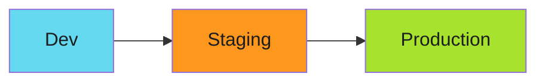

# Environment Progression Testing: Dev → Stage → Prod Validation

The deployment worked in dev. Unit tests passed. Code review approved. Merged to main.

Production exploded.

The config used a dev secret. Migration locked tables at scale. Feature flag on in staging. Off in prod.

Environmental differences killed us.

<!-- more -->

---

## The Illusion of "It Works on My Machine"

Every environment is different:



| Aspect | Dev | Staging | Production |
| ------ | --- | ------- | ---------- |
| Scale | 1 pod | 3 pods | 50 pods |
| Data | Synthetic | Sanitized prod copy | Real data |
| Secrets | Shared dev keys | Staging keys | Prod keys |
| Network | Permissive | Restricted | Locked down |
| Load | Developer testing | Automated tests | Real traffic |

Code passes in dev. It fails in production. The environments aren't the same.

!!! warning "Environmental Parity Problem"
    Dev, staging, and production are never identical. Progressive deployment catches issues early. Production never sees them.

---

## Progressive Deployment Strategy

Test in each environment sequentially:

```yaml
# .github/workflows/deploy.yml
name: Progressive Deployment

on:
  push:
    branches: [main]

jobs:
  deploy-dev:
    runs-on: ubuntu-latest
    steps:
      - uses: actions/checkout@v4
      - name: Deploy to dev
        run: kubectl apply -f manifests/ -n development
      - name: Smoke test dev
        run: ./scripts/smoke-test.sh https://dev.example.com

  deploy-staging:
    needs: deploy-dev
    runs-on: ubuntu-latest
    steps:
      - uses: actions/checkout@v4
      - name: Deploy to staging
        run: kubectl apply -f manifests/ -n staging
      - name: Smoke test staging
        run: ./scripts/smoke-test.sh https://staging.example.com

  deploy-production:
    needs: deploy-staging
    runs-on: ubuntu-latest
    environment: production  # Requires approval
    steps:
      - uses: actions/checkout@v4
      - name: Deploy to production
        run: kubectl apply -f manifests/ -n production
      - name: Smoke test production
        run: ./scripts/smoke-test.sh https://example.com
```

Dev fails? Staging blocked. Staging fails? Production blocked.

---

## Smoke Tests That Matter

Smoke tests validate critical paths:

```bash
#!/usr/bin/env bash
# scripts/smoke-test.sh

set -euo pipefail

URL=$1

echo "Testing $URL"

# Health check
if ! curl -sf "$URL/healthz" > /dev/null; then
    echo "❌ Health check failed"
    exit 1
fi

# API responds
if ! curl -sf "$URL/api/version" | jq -e '.version' > /dev/null; then
    echo "❌ API version check failed"
    exit 1
fi

# Database connectivity
if ! curl -sf "$URL/api/db-status" | jq -e '.connected == true' > /dev/null; then
    echo "❌ Database connection failed"
    exit 1
fi

# Critical feature works
RESPONSE=$(curl -sf -X POST "$URL/api/test-action" -d '{"test": true}')
if ! echo "$RESPONSE" | jq -e '.success == true' > /dev/null; then
    echo "❌ Critical action failed"
    exit 1
fi

echo "✅ All smoke tests passed"
```

Not comprehensive tests. Just basic health checks.

---

## Namespace Strategy

One cluster, multiple namespaces:

```yaml
# Namespace isolation
apiVersion: v1
kind: Namespace
metadata:
  name: development
  labels:
    environment: dev
---
apiVersion: v1
kind: Namespace
metadata:
  name: staging
  labels:
    environment: staging
---
apiVersion: v1
kind: Namespace
metadata:
  name: production
  labels:
    environment: prod
```

NetworkPolicies enforce isolation:

```yaml
apiVersion: networking.k8s.io/v1
kind: NetworkPolicy
metadata:
  name: deny-cross-environment
  namespace: production
spec:
  podSelector: {}
  policyTypes:
    - Ingress
    - Egress
  ingress:
    - from:
        - namespaceSelector:
            matchLabels:
              environment: prod
```

Production pods can't talk to dev pods. Boundaries enforced.

---

## Configuration Management

---

See **[Environment Progression Testing Guide](../../patterns/architecture/environment-progression.md)** for:

- Argo CD configurations
- Smoke test patterns
- Namespace strategies

---

## Related Patterns

- **[Strangler Fig Pattern](../../patterns/architecture/strangler-fig/index.md)** - Incremental system migration
- **[SDLC Hardening](2025-12-12-harden-sdlc-before-audit.md)** - Security across environments
- **[Policy-as-Code](2025-12-13-policy-as-code-kyverno.md)** - Runtime validation

---

*The staging environment caught the breaking change. Production never saw it. The deployment succeeded. The customers never knew.*
