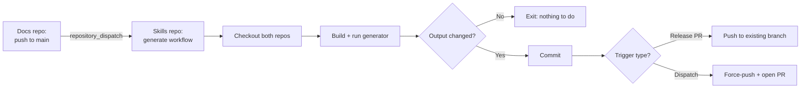

# CI Automation

Regenerating skills automatically when documentation changes, across two repositories, without a human in the loop.

## The Cross-Repository Problem

The documentation and the generated skills live in separate repositories. A push to the docs repository must reach the skills repository, which then checks out both, runs the generator, and publishes the result.



## Triggers

Three entry points, each serving a different need:

```yaml
on:
  workflow_dispatch:
  repository_dispatch:
    types: [docs-updated]
  pull_request:
    branches: [main]
    types: [opened, synchronize]
```

`repository_dispatch` is the cross-repository signal. `workflow_dispatch` allows manual regeneration. The `pull_request` trigger exists for a narrower purpose, keeping the catalog in step with version bumps, and is gated to release branches only:

```yaml
jobs:
  generate:
    if: >-
      github.event_name != 'pull_request' ||
      startsWith(github.head_ref, 'release-please--')
```

Without that guard, every pull request would regenerate skills.

## Authentication

`GITHUB_TOKEN` cannot trigger downstream workflows. A commit pushed with it will not start CI, which silently breaks the chain from regeneration to release. A GitHub App token does not have this limitation.

```yaml
- uses: actions/create-github-app-token@v2
  id: app-token
  with:
    app-id: ${{ secrets.CORE_APP_ID }}
    private-key: ${{ secrets.CORE_APP_PRIVATE_KEY }}
    owner: example-org
```

The token is org-scoped, so the same credential checks out both repositories and drives the `gh` CLI.

!!! tip "One App, Many Repositories"
    Org-scoped App installation tokens remove per-repository deploy keys entirely.

    See [GitHub Apps](../../secure/github-apps/index.md) for setup, [Authentication Flows](../../secure/github-apps/authentication-flows.md) for token generation, and [Installation Scopes](../../secure/github-apps/installation-scopes.md) for scoping patterns.

## Generation Step

Both repositories are checked out, the generator is built from source, and it runs against the documentation checkout:

```yaml
- uses: actions/checkout@v5
  with:
    token: ${{ steps.app-token.outputs.token }}

- uses: actions/checkout@v5
  with:
    repository: example-org/docs-site
    path: docs-src
    token: ${{ steps.app-token.outputs.token }}

- uses: actions/setup-go@v6
  with:
    go-version: '1.25'

- run: go build -o ../bin/skillgen ./cmd/skillgen
  working-directory: skillgen

- run: |
    ./bin/skillgen \
      --source docs-src/docs \
      --output plugins \
      --plugin-metadata ./plugin-metadata.json \
      --release-manifest ./.release-please-manifest.json \
      --templates skillgen/templates
```

Building from source rather than downloading a release binary means the workflow always tests the current generator.

## Work Avoidance

Because generation is deterministic, detecting "nothing changed" is a single command:

```yaml
- name: Check for changes
  id: changes
  run: |
    if [ -z "$(git status --porcelain plugins/ .claude-plugin/)" ]; then
      echo "changed=false" >> "$GITHUB_OUTPUT"
    else
      echo "changed=true" >> "$GITHUB_OUTPUT"
    fi
```

A documentation change touching only prose that maps to no component produces identical skills, and the workflow exits without a commit. This is the [work avoidance](../../patterns/efficiency/work-avoidance/index.md) pattern applied to content generation.

## Commit Versus Pull Request

The publication path depends on why the workflow ran:

| Trigger | Action | Why |
| --- | --- | --- |
| Release-please PR | Commit directly to the existing branch | Version sync belongs in the release PR under review |
| Dispatch or manual | Force-push a fixed branch, open a PR if none is open | Content changes deserve independent review |

Using a fixed branch for dispatch runs keeps regeneration idempotent at the PR level. Repeated documentation changes update one pull request rather than opening a queue of them.

```yaml
- name: Create pull request
  if: steps.changes.outputs.changed == 'true' && github.event_name != 'pull_request'
  env:
    GH_TOKEN: ${{ steps.app-token.outputs.token }}
  run: |
    git push --force origin chore/regenerate-skills

    if [ -z "$(gh pr list --head chore/regenerate-skills --state open --json number --jq '.[].number')" ]; then
      gh pr create \
        --title "chore: regenerate skills from documentation" \
        --body "Automated regeneration. $(find plugins -name SKILL.md | wc -l) skills." \
        --head chore/regenerate-skills \
        --base main
    fi
```

!!! warning "Force-Push Requires a Dedicated Branch"
    Force-pushing is safe here only because `chore/regenerate-skills` is owned entirely by automation and reset from remote on each run. Never force-push a branch a human might have committed to.

## Permissions

Grant only what the job uses:

```yaml
permissions:
  contents: write
  pull-requests: write
```

See [GITHUB_TOKEN Permissions](../../secure/github-actions-security/token-permissions/index.md) for least-privilege patterns.

## Verification

Two checks are worth running in CI, because both failure modes are silent:

**Skill count did not collapse.** A parser regression can produce zero skills and still exit successfully.

```bash
count=$(find plugins -name SKILL.md | wc -l)
[ "$count" -ge 100 ] || { echo "Skill count dropped to $count"; exit 1; }
```

**Source URLs resolve.** A URL that points at the wrong real page will not surface as a broken link.

```bash
for url in $(grep -rhoP '(?<=\[Source Documentation\]\()[^)]*' plugins/ | sort -u); do
  path="${url#https://example.com/}"
  [ -f "docs-src/docs/${path%/}/index.md" ] || { echo "BROKEN: $url"; exit 1; }
done
```

!!! tip "Exit Codes Communicate Intent"
    A generator that exits non-zero on any malformed document blocks the whole catalog over one bad page. A generator that always exits zero cannot fail CI at all. Separate the two: exit zero for per-document findings, and assert on aggregate invariants such as total count and broken links in the workflow.

---

**Related:** [Release Pipelines](../release-pipelines/index.md) · [Work Avoidance](../../patterns/efficiency/work-avoidance/index.md) · [GitHub Apps](../../secure/github-apps/index.md)
