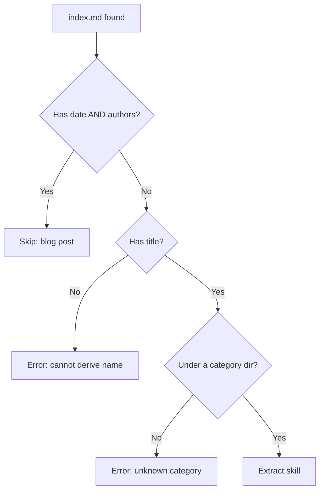

# Extraction Pipeline

Discovery, filtering, and naming. This is the stage that decides what becomes a skill and what it is called.

## Discovery

The generator walks a documentation root and collects candidate files from a fixed set of category directories. Each category maps one-to-one onto a plugin in the published marketplace.

```bash
skillgen \
  --source ../adaptive-enforcement-lab-com/docs \
  --output plugins \
  --plugin-metadata ./plugin-metadata.json \
  --release-manifest ./.release-please-manifest.json \
  --templates skillgen/templates
```

| Flag | Default | Purpose |
| --- | --- | --- |
| `--source` | *required* | Documentation root to scan |
| `--output` | `./plugins` | Where generated plugin trees are written |
| `--marketplace` | `./.claude-plugin/marketplace.json` | Marketplace catalog path |
| `--templates` | `./templates` | Directory of Go templates |
| `--plugin-metadata` | `./plugin-metadata.json` | Plugin descriptions, tags, shared author fields |
| `--release-manifest` | `./.release-please-manifest.json` | Version source of truth |
| `--verbose` | `false` | Raise log level from info to debug |

Only files named `index.md` are collected. Every other markdown file is invisible to the generator and serves as supporting documentation for human readers.

!!! tip "Why index.md Only"
    Keying on `index.md` makes the directory the unit of meaning. A concept with six explanatory pages produces one skill, not six fragments. That is what an agent actually wants to load.

Nesting depth is unlimited. A document six levels deep is collected on the same terms as one at the top of a category.

## Filtering

Two rules remove documents from the candidate set.

**Blog posts are skipped.** A document is treated as a blog post when its frontmatter carries both a `date` and a non-empty `authors` list. Narrative content makes poor skill material, and this heuristic separates it without a manual exclusion list.

**Documents without a title produce an error.** The skill name is derived from the title, so an empty one cannot be processed. The document is logged, counted, and skipped; generation continues.



## Category Mapping

The plugin a skill belongs to is determined by directory, not configuration. The generator scans the path for the first segment matching a known category and uses it. A document outside every category directory produces no skill.

This has a consequence worth planning around: **adding a new top-level documentation section does not create a new plugin.** The category list is compiled into the generator, so a new section is invisible until that list is extended.

## Skill Naming

The skill name is derived from the frontmatter `title`, not the directory name. Derivation lowercases the title, replaces spaces and separators with hyphens, drops remaining non-alphanumeric characters, collapses repeated hyphens, and trims the ends.

| Title | Skill name |
| --- | --- |
| `Idempotency` | `idempotency` |
| `GITHUB_TOKEN Permissions Overview` | `github-token-permissions-overview` |
| `CI/CD Integration` | `ci-cd-integration` |

!!! warning "Titles Must Be Unique Within a Category"
    Because the name comes from the title and the name becomes the output directory, two documents in the same category with identical titles silently overwrite each other. Uniqueness is a documentation convention the generator does not enforce.

## Source URLs

Each generated skill links back to the page it came from. Building that URL correctly requires preserving **every** path segment from the category directory down to the document's parent, then dropping the filename. MkDocs serves `index.md` as its parent directory.

| Source path | Correct URL |
| --- | --- |
| `docs/patterns/efficiency/idempotency/index.md` | `/patterns/efficiency/idempotency/` |
| `docs/secure/cloud-native/workload-identity/index.md` | `/secure/cloud-native/workload-identity/` |
| `docs/enforce/index.md` | `/enforce/` |

Truncating to a single segment after the category is a subtle failure. The URL still resolves to a real page, just the wrong one: the parent section rather than the document. Broken links announce themselves; wrong-but-valid links do not.

!!! tip "Verify URLs Against the Filesystem"
    A generated URL is checkable. For each emitted source URL, confirm the corresponding `index.md` exists in the documentation tree. This catches truncation, off-by-one segment errors, and stale links in a single pass.

    ```bash
    for url in $(grep -rhoP '(?<=\[Source Documentation\]\()[^)]*' plugins/ | sort -u); do
      path="${url#https://example.com/}"
      [ -f "docs/${path%/}/index.md" ] || echo "BROKEN: $url"
    done
    ```

## Validation

Each extracted skill is checked before it is written. Findings are advisory. The skill is written regardless, and the finding is surfaced for correction at the source document.

| Check | Severity | Rationale |
| --- | --- | --- |
| Name present, kebab-case, within length limit | Error | The name becomes a directory; an invalid one cannot load |
| Description present and within length limit | Error | The only field used for relevance routing |
| Category is a known plugin | Error | Determines output location |
| Description long enough to be distinctive | Warning | Very short descriptions rarely route well |
| At least one section mapped to a component | Warning | Otherwise the skill body is near-empty |
| Source URL present | Warning | The skill cannot link back to its documentation |

Validate what exists at the stage you are validating. Skill body content is rendered from templates *after* extraction, so a pre-write check on rendered output reports every skill as empty. Judge the extracted sections instead.

---

**Next:** [Skill Anatomy](skill-anatomy.md) covers what a generated skill directory contains.
