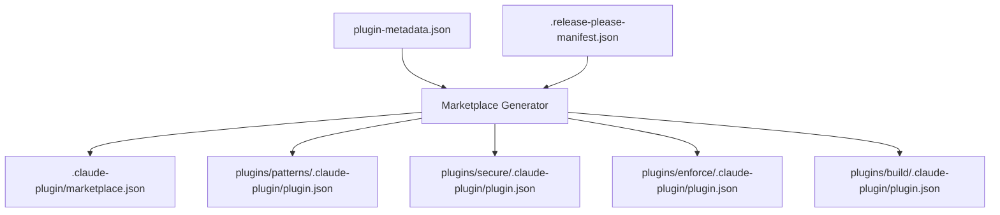

# Marketplace and Versioning

How plugin manifests and the marketplace catalog are produced, and how version numbers stay consistent across independently released packages.

## The Two Manifest Layers

A skills marketplace has two levels of metadata:

- **`marketplace.json`** is the catalog. It lists every plugin, its source directory, and its version.
- **`plugin.json`** is written once per plugin. It carries that plugin's own name, description, version, and author fields.

Both are generated. Neither is hand-edited.



## Configuration Input

`plugin-metadata.json` holds everything that is not derived from documentation. It has three parts:

```json
{
  "marketplace": {
    "name": "example-skills",
    "owner": { "name": "Example Org", "email": "contact@example.com" },
    "pluginRoot": "./plugins"
  },
  "common": {
    "author": { "name": "Example Org", "email": "contact@example.com" },
    "license": "MIT",
    "repository": "https://github.com/example-org/skills"
  },
  "plugins": {
    "patterns": {
      "description": "Reusable engineering patterns for error handling and resilience",
      "category": "development",
      "tags": ["patterns", "engineering"]
    }
  }
}
```

The `common` block exists to avoid repeating author, license, and repository across every plugin. It is merged into each generated `plugin.json`.

!!! warning "Config Is Authoritative and Destructive"
    The catalog is rebuilt from this file on every run. A plugin absent from `plugins` is dropped from `marketplace.json`. There is no merge with the previous catalog. Anything that must persist has to be represented in config.

## Versions Come From release-please

Neither manifest stores a version by hand. Both read `.release-please-manifest.json`, which release-please owns:

```json
{
  ".claude-plugin": "0.3.0",
  "plugins/patterns": "1.0.1",
  "plugins/secure": "1.0.1",
  "plugins/enforce": "1.0.0",
  "plugins/build": "1.0.0",
  "skillgen": "1.0.1"
}
```

The generator looks up `plugins/{name}` for each plugin and falls back to `0.0.0` with a warning when absent. The marketplace's own version comes from the `.claude-plugin` key.

## Independent Package Releases

Each plugin is a separately versioned release-please package, so a change confined to security documentation bumps only the `secure` plugin.

```json
{
  "separate-pull-requests": true,
  "packages": {
    "skillgen": { "release-type": "go" },
    "plugins/patterns": { "release-type": "simple" },
    "plugins/secure": { "release-type": "simple" }
  }
}
```

The generator uses `go` for the CLI itself and `simple` for the plugin directories, which carry no language-specific version file.

## Closing the Loop with extra-files

Both release-please and the generator write versions into the same JSON files. Without coordination they would fight. The coupling mechanism is release-please's `extra-files` with JSONPath:

```json
{
  "packages": {
    "plugins/patterns": {
      "release-type": "simple",
      "extra-files": [
        {
          "type": "json",
          "path": "plugins/patterns/.claude-plugin/plugin.json",
          "jsonpath": "$.version"
        }
      ]
    }
  }
}
```

This makes `.release-please-manifest.json` the single source of truth, reached by two independent paths:

1. Release-please rewrites `$.version` in each `plugin.json` when it cuts a release.
2. The generator reads the manifest and writes the same values on regeneration.

Both converge on identical output, so the order they run in does not matter.

!!! tip "Determinism Enables Work Avoidance"
    Plugin keys are sorted before serialization and JSON is written with stable indentation, so unchanged input produces byte-identical output. CI can then decide whether to publish with a single `git status --porcelain` check, with no content comparison logic.

## Path Handling

Output paths should be derived from flags rather than assumed relative to the working directory. A generator that hardcodes `.claude-plugin/marketplace.json` works only when invoked from the repository root. That is fine in CI and surprising locally.

Passing the path explicitly makes the tool work from any directory and keeps the flag honest about what it controls.

---

**Next:** [CI Automation](ci-automation.md) covers triggering regeneration from documentation changes.
