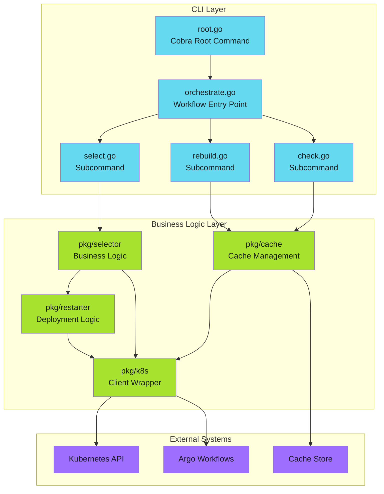

# Go CLI Architecture

Build orchestration CLIs in Go for Kubernetes-native automation.

This guide covers the meta-architecture for building custom CLIs that integrate with Kubernetes and workflow engines. These patterns apply whether you're building deployment tools, cache managers, or any automation that needs to interact with cluster resources.

---

## When to Use Go CLIs

!!! tip "Go vs Shell Scripts"

    Start with shell scripts for prototyping. Graduate to Go when you need type safety, testability, or complex orchestration logic.

**Use Go when you need:**

- Direct Kubernetes API access with type-safe clients
- Complex orchestration logic across multiple resources
- Reusable tooling packaged as container images
- Performance-critical operations (milliseconds matter)
- Long-running controllers or operators

**Use shell scripts when you need:**

- Simple glue logic between existing tools
- Quick prototypes or one-off operations
- kubectl-based workflows without custom logic
- CI/CD steps that primarily call other CLIs

---

## Architecture Overview



---

## Guide Contents

<div class="grid cards" markdown>

-   :material-hammer-wrench:{ .lg .middle } **Framework Selection**

    ---

    Choose between Cobra, urfave/cli, and Kong. Configuration with Viper.

    [:octicons-arrow-right-24: Framework Selection](framework-selection/index.md)

-   :material-kubernetes:{ .lg .middle } **Kubernetes Integration**

    ---

    client-go patterns, in-cluster config, RBAC, and context handling.

    [:octicons-arrow-right-24: Kubernetes Integration](kubernetes-integration/index.md)

-   :material-source-branch:{ .lg .middle } **Command Architecture**

    ---

    Orchestrator pattern, subcommand design, and error handling.

    [:octicons-arrow-right-24: Command Architecture](command-architecture/index.md)

-   :material-package-variant:{ .lg .middle } **Packaging**

    ---

    Multi-stage builds, minimal images, Helm integration.

    [:octicons-arrow-right-24: Packaging](packaging/index.md)

-   :material-test-tube:{ .lg .middle } **Testing Strategies**

    ---

    Fake clients, integration testing, E2E in CI/CD.

    [:octicons-arrow-right-24: Testing](testing/index.md)

</div>

---

## Example Project Structure

```text
myctl/
├── cmd/
│   ├── root.go           # Cobra root command, global flags
│   ├── orchestrate.go    # Main workflow orchestrator
│   ├── check.go          # Cache check command
│   ├── rebuild.go        # Cache rebuild command
│   └── select.go         # Deployment selector
├── pkg/
│   ├── cache/            # Cache management logic
│   │   ├── cache.go
│   │   └── cache_test.go
│   ├── k8s/              # Kubernetes client wrapper
│   │   ├── client.go
│   │   └── client_test.go
│   ├── selector/         # Business logic
│   │   ├── selector.go
│   │   └── selector_test.go
│   └── restarter/        # Deployment restart logic
│       ├── restarter.go
│       └── restarter_test.go
├── Dockerfile
├── go.mod
├── go.sum
└── main.go               # Entry point
```

---

## Key Design Principles

| Principle | Description |
| ----------- | ------------- |
| **[Separation of concerns](../../patterns/architecture/separation-of-concerns/index.md)** | Commands handle CLI logic; `pkg/` handles business logic |
| **[Testable by default](testing/index.md)** | Interfaces for external dependencies enable fake clients |
| **[Fail fast](../../patterns/error-handling/fail-fast/index.md)** | Validate configuration and connectivity before operations |
| **[Structured output](command-architecture/io-contracts.md)** | JSON output for machine consumption, human-friendly by default |
| **[Graceful degradation](../../patterns/error-handling/graceful-degradation/index.md)** | Clear error messages with actionable context |

---

*Building CLIs that operators trust.*
