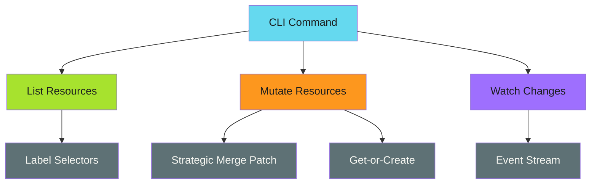

# Common Operations

Implement common Kubernetes operations in your CLI.

!!! abstract "Idiomatic Kubernetes"
    Use label selectors for filtering, strategic merge patches for updates, and proper error handling with `apierrors.IsNotFound()`.

---

## Overview

A well-designed Kubernetes CLI provides idiomatic operations that work consistently across resource types. This section covers:

- **[List Resources](list-resources.md)** - Query resources with label selectors
- **[Rollout Restart](rollout-restart.md)** - Trigger rolling restarts without downtime
- **[ConfigMap Operations](configmap-operations.md)** - Store and retrieve configuration data
- **[Watch Resources](watch-resources.md)** - React to real-time resource changes

---

## Operation Patterns

---

## Best Practices

| Practice | Description |
| ---------- | ------------- |
| **Use label selectors** | Filter resources server-side, not client-side |
| **Prefer patches over updates** | Patches are safer for concurrent modifications |
| **Use strategic merge patches** | Kubernetes-native patch format for resources |
| **Handle not found errors** | Check `apierrors.IsNotFound(err)` before creating |
| **Respect resource versions** | Use optimistic concurrency for updates |

---

*Use the Kubernetes API idiomatically: label selectors, patches, and proper error handling.*
