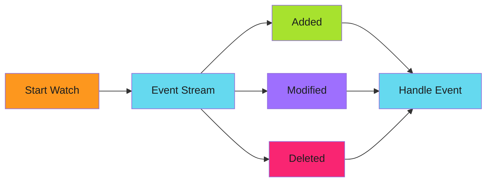

# Watch Resources

React to real-time Kubernetes resource changes.

!!! warning "Always Stop Watches"
    Use `defer watcher.Stop()` to clean up resources. Watches hold server connections that must be released.

---

## Watch Interface

The Kubernetes watch interface provides a streaming channel of resource events. This is more efficient than polling for changes.



---

## Basic Watch

```go
package k8s

import (
    "context"

    appsv1 "k8s.io/api/apps/v1"
    metav1 "k8s.io/apimachinery/pkg/apis/meta/v1"
    "k8s.io/apimachinery/pkg/watch"
)

// WatchDeployments watches for deployment changes
func (c *Client) WatchDeployments(ctx context.Context) (watch.Interface, error) {
    return c.Clientset.AppsV1().Deployments(c.Namespace).Watch(ctx, metav1.ListOptions{})
}
```

---

## Event Handling

!!! warning "Always Stop Watches"
    Use `defer watcher.Stop()` to clean up resources. Watches hold server connections that must be released.

```go
// Example usage
func watchExample(ctx context.Context, client *Client) error {
    watcher, err := client.WatchDeployments(ctx)
    if err != nil {
        return err
    }
    defer watcher.Stop()

    for event := range watcher.ResultChan() {
        deployment := event.Object.(*appsv1.Deployment)
        switch event.Type {
        case watch.Added:
            fmt.Printf("Deployment added: %s\n", deployment.Name)
        case watch.Modified:
            fmt.Printf("Deployment modified: %s\n", deployment.Name)
        case watch.Deleted:
            fmt.Printf("Deployment deleted: %s\n", deployment.Name)
        }
    }
    return nil
}
```

---

## Watch with Label Filter

```go
// WatchDeploymentsWithLabel watches deployments matching a label selector
func (c *Client) WatchDeploymentsWithLabel(ctx context.Context, labelSelector string) (watch.Interface, error) {
    return c.Clientset.AppsV1().Deployments(c.Namespace).Watch(ctx, metav1.ListOptions{
        LabelSelector: labelSelector,
    })
}
```

---

## Wait for Condition

Use watches to wait for a specific condition:

```go
// WaitForDeploymentReady waits until a deployment has all replicas ready
func (c *Client) WaitForDeploymentReady(ctx context.Context, name string, timeout time.Duration) error {
    ctx, cancel := context.WithTimeout(ctx, timeout)
    defer cancel()

    watcher, err := c.Clientset.AppsV1().Deployments(c.Namespace).Watch(ctx, metav1.ListOptions{
        FieldSelector: fmt.Sprintf("metadata.name=%s", name),
    })
    if err != nil {
        return err
    }
    defer watcher.Stop()

    for event := range watcher.ResultChan() {
        if event.Type == watch.Error {
            return fmt.Errorf("watch error")
        }

        deployment := event.Object.(*appsv1.Deployment)
        if deployment.Status.ReadyReplicas == *deployment.Spec.Replicas {
            return nil
        }
    }

    return fmt.Errorf("timeout waiting for deployment %s", name)
}
```

---

## Best Practices

| Practice | Description |
| ---------- | ------------- |
| **Use context cancellation** | Pass context for clean shutdown |
| **Always defer Stop()** | Release watch connections |
| **Handle reconnection** | Watches can disconnect; implement retry logic |
| **Use field selectors** | Filter by name when watching single resources |
| **Set timeouts** | Prevent indefinite waits |

---

*Use watches for real-time updates instead of polling.*
