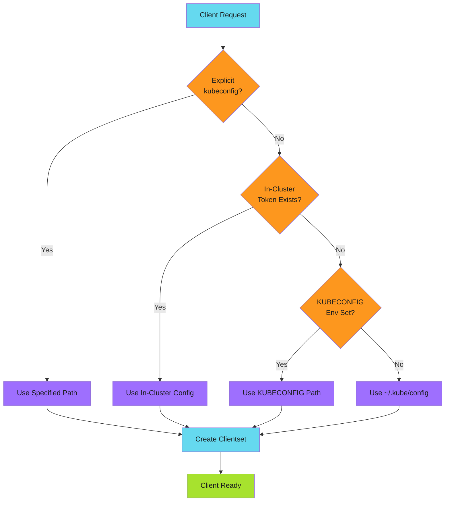

# Kubernetes Integration

Integrate your Go CLI with Kubernetes using client-go.

!!! tip "Universal Client"
    Build clients that work everywhere: developer laptops, CI runners, and cluster pods. Automatic config detection handles the differences.

---

## Overview

A well-designed Kubernetes CLI works seamlessly both on developer laptops and inside cluster pods. This section covers:

- **[Client Configuration](client-configuration.md)** - Automatic config detection for all environments
- **[RBAC Setup](rbac-setup.md)** - Service accounts and permissions
- **[Common Operations](common-operations/index.md)** - List, patch, and restart resources

---

## Configuration Flow



---

## Quick Start

```go
import "k8s.io/client-go/kubernetes"

// Create a client that works everywhere
client, err := k8s.NewClient(kubeconfig, namespace)
if err != nil {
    return fmt.Errorf("failed to create client: %w", err)
}

// Use the client
deployments, err := client.ListDeployments(ctx)
```

---

## Best Practices

| Practice | Description |
| ---------- | ------------- |
| **Use contexts everywhere** | Pass `context.Context` to all Kubernetes operations |
| **Handle cancellation** | Respect context cancellation for clean shutdowns |
| **Wrap errors with context** | Include resource type and name in error messages |
| **Default to current namespace** | Match kubectl behavior for namespace resolution |
| **Support both configs** | Always handle in-cluster and out-of-cluster scenarios |
| **Minimal RBAC** | Request only the permissions your CLI needs |

---

*Build clients that work everywhere: laptop, CI runner, or pod.*
