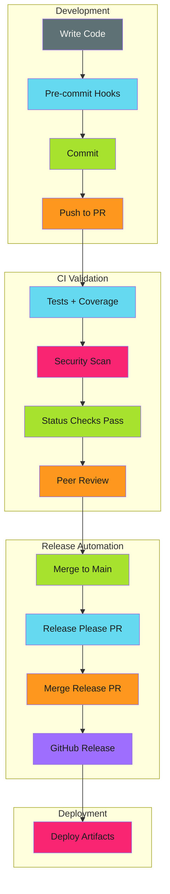

# Build

Development tools and release processes.

!!! abstract "Build with Intent"

    Building secure, tested, versioned software requires more than writing code. It requires **architecture**, **testing discipline**, **release automation**, and **documentation workflows** that scale from prototype to production.

## Overview

This section covers the development practices, tooling choices, and automation patterns that turn code into deployable, documented, versioned artifacts.

## What You'll Find Here

**[Go CLI Architecture](go-cli-architecture/index.md)**: Production-grade Go CLIs with Kubernetes integration, testing, and packaging (21 pages)

**[Coverage Patterns](coverage-patterns/coverage-patterns.md)**: Testing strategies and coverage enforcement without slowing development

**[Release Pipelines](release-pipelines/index.md)**: Automated releases with Release Please for conventional commits and semantic versioning (8 pages)

**[Versioned Documentation](versioned-docs/index.md)**: Multi-version docs with Mike to prevent user confusion

## Integration with Secure and Enforce

Build processes integrate with security and enforcement:

1. **Build artifacts** (Build) → **Scan for vulnerabilities** ([Secure](../secure/index.md)) → **Block vulnerable images** ([Enforce](../enforce/index.md))
2. **Run tests** (Build) → **Enforce coverage** ([Enforce](../enforce/index.md)) → **Gate PR merge** ([Enforce](../enforce/index.md))
3. **Generate SBOM** ([Secure](../secure/index.md)) → **Attach to release** (Build) → **Require in deployment** ([Enforce](../enforce/index.md))
4. **Create release** (Build) → **Generate SLSA provenance** ([Enforce](../enforce/index.md)) → **Verify in deployment** ([Enforce](../enforce/index.md))

## Development Workflow

Typical development flow using these patterns:

## Related Content

- [Secure](../secure/index.md): Security scanning and SBOM generation
- [Enforce](../enforce/index.md): Testing enforcement and compliance
- [Patterns](../patterns/index.md): CI/CD patterns and architecture

## Tags

Browse all content tagged with ci-cd, automation, testing, and go on the [Tags](../tags.md) page.
