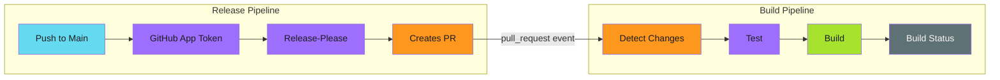
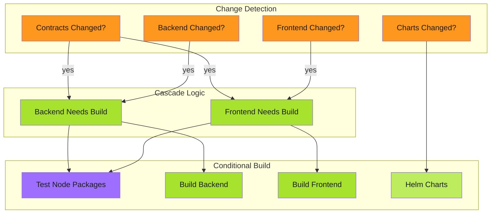
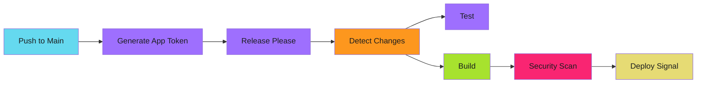

# Modular Release Pipelines

Automated version management, changelog generation, and optimized builds for monorepos.

!!! abstract "Smart Builds"
    Only build what changed. GitHub App tokens trigger builds correctly. Release-please handles versions automatically.

---

## Overview

This guide covers implementing release automation with:

- **Release-please** for version bumping and changelog generation
- **GitHub App authentication** for proper workflow triggering
- **Change detection** to skip unnecessary builds
- **Cascade rebuilds** when shared dependencies change

---

## The Problem

Traditional CI/CD pipelines rebuild everything on every commit. In a monorepo with multiple components, this means:

- Unnecessary compute time for unchanged components
- Longer feedback loops for developers
- Wasted resources on duplicate work

Additionally, release-please using the default `GITHUB_TOKEN` won't trigger build pipelines on its PRs -- a [GitHub security measure](https://docs.github.com/en/actions/security-guides/automatic-token-authentication#using-the-github_token-in-a-workflow) to prevent infinite loops.

---

## The Solution

A modular pipeline architecture that:

1. Uses a **GitHub App token** for release-please (triggers `pull_request` events correctly)
2. Detects which components changed
3. Only builds affected components
4. Automatically versions and releases based on commits

---

## Guides

| Guide | Description |
| ----- | ----------- |
| [Release-Please Configuration](release-please/index.md) | Setting up automated versioning with GitHub App |
| [Change Detection](change-detection.md) | Detecting and cascading changes |
| [Workflow Triggers](workflow-triggers.md) | GitHub App token vs GITHUB_TOKEN |
| [Protected Branches](protected-branches.md) | Working with branch protection rules |

---

## Prerequisites

Before implementing release pipelines, set up a GitHub App for your organization:

- [GitHub App Setup](../../secure/github-apps/index.md) - Create and configure the App
- [Token Generation](../../patterns/github-actions/actions-integration/token-generation/index.md) - Generate tokens in workflows

---

## Architecture

### Build Pipeline

Runs on pull requests (including release-please PRs with GitHub App token):

### Release Pipeline

Runs on main branch pushes:

---

## Quick Start

1. [Set up GitHub App](../../secure/github-apps/index.md) for your organization
2. [Configure release-please](release-please/index.md) with App token
3. [Set up change detection](change-detection.md) for your components
4. [Handle protected branches](protected-branches.md) if applicable

---

## Related

- [GitHub App Setup](../../secure/github-apps/index.md) - Machine identity for automation
- [Idempotency Patterns](../../patterns/efficiency/idempotency/index.md) - Making reruns safe
- [Three-Stage Design](../../patterns/architecture/three-stage-design.md) - Complex workflows
