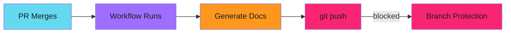

# Protected Branches

Configure workflows to work correctly with branch protection rules.

---

## The Problem

Protected branches prevent direct pushes. Tools that auto-commit changes (like documentation generators) can fail when they try to push to the main branch after merge.



Common tools that auto-commit:

- `helm-docs` - Generates README from chart values
- `prettier` - Formats code
- `eslint --fix` - Auto-fixes linting issues
- `go generate` - Generates Go code

---

## Solution: Run on PR Branches Only

Skip commits on protected branches:

```yaml
- name: Generate documentation
  run: helm-docs

- name: Commit changes
  if: github.ref_name != 'main'
  run: |
    git config user.name "github-actions[bot]"
    git config user.email "github-actions[bot]@users.noreply.github.com"
    git add .
    git diff --staged --quiet || git commit -m "docs: update generated docs"
    git push
```

The condition `github.ref_name != 'main'` ensures commits only happen on PR branches.

---

## Workflow Pattern

A complete pattern for documentation generation:

```yaml
name: Documentation
on:
  pull_request:
    branches: [main]
    paths:
      - 'charts/**'
  push:
    branches:
      - 'release-please--**'

jobs:
  generate-docs:
    runs-on: ubuntu-latest
    steps:
      - name: Checkout
        uses: actions/checkout@v4
        with:
          ref: ${{ github.head_ref || github.ref_name }}
          token: ${{ secrets.GITHUB_TOKEN }}

      - name: Generate documentation
        run: helm-docs

      - name: Check for changes
        id: changes
        run: |
          git diff --quiet || echo "changed=true" >> $GITHUB_OUTPUT

      - name: Commit and push
        if: steps.changes.outputs.changed == 'true' && github.ref_name != 'main'
        run: |
          git config user.name "github-actions[bot]"
          git config user.email "github-actions[bot]@users.noreply.github.com"
          git add .
          git commit -m "docs: update generated documentation"
          git push
```

---

## Branch Protection Settings

For status checks with conditional jobs, configure branch protection to require a summary job:

```yaml
build-status:
  name: Build Status
  needs: [test, build, docs]
  if: always()
  runs-on: ubuntu-latest
  steps:
    - name: Check results
      if: |
        needs.test.result == 'failure' ||
        needs.build.result == 'failure' ||
        needs.docs.result == 'failure'
      run: exit 1
```

Then set `Build Status` as the required check, not individual jobs.

!!! tip "Single Required Check"

    Using one summary job as the required check simplifies branch protection
    and handles skipped jobs correctly.

---

## Release-Please Considerations

Release-please needs permissions to:

1. Create and update PRs
2. Push commits to PR branches
3. Create releases and tags

Standard permissions:

```yaml
release-please:
  runs-on: ubuntu-latest
  permissions:
    contents: write
    pull-requests: write
```

With branch protection requiring status checks, ensure the build pipeline passes before release-please PRs can merge.

---

## Common Patterns

### Pre-commit on PR Branches

Run formatters and commit fixes:

```yaml
- name: Run pre-commit
  run: pre-commit run --all-files

- name: Commit formatting changes
  if: github.event_name == 'pull_request'
  run: |
    git diff --quiet || {
      git add .
      git commit -m "style: apply formatting"
      git push
    }
```

### Conditional Documentation Updates

Only update docs when source files change:

```yaml
- name: Check if docs need update
  id: check
  run: |
    helm-docs --dry-run > /tmp/new-readme.md
    diff -q charts/*/README.md /tmp/new-readme.md || echo "needs_update=true" >> $GITHUB_OUTPUT

- name: Update documentation
  if: steps.check.outputs.needs_update == 'true' && github.ref_name != 'main'
  run: |
    helm-docs
    git add .
    git commit -m "docs: update helm chart documentation"
    git push
```

### Skip CI Commits

Prevent infinite loops with `[skip ci]`:

```yaml
- name: Commit changes
  if: github.ref_name != 'main'
  run: |
    git add .
    git diff --staged --quiet || git commit -m "chore: auto-generated changes [skip ci]"
    git push
```

!!! warning "Use Sparingly"

    `[skip ci]` skips all workflows. Only use for commits that definitely
    don't need validation.

---

## Bypass Rules

For emergency fixes, repository admins can bypass protection rules. GitHub provides:

- Admin bypass for required reviews
- Admin bypass for status checks
- Lock branch for read-only access

Configure bypass permissions carefully in repository settings.

---

## Troubleshooting

| Issue | Cause | Solution |
| ------- | ------- | ---------- |
| Push declined | Branch protection | Add conditional `if: github.ref_name != 'main'` |
| Outdated docs on main | Docs generated after merge | Trigger docs on PR, not main |
| Status check never completes | Skipped job as required check | Use summary job pattern |
| Release-please can't push | Missing permissions | Add `contents: write` permission |

---

## Verification Checklist

1. Documentation generators run on PR branches
2. Commits skip on protected branches
3. Branch protection requires summary job
4. Release-please has required permissions
5. Concurrency prevents duplicate runs

---

## Related

- [Workflow Triggers](workflow-triggers.md) - Handle automation events
- [Release-Please Setup](release-please/index.md) - Configure release automation
