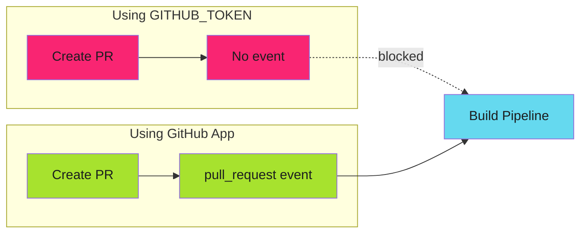

# Workflow Triggers

Ensure release-please PRs trigger your build pipelines correctly.

---

## The Problem

[Release-please](https://github.com/marketplace/actions/release-please-action) creates PRs via the GitHub API. When using the default `GITHUB_TOKEN`, these PRs don't trigger `pull_request` workflows:



!!! warning "GITHUB_TOKEN Security Measure"

    Actions triggered by `GITHUB_TOKEN` [don't emit workflow events](https://docs.github.com/en/actions/security-guides/automatic-token-authentication#using-the-github_token-in-a-workflow).
    This prevents infinite recursion but breaks automation compatibility.

---

## The Solution: GitHub App Token

GitHub Apps are treated as separate actors. When a GitHub App creates a PR, the `pull_request` event fires normally.

```yaml
jobs:
  release-please:
    runs-on: ubuntu-latest
    permissions:
      contents: write
      pull-requests: write
    steps:
      - name: Generate App Token
        id: app-token
        uses: actions/create-github-app-token@v2
        with:
          app-id: ${{ secrets.CORE_APP_ID }}
          private-key: ${{ secrets.CORE_APP_PRIVATE_KEY }}
          owner: your-org

      - uses: googleapis/release-please-action@v4
        id: release
        with:
          token: ${{ steps.app-token.outputs.token }}
          config-file: release-please-config.json
          manifest-file: .release-please-manifest.json
```

!!! success "Result"

    Release-please PRs now trigger `pull_request` events like any developer-created PR.
    No workarounds needed.

For GitHub App setup instructions, see [GitHub App Setup](../../secure/github-apps/index.md).

---

## Build Pipeline Configuration

With the GitHub App token, your build pipeline needs only standard triggers:

```yaml
name: Build Pipeline
on:
  pull_request:
    branches: [main]
    types: [opened, synchronize, reopened]
  workflow_dispatch:

concurrency:
  group: build-${{ github.head_ref || github.ref }}
  cancel-in-progress: true
```

No special handling for release-please branches required.

---

## Why Not a PAT?

Personal Access Tokens also trigger workflow events, but they're the wrong tool:

| Aspect | PAT | GitHub App |
| -------- | ----- | ------------ |
| Identity | Tied to user account | Machine identity |
| Lifecycle | Revoked when user leaves | Survives personnel changes |
| Permissions | Broad, user-level | Fine-grained, scoped |
| Rotation | Manual | Automatic (tokens expire, keys rotatable) |
| Audit | Actions attributed to user | Actions attributed to App |

GitHub Apps are [the proper solution](../../secure/github-apps/index.md#why_use_a_core_app) for machine-to-machine authentication.

---

## Fallback: Dual-Trigger Pattern

If you don't have access to a GitHub App, you can use a workaround that exploits push events:

```yaml
on:
  pull_request:
    branches: [main]
    types: [opened, synchronize, reopened]
  push:
    branches:
      - 'release-please--**'
```

!!! warning "Workaround Limitations"

    - Uses `push` events instead of `pull_request` (limited PR context)
    - Risk of duplicate runs if you later add GitHub App token
    - Different event type than regular PRs

### How It Works

Even with `GITHUB_TOKEN`, pushing commits to a branch emits `push` events. Only PR operations are silent:

| Action | Git Push | API (GITHUB_TOKEN) |
| -------- | ---------- | ------------------- |
| Push to branch | `push` event | `push` event |
| Create PR | `pull_request` event | **No event** |
| Update PR | `pull_request` event | **No event** |

### Branch Patterns

Release-please uses specific branch naming:

| Repository Type | Branch Pattern |
| ----------------- | --------------- |
| Simple repo | `release-please--branches--main` |
| Monorepo | `release-please--branches--main--component` |

The glob `release-please--**` matches both patterns.

---

## Migrating from Dual-Trigger to GitHub App

If you implemented the dual-trigger workaround and now want to use a GitHub App:

1. **Add the GitHub App token** to your release workflow
2. **Remove the push trigger** from your build workflow
3. **Test** by merging a conventional commit

!!! danger "Remove the Workaround"

    If you keep both the dual-trigger and GitHub App token, you'll get
    duplicate workflow runs (one from `push`, one from `pull_request`).

Before:

```yaml
on:
  pull_request:
    branches: [main]
  push:
    branches:
      - 'release-please--**'  # Remove this
```

After:

```yaml
on:
  pull_request:
    branches: [main]
    types: [opened, synchronize, reopened]
  # push trigger removed - GitHub App token handles this
```

---

## Other Automation Tools

The same principle applies to other tools:

| Tool | Recommended | Fallback |
| ------ | ------------- | ---------- |
| Release-please | GitHub App token | `push` trigger for `release-please--**` |
| Renovate (self-hosted) | GitHub App token | `push` trigger for `renovate/**` |
| Custom bots | GitHub App token | Tool-specific branch patterns |
| Dependabot | Built-in (uses `pull_request_target`) | N/A |

---

## Concurrency Control

Prevent duplicate builds with concurrency groups:

```yaml
concurrency:
  group: build-${{ github.head_ref || github.ref }}
  cancel-in-progress: true
```

| Variable | Context |
| ---------- | --------- |
| `github.head_ref` | PR source branch (exists for PRs) |
| `github.ref` | Full ref (fallback for push events) |

For release pipelines, don't cancel in progress:

```yaml
concurrency:
  group: release-${{ github.ref }}
  cancel-in-progress: false
```

---

## Troubleshooting

| Issue | Cause | Solution |
| ------- | ------- | ---------- |
| No build on release PR | Using `GITHUB_TOKEN` | Use GitHub App token for release-please |
| Duplicate builds | Both App token and push trigger | Remove the push trigger workaround |
| Wrong ref in build | Using `github.ref` on PR | Use `github.head_ref` for PR builds |
| App token not working | Missing permissions | Verify App has `contents: write` and `pull-requests: write` |

---

## Verification

Test your setup:

1. Merge a conventional commit (`feat: new feature`)
2. Verify release-please creates a PR
3. Verify build pipeline runs with `pull_request` event (not `push`)
4. Check workflow run shows correct trigger type

---

## Next Steps

- [GitHub App Setup](../../secure/github-apps/index.md) - Configure the GitHub App
- [Protected Branches](protected-branches.md) - Handle branch protection
- [Change Detection](change-detection.md) - Optimize builds

---

## References

- [Release-please Action](https://github.com/marketplace/actions/release-please-action) - GitHub Marketplace
- [GITHUB_TOKEN automatic authentication](https://docs.github.com/en/actions/security-guides/automatic-token-authentication) - GitHub Docs
- [create-github-app-token Action](https://github.com/actions/create-github-app-token) - GitHub
- [Release-please repository](https://github.com/googleapis/release-please) - googleapis
