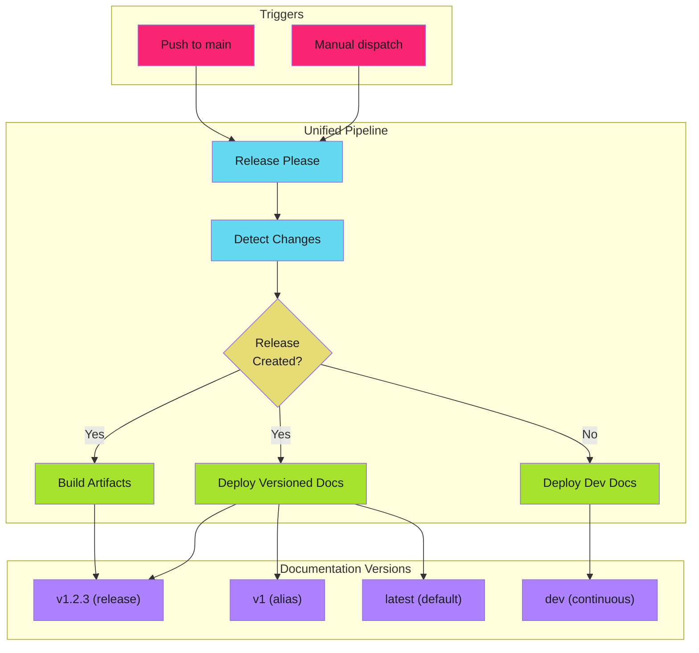

# Versioned Documentation

Deploy documentation versions that align with software releases using MkDocs Material and mike.

!!! abstract "Version Alignment"
    Users need docs that match the version they're running. Integrate release-please with mike to deploy version-tagged documentation alongside software releases.

---

## Overview

Versioned documentation solves a critical problem: users need docs that match the version they're running, not the latest development state.

This pattern integrates with [release-please](../release-pipelines/release-please/index.md) to deploy version-tagged documentation alongside software releases.

---

## Architecture

---

## Key Concepts

### Version Aliasing

Mike manages documentation versions with aliases:

| Version | Alias | Purpose |
| --------- | ------- | --------- |
| `1.2.3` | `v1`, `latest` | Current stable release |
| `1.1.0` | | Previous releases |
| `dev` | | Continuous from main branch |

Users selecting "v1" always get the latest 1.x release. The `latest` alias points to the most recent stable version.

### Deployment Strategy

| Trigger | Action |
| --------- | -------- |
| Release created | Deploy versioned docs with aliases |
| Docs changed (no release) | Deploy to `dev` only |
| No docs changes | Skip documentation build entirely |

---

## In This Section

- [Mike Configuration](mike-configuration.md) - MkDocs + mike setup
- [Pipeline Integration](pipeline-integration.md) - Unified release workflow
- [Version Strategies](version-strategies.md) - Aliasing and navigation patterns

---

## Related

- [Release-Please Configuration](../release-pipelines/release-please/index.md) - Version management
- [Change Detection](../release-pipelines/change-detection.md) - Skip unnecessary builds
- [Work Avoidance](../../patterns/efficiency/work-avoidance/index.md) - Conditional job execution

## Live Example

See this pattern in action at [readability.adaptive-enforcement-lab.com](https://readability.adaptive-enforcement-lab.com): a docs site with version selector powered by mike and release-please.
