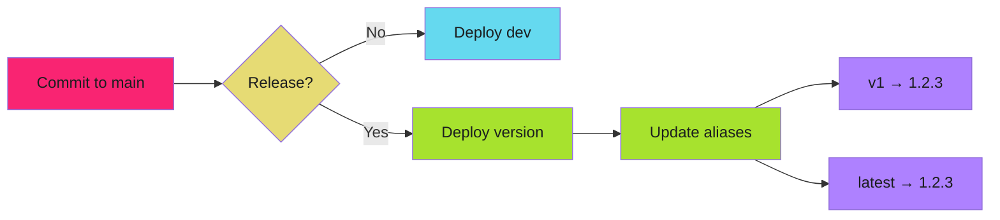

# Version Strategies

Patterns for managing documentation versions and aliases.

!!! tip "Major Version Aliases"
    Point `v1`, `v2` aliases to the latest patch release. Users linking to `/v1/` always get the latest 1.x documentation without updating their links.

---

## Alias Patterns

### Major Version Aliases

Point `v1`, `v2`, etc. to the latest patch release:

```bash
# Release 1.2.3 updates v1 alias
mike deploy --push --update-aliases 1.2.3 v1 latest
```

Users who link to `/v1/` always get the latest 1.x documentation without updating their links.

### Latest Alias

The `latest` alias should always point to the most recent stable release:

```bash
mike deploy --push --update-aliases 1.2.3 v1 latest
```

Configure MkDocs to default to `latest`:

```yaml
extra:
  version:
    provider: mike
    default: latest
```

Root URL redirects to `/latest/`.

### Development Version

Continuous deployment from main branch:

```bash
mike deploy --push dev
```

No aliases for `dev` -- it's a moving target that shouldn't be linked to.

---

## Version Lifecycle



---

## Version Cleanup

### Remove Old Versions

```bash
mike delete 0.9.0
mike delete 0.8.0
```

### List All Versions

```bash
mike list
```

### Retitle a Version

```bash
mike retitle 1.2.3 "v1.2.3 (LTS)"
```

---

## Multi-Major Version Support

When maintaining multiple major versions simultaneously:

```bash
# v1.x branch
mike deploy --push --update-aliases 1.5.2 v1

# v2.x branch
mike deploy --push --update-aliases 2.1.0 v2 latest
```

Only `latest` points to v2. Users on v1 continue to receive updates via the `v1` alias.

---

## Version Navigation

### Version Selector Behavior

MkDocs Material's version selector:

1. Reads `versions.json` from site root
2. Displays all versions in dropdown
3. Preserves current page path when switching versions

### Cross-Version Links

Link to specific versions:

```markdown
See [v1 documentation](/v1/getting-started/)
See [latest documentation](/latest/getting-started/)
```

Link to current version (relative):

```markdown
See [Getting Started](getting-started/)
```

---

## Deprecation Strategy

Mark deprecated versions in the selector:

```bash
mike retitle 0.9.0 "0.9.0 (deprecated)"
```

Or remove them entirely after a grace period:

```bash
mike delete 0.9.0
```

---

## Related

- [Mike Configuration](mike-configuration.md) - Setup and local development
- [Pipeline Integration](pipeline-integration.md) - CI/CD workflow
