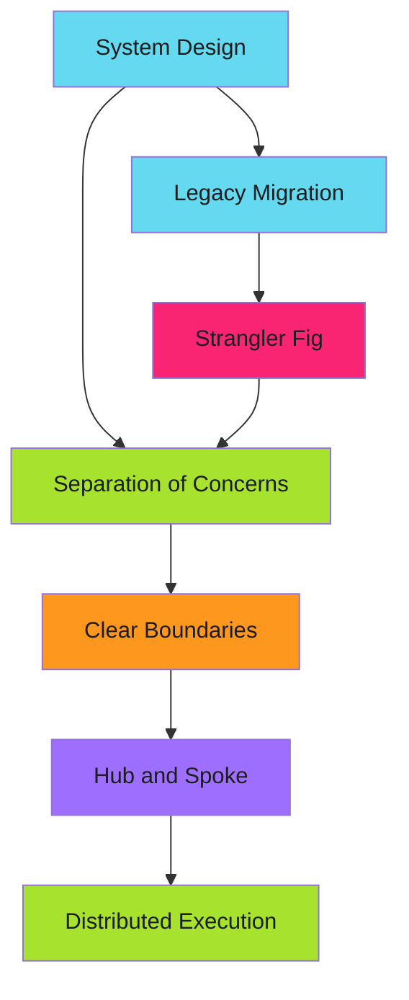

# Architecture Patterns

These patterns govern how systems are structured and how components interact.

!!! tip "Implementation Guide"
    This guide is part of a modular documentation set. Refer to related guides for complete context.

---

## Patterns in This Section

### [Separation of Concerns](separation-of-concerns/index.md)

Single-responsibility components with clear boundaries. Orchestration separate from execution. Testability through isolation.

**Use when:** Building CLIs, microservices, or any system with distinct responsibilities

**Key benefit:** Maintainability - change one thing without breaking everything

---

### [Hub and Spoke](hub-and-spoke/index.md)

Centralized orchestration with distributed execution. One coordinator, many workers. Event-driven task distribution.

**Use when:** Scaling workflows, managing distributed systems, event-driven architectures

**Key benefit:** Scalability - add workers without changing orchestration

---

### [Strangler Fig](strangler-fig/index.md)

Incremental migration from legacy systems. Run old and new in parallel. Gradually shift traffic. Zero downtime transitions.

**Use when:** Replacing monoliths, migrating to new tech, risky system rewrites

**Key benefit:** Risk reduction - rollback at any point, validate in production

---

## How These Patterns Relate

Separation of Concerns provides the foundation. Hub and Spoke scales it. Strangler Fig migrates to it.

---

## Related Patterns

These architectural patterns complement:

- **[Efficiency Patterns](../efficiency-patterns/index.md)** - Idempotency, work avoidance
- **[Error Handling](../error-handling/index.md)** - Fail fast, graceful degradation
- **[Workflow Architecture](../workflow-architecture/index.md)** - Three-stage design, matrix distribution

---

*Build systems that scale, change, and survive.*
