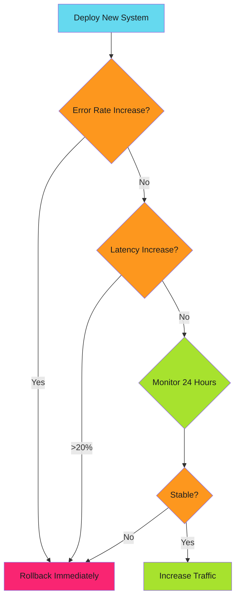

# Monitoring and Rollback

Monitor both systems in parallel. Compare metrics. Rollback instantly if new system degrades.

!!! tip "Migration Pattern"
    This guide covers the Strangler Fig pattern for incremental system migration. Review all sections for complete implementation strategy.

---

## Monitoring During Migration

Track both systems:

```yaml
# Prometheus queries
# Legacy request rate
rate(http_requests_total{service="api-legacy"}[5m])

# New system request rate
rate(http_requests_total{service="api-v2"}[5m])

# Error rate comparison
rate(http_requests_total{service="api-legacy",status="500"}[5m])
/
rate(http_requests_total{service="api-legacy"}[5m])

vs

rate(http_requests_total{service="api-v2",status="500"}[5m])
/
rate(http_requests_total{service="api-v2"}[5m])
```

Alert if new system error rate > legacy error rate. Rollback flag immediately.

---

## Key Metrics to Track

| Metric | Why It Matters | Threshold |
| -------- | ---------------- | ----------- |
| **Error Rate** | New system breaking requests | New ≤ Legacy |
| **P95 Latency** | Performance regression | New ≤ Legacy × 1.2 |
| **Throughput** | Capacity handling | New ≥ Legacy |
| **Resource Usage** | Cost implications | Monitor CPU/memory |
| **Database Lag** | Dual write consistency | < 100ms between DBs |

---

## Rollback Strategy

Feature flags enable instant rollback:

```bash
# Increase traffic to new system
curl -X PATCH https://api.launchdarkly.com/flags/new-api-v2 \
  -d '{"variations": [{"value": true, "weight": 50000}]}'  # 50%

# Monitor metrics...

# Rollback if issues
curl -X PATCH https://api.launchdarkly.com/flags/new-api-v2 \
  -d '{"variations": [{"value": true, "weight": 0}]}'  # 0%
```

No deployment needed. Instant traffic shift.

---

## Rollback Decision Tree



Error rate spike: Immediate rollback. Latency degradation >20%: Rollback. Stable for 24 hours: Proceed.

---

## Automated Rollback

Automate rollback based on metrics:

```yaml
# Prometheus alerting rule
groups:
  - name: strangler_rollback
    rules:
      - alert: NewSystemHighErrorRate
        expr: |
          (
            rate(http_requests_total{service="api-v2",status="500"}[5m])
            /
            rate(http_requests_total{service="api-v2"}[5m])
          )
          >
          (
            rate(http_requests_total{service="api-legacy",status="500"}[5m])
            /
            rate(http_requests_total{service="api-legacy"}[5m])
          )
        for: 5m
        annotations:
          summary: "New system error rate exceeds legacy"
          description: "Rollback new-api-v2 feature flag"
```

Alert triggers runbook. Rollback initiated automatically or manually depending on severity.

---

## Observability Checklist

Before increasing traffic:

- [ ] Logs aggregated for both systems
- [ ] Metrics dashboards compare legacy vs new
- [ ] Error tracking (Sentry, Rollbar) configured
- [ ] Alerting rules deployed
- [ ] Runbook documented for rollback
- [ ] On-call team notified of migration phase

Don't proceed without observability in place.

---

## Related Patterns

- **[Traffic Routing](traffic-routing.md)** - Control traffic flow
- **[Implementation Strategies](implementation.md)** - Feature flags and shadow mode
- **[Migration Guide](migration-guide.md)** - Phased rollout timeline

---

*Monitoring caught the latency spike at 10% traffic. Feature flag rolled back to 0% in 30 seconds. Root cause identified: database connection pool too small. Fixed, redeployed, resumed migration. Zero customer impact.*
