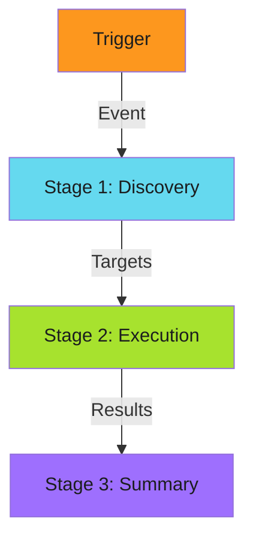
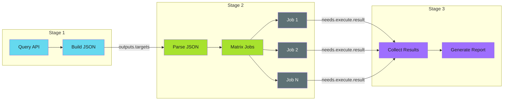

# Three-Stage Design

Separate concerns into discovery, execution, and reporting phases.

!!! abstract "Key Insight"
    Complex workflows become tangled when discovery, execution, and reporting logic interleave. Separating them into distinct stages improves testability, debuggability, and observability.

---

## The Pattern



Complex workflows become tangled when discovery, execution, and reporting logic interleave. Separating them into distinct stages improves:

- **Testability** - Each stage can be tested independently
- **Debuggability** - Failures localize to a specific stage
- **Reusability** - Stages can be mixed and matched
- **Observability** - Clear boundaries for logging and metrics

---

## Stage Responsibilities

| Stage | Input | Output | Purpose |
| ----- | ----- | ------ | ------- |
| **Discovery** | Trigger event | Target list | Determine what to process |
| **Execution** | Target list | Results | Perform the actual work |
| **Summary** | Results | Report | Aggregate and communicate |

---

## When to Use

!!! success "Good Fit"

    - Processing multiple targets (repos, files, services)
    - Operations that benefit from parallelization
    - Workflows requiring clear audit trails
    - Complex logic that needs separation of concerns

!!! warning "Poor Fit"

    - Simple single-target operations
    - Workflows where discovery and execution are tightly coupled
    - Real-time operations where staging adds unacceptable latency

---

## Implementation

### Stage 1: Discovery

Query for targets and output a structured list:

```yaml
jobs:
  discover:
    runs-on: ubuntu-latest
    outputs:
      targets: ${{ steps.query.outputs.targets }}
      count: ${{ steps.query.outputs.count }}
    steps:
      - name: Query targets
        id: query
        run: |
          # Discovery logic - API calls, file scans, etc.
          TARGETS='[{"name": "target-1"}, {"name": "target-2"}]'
          echo "targets=$TARGETS" >> $GITHUB_OUTPUT
          echo "count=$(echo $TARGETS | jq 'length')" >> $GITHUB_OUTPUT
```

**Key principles:**

- Output structured data (JSON) for downstream consumption
- Include metadata (count) for conditional logic
- Keep discovery fast - defer heavy work to execution

### Stage 2: Execution

Process each target, typically in parallel:

```yaml
execute:
  needs: discover
  if: needs.discover.outputs.count > 0
  strategy:
    matrix:
      target: ${{ fromJson(needs.discover.outputs.targets) }}
    fail-fast: false
  steps:
    - name: Process target
      run: |
        echo "Processing ${{ matrix.target.name }}"
        # Execution logic here
```

**Key principles:**

- Use matrix strategy for parallelization
- Set `fail-fast: false` to process all targets even if some fail
- Each job should be [idempotent](../efficiency-patterns/idempotency/index.md)

### Stage 3: Summary

Aggregate results and report:

```yaml
summary:
  needs: [discover, execute]
  if: always()  # Run even if execution had failures
  steps:
    - name: Generate report
      run: |
        echo "## Workflow Summary" >> $GITHUB_STEP_SUMMARY
        echo "Processed ${{ needs.discover.outputs.count }} targets" >> $GITHUB_STEP_SUMMARY

        if [ "${{ needs.execute.result }}" == "failure" ]; then
          echo ":warning: Some targets failed" >> $GITHUB_STEP_SUMMARY
        else
          echo ":white_check_mark: All targets succeeded" >> $GITHUB_STEP_SUMMARY
        fi
```

**Key principles:**

- Use `if: always()` to run regardless of execution outcome
- Write to `$GITHUB_STEP_SUMMARY` for visibility
- Aggregate success/failure counts when possible

---

## Data Flow



---

## Variations

### Two-Stage (No Summary)

For simple workflows where reporting isn't needed:

```yaml
jobs:
  discover:
    # ...
  execute:
    needs: discover
    # ...
```

### Four-Stage (With Validation)

Add a validation stage before execution:

```yaml
jobs:
  discover:
    # Find targets
  validate:
    needs: discover
    # Verify targets are valid, check permissions, etc.
  execute:
    needs: validate
    # Process validated targets
  summary:
    needs: [discover, execute]
```

### Nested Stages

For hierarchical targets (orgs → repos → branches):

```yaml
jobs:
  discover-orgs:
    # Find organizations
  discover-repos:
    needs: discover-orgs
    strategy:
      matrix:
        org: ${{ fromJson(needs.discover-orgs.outputs.orgs) }}
    # Find repos per org
  execute:
    needs: discover-repos
    # Process all repos
```

---

## Anti-Patterns

### Interleaved Logic

```yaml
# Bad: discovery and execution mixed
- name: Find and process
  run: |
    for target in $(find-targets); do
      process "$target"
    done
```

This loses parallelization and makes failures harder to diagnose.

### Heavy Discovery

```yaml
# Bad: doing too much in discovery
- name: Discover
  run: |
    TARGETS=$(expensive-api-call)
    VALIDATED=$(validate-all "$TARGETS")  # Should be separate stage
    ENRICHED=$(enrich-all "$VALIDATED")   # Should be separate stage
```

Keep discovery lightweight. Defer expensive operations to execution.

### Ignoring Partial Failures

```yaml
# Bad: no summary when execution fails
summary:
  needs: execute
  # Won't run if execute fails!
```

Always use `if: always()` on summary stages.

---

## Real-World Applications

- **File Distribution** - Discover repos, distribute files, report results
- **Dependency Updates** - Find outdated deps, create PRs, summarize changes
- **Security Scanning** - Enumerate targets, scan each, aggregate findings
- **Configuration Drift** - Query resources, compare to desired state, report drift

See [File Distribution](../../operator-manual/github-actions/use-cases/file-distribution/index.md) for a complete implementation example.

---

## Summary

!!! abstract "Key Takeaways"

    1. **Separate concerns** - Discovery, execution, and reporting are distinct
    2. **Use job outputs** - Pass structured data between stages
    3. **Parallelize execution** - Matrix strategy for horizontal scaling
    4. **Always summarize** - Use `if: always()` on summary stages
    5. **Keep discovery light** - Defer heavy work to execution
