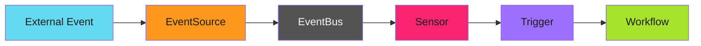

# Argo Events

Argo Events is an event-driven workflow automation framework for Kubernetes. It connects external event sources to Argo Workflows, enabling reactive automation. For comprehensive documentation, see the [official Argo Events docs](https://argoproj.github.io/argo-events/).

---

## Core Components

| Component | Purpose | Argo Docs |
|-----------|---------|-----------|
| **EventSource** | Connects to external systems | [EventSource Types](https://argoproj.github.io/argo-events/eventsources/setup/intro/) |
| **EventBus** | Message broker for delivery | [EventBus](https://argoproj.github.io/argo-events/eventbus/) |
| **Sensor** | Filters events and triggers | [Sensors](https://argoproj.github.io/argo-events/sensors/intro/) |
| **Trigger** | Action when conditions met | [Triggers](https://argoproj.github.io/argo-events/sensors/triggers/intro/) |

---

## Pattern Categories

| Category | Description |
|----------|-------------|
| [Setup Guide](setup/index.md) | EventSource, EventBus, and Sensor configuration |
| [Event Routing](routing/index.md) | Multi-action routing, filtering, and transformations |
| [Reliability Patterns](reliability/index.md) | Retry strategies, dead letter queues, and backpressure |
| [Troubleshooting](troubleshooting/index.md) | Debugging event flows and common issues |

---

## Quick Start

1. **Deploy EventBus** - The message broker that connects everything
2. **Create EventSource** - Connect to your event producer (Pub/Sub, webhooks, etc.)
3. **Create Sensor** - Define filters and triggers for workflows

See the [Setup Guide](setup/index.md) for detailed instructions.

---

!!! note "Prerequisites"
    Argo Events requires Argo Workflows for workflow triggers. See the [official installation guide](https://argoproj.github.io/argo-events/installation/) for setup.

---

## Related Content

- [Argo Workflows Patterns](../argo-workflows/index.md) - WorkflowTemplate design and error handling
- [Event-Driven Deployments](../../blog/posts/2025-12-14-event-driven-deployments-argo.md) - The journey to zero-latency automation
- [ConfigMap as Cache Pattern](../efficiency-patterns/idempotency/caches.md) - Volume mounts for zero-API reads
