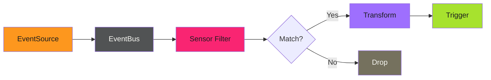

# Event Routing

Event routing controls how events flow from EventSources through Sensors to Triggers. Argo Events provides powerful filtering, transformation, and multi-action capabilities. For the complete reference, see the [official Sensors documentation](https://argoproj.github.io/argo-events/sensors/intro/).

---

## Event Flow Architecture

Events pass through multiple stages, each providing opportunities to filter, transform, and route:



**Key decision points:**

1. **EventSource**: Receives raw events, normalizes format, publishes to EventBus
2. **Sensor Filter**: Evaluates event data against filter expressions
3. **Transform**: Modifies event payload before trigger execution
4. **Trigger**: Executes action (workflow, HTTP request, Kubernetes resource)

---

## Routing Patterns

| Pattern | Use Case | Complexity |
| --------- | ---------- | ------------ |
| [Simple Filtering](filtering.md) | Route events based on field values | Low |
| [Multi-Trigger Actions](multi-trigger.md) | Execute multiple actions from one event | Medium |
| [Event Transformation](transformation.md) | Modify payloads before triggering | Medium |
| [Conditional Routing](conditional.md) | Complex decision trees | High |

---

## Quick Example: Image Tag Filtering

Filter container registry events to only process production tags:

```yaml
apiVersion: argoproj.io/v1alpha1
kind: Sensor
metadata:
  name: prod-image-filter
spec:
  dependencies:
    - name: image-push
      eventSourceName: container-registry
      eventName: push
      filters:
        data:
          - path: body.tag
            type: string
            value:
              - "v*"
              - "release-*"
```

This Sensor only triggers when images are pushed with tags starting with `v` or `release-`. Development tags like `dev-123` or `feature-xyz` are silently dropped.

---

!!! note "Filter Evaluation"
    Filters are evaluated in order. The first matching filter wins. If no filters match, the event is dropped without triggering any action. Use the [Sensor troubleshooting guide](../../../operator-manual/argo-events/troubleshooting/sensors.md) to debug filter issues.

---

## Related

- [Simple Filtering](filtering.md) - Basic filter expressions
- [Multi-Trigger Actions](multi-trigger.md) - Fan-out patterns
- [Sensor Configuration](../../../operator-manual/argo-events/setup/sensors.md) - Basic Sensor setup
- [Official Sensor Docs](https://argoproj.github.io/argo-events/sensors/intro/) - Complete reference
