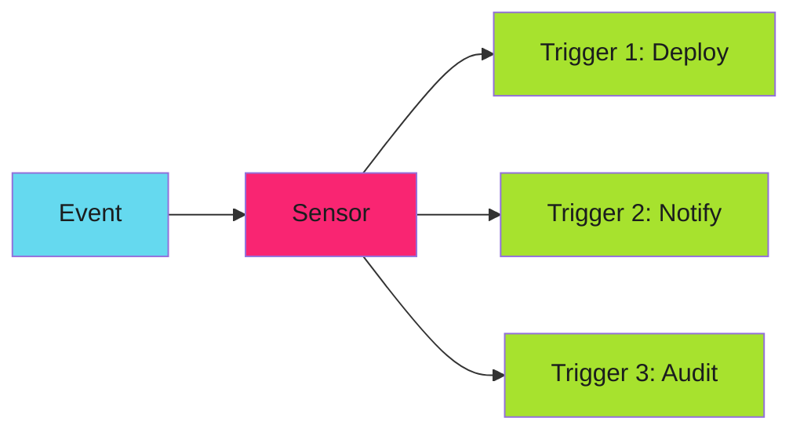

# Multi-Trigger Actions

A single Sensor can trigger multiple independent actions from one event. This fan-out pattern enables parallel processing, notifications, and coordinated responses. For the complete trigger reference, see the [official Triggers documentation](https://argoproj.github.io/argo-events/sensors/triggers/intro/).

---

## Fan-Out Pattern

Multiple triggers execute in parallel when an event matches:



---

## Multiple Triggers Configuration

Define multiple triggers in a single Sensor:

```yaml
apiVersion: argoproj.io/v1alpha1
kind: Sensor
metadata:
  name: multi-action-sensor
spec:
  dependencies:
    - name: image-push
      eventSourceName: registry
      eventName: push

  triggers:
    # Trigger 1: Start deployment workflow
    - template:
        name: deploy-workflow
        argoWorkflow:
          operation: submit
          source:
            resource:
              apiVersion: argoproj.io/v1alpha1
              kind: Workflow
              metadata:
                generateName: deploy-
              spec:
                workflowTemplateRef:
                  name: deployment-workflow
                arguments:
                  parameters:
                    - name: image
                      value: ""

    # Trigger 2: Send Slack notification
    - template:
        name: slack-notify
        http:
          url: https://hooks.slack.com/services/XXX/YYY/ZZZ
          method: POST
          payload:
            - src:
                dependencyName: image-push
                dataKey: body.repository
              dest: text

    # Trigger 3: Create audit log entry
    - template:
        name: audit-log
        k8s:
          operation: create
          source:
            resource:
              apiVersion: v1
              kind: ConfigMap
              metadata:
                generateName: audit-
              data:
                event: ""
```

All three triggers fire simultaneously when an image push event arrives.

---

## Trigger Types

Different actions for different purposes:

| Trigger Type | Purpose | Argo Docs |
|--------------|---------|-----------|
| `argoWorkflow` | Submit Argo Workflows | [Argo Workflow Trigger](https://argoproj.github.io/argo-events/sensors/triggers/argo-workflow/) |
| `http` | HTTP/webhook requests | [HTTP Trigger](https://argoproj.github.io/argo-events/sensors/triggers/http/) |
| `k8s` | Create/patch K8s resources | [Kubernetes Trigger](https://argoproj.github.io/argo-events/sensors/triggers/k8s/) |
| `awsLambda` | Invoke Lambda functions | [AWS Lambda Trigger](https://argoproj.github.io/argo-events/sensors/triggers/aws-lambda/) |
| `kafka` | Publish to Kafka topics | [Kafka Trigger](https://argoproj.github.io/argo-events/sensors/triggers/kafka/) |
| `slack` | Send Slack messages | [Slack Trigger](https://argoproj.github.io/argo-events/sensors/triggers/slack/) |

---

## Conditional Triggers

Apply conditions to individual triggers:

```yaml
triggers:
  - template:
      name: prod-deploy
      conditions: prod-only
      argoWorkflow:
        # Only fires if condition matches
        operation: submit
        source:
          resource:
            # ...

  - template:
      name: staging-deploy
      conditions: staging-only
      argoWorkflow:
        # Different condition
        operation: submit
        source:
          resource:
            # ...

  conditions:
    prod-only:
      - expr: body.tag matches "^v[0-9]+"
    staging-only:
      - expr: body.tag matches "^staging-"
```

Different triggers fire based on which condition matches the event.

---

## Parameter Injection

Pass event data to each trigger:

```yaml
triggers:
  - template:
      name: deploy-workflow
      argoWorkflow:
        operation: submit
        parameters:
          - src:
              dependencyName: image-push
              dataKey: body.repository
            dest: spec.arguments.parameters.0.value
          - src:
              dependencyName: image-push
              dataKey: body.tag
            dest: spec.arguments.parameters.1.value
        source:
          resource:
            apiVersion: argoproj.io/v1alpha1
            kind: Workflow
            spec:
              arguments:
                parameters:
                  - name: image
                    value: ""
                  - name: tag
                    value: ""
```

The `parameters` section extracts data from the event and injects it into the trigger resource.

---

## Trigger Independence

Each trigger is independent:

- **Parallel execution**: All triggers start simultaneously
- **Independent failure**: One trigger failing doesn't affect others
- **No ordering**: No guaranteed execution order between triggers

If you need sequential execution, use a single workflow trigger that handles the orchestration internally.

---

!!! tip "Keep Triggers Simple"
    Each trigger should do one thing. Complex orchestration belongs in workflows, not in Sensor trigger definitions. Sensors route and fan-out; workflows orchestrate.

---

## Related

- [Simple Filtering](filtering.md) - Control which events trigger
- [Event Transformation](transformation.md) - Modify payloads before triggering
- [Conditional Routing](conditional.md) - Complex decision trees
- [Official Triggers Docs](https://argoproj.github.io/argo-events/sensors/triggers/intro/) - Complete reference
