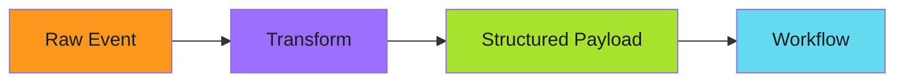

# Event Transformation

Transformations modify event payloads before they reach triggers. This enables data normalization, field extraction, and payload restructuring without changing EventSource or workflow code. For the complete reference, see the [official Trigger Parameterization docs](https://argoproj.github.io/argo-events/sensors/trigger-parameterization/).

---

## Why Transform?

EventSources produce normalized but raw events. Workflows often need data in a specific format. Transformation bridges this gap:



**Common transformations:**

- Extract specific fields from complex payloads
- Rename fields to match workflow parameters
- Combine multiple fields into a single value
- Set default values for optional fields

---

## Parameter Extraction

Extract and map event data to trigger parameters:

```yaml
triggers:
  - template:
      name: deploy
      argoWorkflow:
        operation: submit
        parameters:
          # Extract image name from nested path
          - src:
              dependencyName: image-push
              dataKey: body.repository.name
            dest: spec.arguments.parameters.0.value

          # Extract tag with default fallback
          - src:
              dependencyName: image-push
              dataKey: body.tag
              value: "latest"  # Default if missing
            dest: spec.arguments.parameters.1.value

          # Extract digest for immutable reference
          - src:
              dependencyName: image-push
              dataKey: body.digest
            dest: spec.arguments.parameters.2.value
        source:
          resource:
            apiVersion: argoproj.io/v1alpha1
            kind: Workflow
            spec:
              arguments:
                parameters:
                  - name: image
                    value: ""
                  - name: tag
                    value: ""
                  - name: digest
                    value: ""
```

**Parameter mapping fields:**

- `src.dependencyName`: Which dependency's event to read from
- `src.dataKey`: JSONPath to the field in the event
- `src.value`: Default value if dataKey is missing
- `dest`: JSONPath in the trigger resource to write to

---

## Template Operations

Use Go templates for complex transformations:

```yaml
parameters:
  - src:
      dependencyName: github-push
      dataTemplate: "{{ .Input.body.repository.full_name }}:{{ .Input.body.after }}"
    dest: spec.arguments.parameters.0.value
```

The `dataTemplate` field supports Go template syntax with access to:

- `.Input`: The full event payload
- `.Input.body`: The event body
- `.Input.context`: CloudEvents context

---

## JSON Path Expressions

Navigate complex nested structures:

```yaml
# GitHub push event structure
# body:
#   repository:
#     full_name: "org/repo"
#   commits:
#     - id: "abc123"
#       message: "feat: add feature"
#       author:
#         email: "dev@example.com"

parameters:
  # Get repository name
  - src:
      dependencyName: github-push
      dataKey: body.repository.full_name
    dest: spec.arguments.parameters.0.value

  # Get first commit SHA
  - src:
      dependencyName: github-push
      dataKey: body.commits.0.id
    dest: spec.arguments.parameters.1.value

  # Get commit author email
  - src:
      dependencyName: github-push
      dataKey: body.commits.0.author.email
    dest: spec.arguments.parameters.2.value
```

---

## Combining Multiple Events

When Sensors have multiple dependencies, combine data from all:

```yaml
spec:
  dependencies:
    - name: config-change
      eventSourceName: github
      eventName: config-push
    - name: approval
      eventSourceName: slack
      eventName: approval-reaction

  triggers:
    - template:
        name: deploy-with-approval
        argoWorkflow:
          operation: submit
          parameters:
            # From first dependency
            - src:
                dependencyName: config-change
                dataKey: body.repository.full_name
              dest: spec.arguments.parameters.0.value

            # From second dependency
            - src:
                dependencyName: approval
                dataKey: body.user.name
              dest: spec.arguments.parameters.1.value
```

Both events must arrive before the trigger fires, and data from both is available for transformation.

---

## Payload Restructuring

Create entirely new payload structures:

```yaml
parameters:
  - src:
      dependencyName: webhook
      dataTemplate: |
        {
          "source": "{{ .Input.body.source }}",
          "timestamp": "{{ .Input.context.time }}",
          "data": {
            "id": "{{ .Input.body.id }}",
            "action": "{{ .Input.body.action }}"
          }
        }
    dest: spec.arguments.parameters.0.value
```

The template outputs a JSON string that becomes the parameter value.

---

!!! warning "Template Escaping"
    JSON in Go templates requires careful escaping. Test templates with simple values before adding complexity. Malformed JSON causes silent trigger failures.

---

## Related

- [Simple Filtering](filtering.md) - Control which events trigger
- [Multi-Trigger Actions](multi-trigger.md) - Fan-out patterns
- [Sensor Configuration](../setup/sensors.md) - Basic Sensor setup
- [Official Parameterization Docs](https://argoproj.github.io/argo-events/sensors/trigger-parameterization/) - Complete reference
