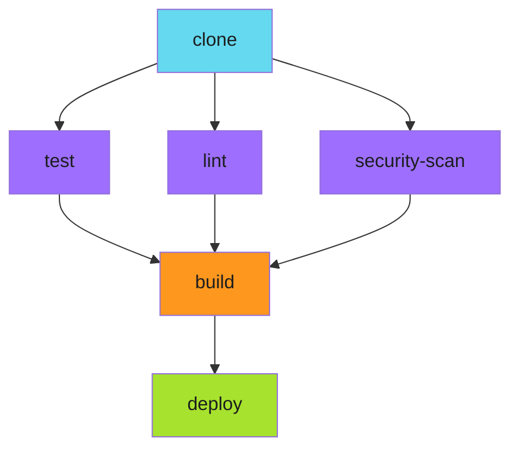
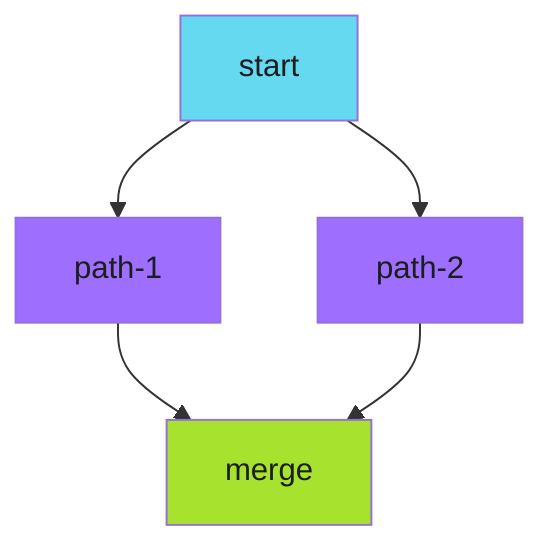

# DAG Orchestration

For complex dependency graphs that don't fit the step-by-step model, use DAG (Directed Acyclic Graph) templates. DAGs express dependencies explicitly, and the scheduler automatically parallelizes what it can.

---

## Why DAG?

Steps work well for linear flows with occasional parallel sections. But some workflows have complex dependencies that are awkward to express sequentially.

Consider a pipeline where:

- A must complete before B and C
- B must complete before D
- C must complete before D and E
- D and E must complete before F

Expressing this with steps requires careful grouping. With DAG, you simply declare the dependencies and let the scheduler figure out the execution order.

---

## Basic DAG Pattern

```yaml
templates:
  - name: main
    dag:
      tasks:
        - name: clone
          template: git-clone
        - name: test
          template: run-tests
          dependencies: [clone]
        - name: lint
          template: run-lint
          dependencies: [clone]
        - name: security-scan
          template: security-scan
          dependencies: [clone]
        - name: build
          template: build-artifact
          dependencies: [test, lint, security-scan]
        - name: deploy
          template: deploy-artifact
          dependencies: [build]
```

The scheduler reads the dependencies and determines execution order automatically:

1. `clone` runs first (no dependencies)
2. `test`, `lint`, and `security-scan` run in parallel (all depend only on `clone`)
3. `build` waits for all three (depends on `test`, `lint`, `security-scan`)
4. `deploy` waits for `build`

---

## DAG Execution Flow



The visual representation matches the dependency declaration. You declare what depends on what; the scheduler handles the rest.

---

## DAG vs Steps

| Aspect | Steps | DAG |
|--------|-------|-----|
| Mental model | Execution order | Dependency structure |
| Parallelism | Explicit groups | Automatic from dependencies |
| Complex dependencies | Awkward | Natural |
| Simple linear flows | Clean | Verbose |
| Readability | Sequence-focused | Structure-focused |

**Use Steps when:**

- Your workflow is fundamentally sequential
- Parallel sections are occasional and clear
- You think in terms of "do this, then do that"

**Use DAG when:**

- Dependencies form a complex graph
- Multiple tasks depend on multiple predecessors
- You think in terms of "X must finish before Y can start"

---

## Conditional Tasks

DAG tasks can be conditional:

```yaml
dag:
  tasks:
    - name: build
      template: build-artifact
      dependencies: [clone]
    - name: deploy-staging
      template: deploy
      dependencies: [build]
      when: "{{workflow.parameters.environment}} == 'staging'"
    - name: deploy-production
      template: deploy
      dependencies: [build]
      when: "{{workflow.parameters.environment}} == 'production'"
```

The `when` clause evaluates at runtime. Only matching tasks execute. Non-matching tasks are skipped, and their dependents proceed as if the skipped task succeeded.

---

## Aggregation Patterns

Collect results from multiple parallel tasks:

```yaml
dag:
  tasks:
    - name: test-service-a
      template: run-tests
      arguments:
        parameters:
          - name: service
            value: service-a
    - name: test-service-b
      template: run-tests
      arguments:
        parameters:
          - name: service
            value: service-b
    - name: test-service-c
      template: run-tests
      arguments:
        parameters:
          - name: service
            value: service-c
    - name: aggregate-results
      template: collect-reports
      dependencies: [test-service-a, test-service-b, test-service-c]
      arguments:
        parameters:
          - name: services
            value: "service-a,service-b,service-c"
```

The aggregation task runs after all test tasks complete. It can read outputs from each (if stored in a shared location) and produce a combined report.

---

## Diamond Dependencies

DAG handles diamond patterns naturally:



```yaml
dag:
  tasks:
    - name: start
      template: initialize
    - name: path-1
      template: process-a
      dependencies: [start]
    - name: path-2
      template: process-b
      dependencies: [start]
    - name: merge
      template: combine-results
      dependencies: [path-1, path-2]
```

The scheduler runs `path-1` and `path-2` in parallel after `start` completes. `merge` waits for both paths to finish before running.

---

## Failure Propagation

When a DAG task fails:

1. The failed task's dependents are skipped
2. Independent tasks continue running
3. The overall DAG fails

```yaml
dag:
  tasks:
    - name: a
      template: task-a
    - name: b
      template: task-b
      dependencies: [a]
    - name: c
      template: task-c
      dependencies: [a]
    - name: d
      template: task-d
      dependencies: [b, c]
```

If `b` fails:

- `a` has already completed
- `c` continues (independent of `b`)
- `d` is skipped (depends on failed `b`)
- Overall DAG status: Failed

Use `continueOn` to change this behavior for specific tasks.

---

!!! note "DAG Tasks Are Not Retriable"
    Unlike steps, DAG tasks don't support retryStrategy at the task level. Put retry logic in the template that the task invokes instead.

---

## Related

- [Spawning Child Workflows](spawning-children.md) - Using DAG with child workflows
- [Parallel Execution](parallel.md) - Alternative parallel patterns
- [Cross-Workflow Communication](communication.md) - Connecting DAGs across workflows
