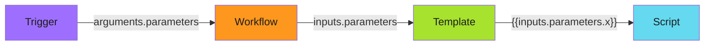

# Basic WorkflowTemplate Structure

A WorkflowTemplate has the same structure as a Workflow, but lives independently and can be invoked multiple times with different parameters. This separation between definition and execution is what makes templates reusable. For the complete reference, see the [official WorkflowTemplate docs](https://argo-workflows.readthedocs.io/en/latest/workflow-templates/).

---

## Anatomy of a WorkflowTemplate

```yaml
apiVersion: argoproj.io/v1alpha1
kind: WorkflowTemplate
metadata:
  name: deployment-restart
  namespace: argo-workflows
  annotations:
    workflows.argoproj.io/description: |
      Restarts deployments using a specific container image.
      Uses cached deployment-to-image mapping for fast lookups.
spec:
  entrypoint: restart-deployments
  arguments:
    parameters:
      - name: image
      - name: digest

  volumes:
    - name: cache-volume
      configMap:
        name: deployment-image-cache
        optional: true

  templates:
    - name: restart-deployments
      inputs:
        parameters:
          - name: image
          - name: digest
      script:
        image: example-registry/workflows-cli:v1.0.0
        command: [bash]
        source: |
          set -euo pipefail

          DEPLOYMENTS=$(workflows check \
            --image "{{inputs.parameters.image}}" \
            --cache-path /etc/cache/cache.json \
            --output json)

          if [ "$DEPLOYMENTS" == "[]" ]; then
            echo "No deployments found"
            exit 0
          fi

          echo "$DEPLOYMENTS" | jq -r '.[] | "\(.namespace)/\(.name)"' | while read deployment; do
            NAMESPACE=$(echo "$deployment" | cut -d/ -f1)
            NAME=$(echo "$deployment" | cut -d/ -f2)
            kubectl rollout restart deployment "$NAME" -n "$NAMESPACE"
          done

        volumeMounts:
          - name: cache-volume
            mountPath: /etc/cache
            readOnly: true
        resources:
          requests:
            memory: "128Mi"
            cpu: "100m"
          limits:
            memory: "256Mi"
            cpu: "200m"
      serviceAccountName: deployment-restarter
```

The `annotations` field documents what the template does. This appears in the Argo UI and helps operators understand the template's purpose without reading the implementation. Good descriptions save debugging time later.

The `arguments.parameters` section declares what inputs the template expects. Callers must provide values for these parameters, either through Sensor parameter injection, CronWorkflow arguments, or manual submission. Parameters without default values are required.

See the [Variables reference](https://argo-workflows.readthedocs.io/en/latest/variables/) for the complete parameter syntax.

---

## How Parameters Flow Through Templates

Understanding parameter flow is essential for debugging workflows that don't behave as expected. Parameters move through three distinct scopes, and mixing them up is a common source of errors.



**The parameter journey:**

1. **Trigger scope**: The Sensor, CronWorkflow, or manual submission provides values in `spec.arguments.parameters`
2. **Workflow scope**: The WorkflowTemplate receives these as `arguments.parameters` and makes them available to templates
3. **Template scope**: Individual templates declare `inputs.parameters` to receive values from the workflow
4. **Script scope**: The actual code accesses parameters using `{{inputs.parameters.name}}` syntax

A common mistake is referencing `{{workflow.parameters.image}}` inside a template when you should use `{{inputs.parameters.image}}`. The workflow-level syntax works but creates tight coupling. Template-level inputs make templates more reusable because they don't assume anything about the workflow structure.

The [Workflow Concepts guide](https://argo-workflows.readthedocs.io/en/latest/workflow-concepts/) explains this scope hierarchy in detail.

---

## Default Values and Validation

Parameters can have default values, making them optional for callers:

```yaml
arguments:
  parameters:
    - name: image
      # Required - no default
    - name: digest
      default: "latest"
    - name: dry-run
      default: "false"
      enum:
        - "true"
        - "false"
```

The `enum` field restricts parameter values to a specific set. The workflow fails fast with a clear error if an invalid value is provided. This is much better than failing mid-execution with a cryptic script error.

---

## Template Types

WorkflowTemplates support several template types for different use cases:

| Type | Use Case | Argo Docs |
|------|----------|-----------|
| `script` | Inline code execution | [Script Template](https://argo-workflows.readthedocs.io/en/latest/workflow-concepts/#script) |
| `container` | Run a container command | [Container Template](https://argo-workflows.readthedocs.io/en/latest/workflow-concepts/#container) |
| `resource` | Create/patch Kubernetes resources | [Resource Template](https://argo-workflows.readthedocs.io/en/latest/workflow-concepts/#resource) |
| `steps` | Sequential/parallel execution | [Steps Template](https://argo-workflows.readthedocs.io/en/latest/workflow-concepts/#steps) |
| `dag` | Dependency-based execution | [DAG Template](https://argo-workflows.readthedocs.io/en/latest/workflow-concepts/#dag) |

The `script` type is most common for simple automation tasks. It embeds the code directly in the YAML, making the workflow self-contained. For complex logic, consider building a container image with the code baked in and using the `container` type instead.

---

## Resource Requests and Limits

Always specify resource requests and limits. Without them, your workflow pods can consume unbounded resources or get evicted under pressure:

```yaml
resources:
  requests:
    memory: "128Mi"
    cpu: "100m"
  limits:
    memory: "256Mi"
    cpu: "200m"
```

**Sizing guidance:**

- **Requests**: What the pod needs to run normally. The scheduler uses this to place pods.
- **Limits**: Maximum the pod can consume. Exceeding memory limits kills the pod.

Set limits close to requests for predictable behavior. Large gaps between requests and limits can cause noisy-neighbor problems where pods consume more than expected.

See [Kubernetes Resource Management](https://kubernetes.io/docs/concepts/configuration/manage-resources-containers/) for detailed sizing strategies.

---

!!! tip "Deep Dive Resources"
    This page covers production patterns. For foundational concepts, start with the [Argo Workflows Quick Start](https://argo-workflows.readthedocs.io/en/latest/quick-start/) and the [Workflow Concepts guide](https://argo-workflows.readthedocs.io/en/latest/workflow-concepts/).

    The [Examples repository](https://github.com/argoproj/argo-workflows/tree/main/examples) has dozens of patterns for common use cases.

---

## Related

- [Retry Strategy](retry-strategy.md) - Error handling patterns
- [Init Containers](init-containers.md) - Multi-stage setup
- [Volume Patterns](volume-patterns.md) - Storage configuration
- [RBAC Configuration](rbac.md) - Permission patterns
- [Official Argo Docs](https://argo-workflows.readthedocs.io/en/latest/) - Comprehensive reference
