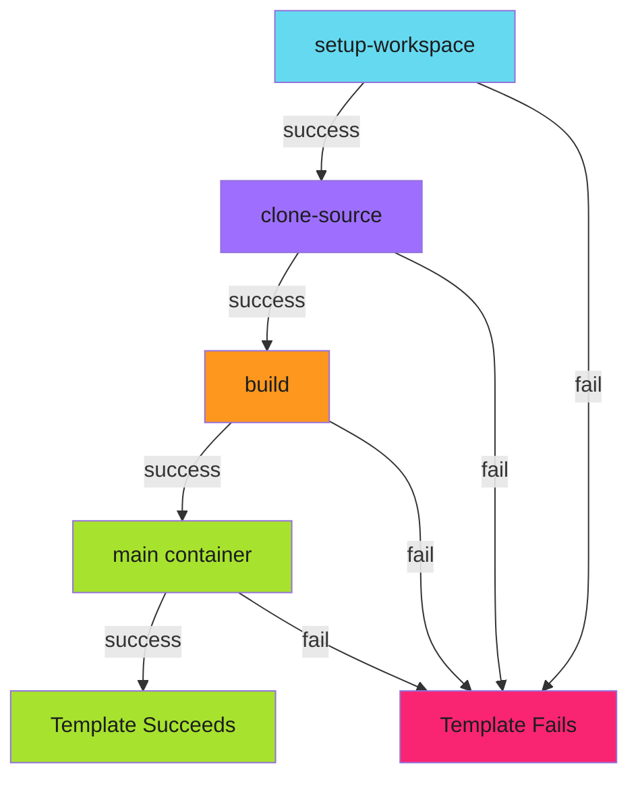

# Init Containers

Init containers run sequentially before the main container, each completing before the next starts. They share volumes with each other and the main container, enabling multi-stage pipelines where each stage has its own image and dependencies.

---

## Why Init Containers?

The obvious approach to a build pipeline is cramming everything into one container image: Git, build tools, testing frameworks, and deployment utilities. This works, but the image grows large and updates become risky. Changing the Go version might break the deployment scripts.

Init containers offer an alternative: use purpose-built images for each stage. The git image handles cloning. The Go image handles compilation. The deployment image handles publishing. Each image is small, focused, and independently versioned.

The tradeoff is complexity. More images mean more to manage. Data must flow between containers through volumes. Debugging requires understanding which container failed. Use init containers when the modularity benefits outweigh the coordination costs.

---

## Basic Pattern

```yaml
templates:
  - name: build-and-publish
    initContainers:
      - name: setup-workspace
        image: alpine:latest
        command: [sh, -c]
        args: ["mkdir -p /workspace && chmod 777 /workspace"]
        volumeMounts:
          - name: workspace
            mountPath: /workspace
      - name: clone-source
        image: alpine/git:latest
        command: [git, clone, "{{workflow.parameters.repo}}", /workspace/src]
        volumeMounts:
          - name: workspace
            mountPath: /workspace
      - name: build
        image: golang:1.21
        command: [go, build, -o, /workspace/bin/app, ./...]
        workingDir: /workspace/src
        volumeMounts:
          - name: workspace
            mountPath: /workspace
    container:
      image: gcr.io/my-project/publisher:latest
      command: [publish, /workspace/bin/app]
      volumeMounts:
        - name: workspace
          mountPath: /workspace
```

This pattern separates concerns cleanly. Each image does one thing. Updates to one stage don't affect others. You can test each stage independently by running just that image.

---

## Data Flow Through Volumes

Init containers communicate through shared volumes. Each container writes to a known location; the next container reads from it.


**The handoff chain:**

1. `setup-workspace` creates the directory structure
2. `clone-source` populates `/workspace/src` with repository contents
3. `build` reads source, writes binary to `/workspace/bin/app`
4. Main container reads the binary and publishes it

Each stage has a clear contract: what it expects to find, what it produces. When something breaks, you can check each stage's output to find the problem.

---

## Failure Behavior

If any init container fails, the entire template fails and the main container never runs. This is usually what you want. There's no point running the build if the clone failed.



For cases where you need partial success handling (for example, running tests even if linting fails), use steps or DAG patterns instead of init containers.

---

## Resource Configuration

Each init container can have its own resource requirements:

```yaml
initContainers:
  - name: clone-source
    image: alpine/git:latest
    resources:
      requests:
        memory: "64Mi"
        cpu: "50m"
      limits:
        memory: "128Mi"
        cpu: "100m"
  - name: build
    image: golang:1.21
    resources:
      requests:
        memory: "512Mi"
        cpu: "500m"
      limits:
        memory: "1Gi"
        cpu: "1000m"
```

The build stage needs more resources than the clone stage. Specifying them separately avoids over-provisioning for lightweight stages and under-provisioning for heavy ones.

---

## Security Context

Init containers can run with different security contexts than the main container:

```yaml
initContainers:
  - name: setup-permissions
    image: alpine:latest
    command: [chown, -R, "1000:1000", /data]
    securityContext:
      runAsUser: 0  # Root to change ownership
    volumeMounts:
      - name: data
        mountPath: /data
  - name: process
    image: processor:latest
    securityContext:
      runAsUser: 1000  # Non-root for actual work
      runAsNonRoot: true
    volumeMounts:
      - name: data
        mountPath: /data
```

This pattern is useful when a volume needs preparation that requires elevated privileges, but the main processing should run without them. The setup container runs as root briefly; everything else runs as a restricted user.

---

## When to Use Init Containers vs Steps

| Aspect | Init Containers | Steps |
| -------- | ----------------- | ------- |
| Execution | Sequential only | Sequential or parallel |
| Failure handling | Fail-fast | Configurable |
| Resource sharing | Shared volumes | Explicit passing |
| Retry | Not supported | Per-step retries |
| Visibility | Single template | Separate nodes in UI |

Use init containers when:

- Stages are tightly coupled and must succeed in order
- You want a simple, single-template approach
- Resource sharing through volumes is natural

Use steps when:

- Stages should have independent retry logic
- You need visibility into each stage in the UI
- Partial success is acceptable

---

!!! note "Init Container Limitations"
    Init containers cannot be retried individually. If an init container fails, the entire template fails. For stages that need independent retry logic, use steps or DAG patterns instead.

---

## Related

- [Basic Structure](basic-structure.md) - WorkflowTemplate anatomy
- [Volume Patterns](volume-patterns.md) - Storage configuration for init containers
- [Workflow Composition](../composition/index.md) - Alternative patterns for multi-stage pipelines
