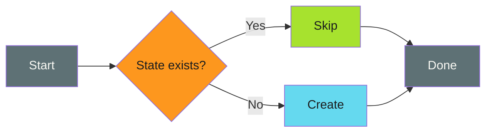

# Check-Before-Act

The most intuitive idempotency pattern: look before you leap.

---

## The Pattern

```bash
if [ condition_already_met ]; then
  echo "Already done, skipping"
else
  perform_action
fi
```

Check if the desired state exists. If yes, skip. If no, act.



---

## When to Use

!!! success "Good Fit"

    - Creating resources that shouldn't be duplicated (PRs, branches, issues)
    - Operations where existence is easy to verify
    - Workflows where partial completion is visible
    - APIs that don't support upsert semantics

!!! warning "Poor Fit"

    - High-concurrency scenarios (race conditions)
    - Operations where state changes rapidly
    - When atomic upsert is available (use that instead)

---

## Examples

### Branch Management

```bash
# Check if branch exists on remote
if git ls-remote --heads origin "$BRANCH" | grep -q "$BRANCH"; then
  # Branch exists: reset to remote state
  git checkout -B "$BRANCH" "origin/$BRANCH"
  echo "Checked out existing branch"
else
  # Branch doesn't exist: create it
  git checkout -b "$BRANCH"
  echo "Created new branch"
fi
```

The `-B` flag is critical here. It force-resets an existing local branch to match the remote, handling diverged state from previous failed runs.

### Pull Request Creation

```bash
# Check if PR already exists for this branch
EXISTING=$(gh pr list --head "$BRANCH" --base "$DEFAULT_BRANCH" --json number --jq 'length')

if [ "$EXISTING" -eq 0 ]; then
  gh pr create --title "Automated update" --body "From central repo"
  echo "Created new PR"
else
  echo "PR already exists, skipping creation"
fi
```

### GitHub Issue Creation

```bash
# Check by title (approximate matching)
EXISTING=$(gh issue list --search "in:title $ISSUE_TITLE" --json number --jq 'length')

if [ "$EXISTING" -eq 0 ]; then
  gh issue create --title "$ISSUE_TITLE" --body "$ISSUE_BODY"
else
  echo "Similar issue already exists"
fi
```

### File Creation

```bash
# Only create if file doesn't exist
if [ ! -f "$TARGET_FILE" ]; then
  cp "$SOURCE_FILE" "$TARGET_FILE"
  echo "Created $TARGET_FILE"
else
  echo "$TARGET_FILE already exists"
fi
```

### Directory Creation

```bash
# mkdir -p is inherently idempotent
mkdir -p "$TARGET_DIR"
```

!!! tip "Built-in Idempotency"

    `mkdir -p` is a built-in example of check-before-act. It succeeds whether the directory exists or not. Look for similar flags in other tools (`cp -n`, `ln -sf`).

---

## GitHub Actions Examples

### Conditional Step Execution

```yaml
- name: Check if release exists
  id: check
  run: |
    if gh release view "${{ env.VERSION }}" &>/dev/null; then
      echo "exists=true" >> "$GITHUB_OUTPUT"
    else
      echo "exists=false" >> "$GITHUB_OUTPUT"
    fi

- name: Create release
  if: steps.check.outputs.exists == 'false'
  run: gh release create "${{ env.VERSION }}" --generate-notes
```

### PR Creation with Existence Check

```yaml
- name: Create PR if not exists
  run: |
    if ! gh pr list --head "${{ env.BRANCH }}" --json number | jq -e 'length > 0'; then
      gh pr create \
        --title "Automated update" \
        --body "Weekly sync from upstream"
    fi
```

---

## Edge Cases and Gotchas

### Race Conditions

!!! danger "The TOCTOU Problem"

    Time-of-check to time-of-use (TOCTOU) is the fundamental weakness of check-before-act. The state can change between checking and acting.

The time between "check" and "act" creates a window for race conditions:

```mermaid
sequenceDiagram
    participant W1 as Worker 1
    participant S as Shared State
    participant W2 as Worker 2

    W1->>S: Check: exists?
    S-->>W1: No
    W2->>S: Check: exists?
    S-->>W2: No
    W1->>S: Create resource
    W2->>S: Create resource
    Note over S: Duplicate created!

    rect rgb(27, 29, 30)
        Note over W1,W2: Both workers pass the check<br/>before either acts
    end
```



```bash
# Thread 1                    # Thread 2
if [ ! -f lock ]; then       if [ ! -f lock ]; then
  # Both threads pass check
  touch lock                   touch lock
  do_work                      do_work  # Duplicate!
fi                           fi
```

**Mitigation**: Use atomic operations where possible, or accept that occasional duplicates may occur.

### Stale Checks

Remote state can change between check and act:

```bash
# Check passes: PR doesn't exist
EXISTING=$(gh pr list --head "$BRANCH" --json number --jq 'length')

# Meanwhile, another process creates the PR...

# Act fails: PR now exists
gh pr create ...  # Error: PR already exists
```

**Mitigation**: Handle the "already exists" error gracefully:

```bash
gh pr create ... 2>/dev/null || echo "PR already exists (created by another process)"
```

### Incorrect Check Conditions

The most common bug: checking the wrong thing.

```bash
# Wrong: checks local branch, not remote
if git branch --list "$BRANCH" | grep -q "$BRANCH"; then

# Right: checks remote branch
if git ls-remote --heads origin "$BRANCH" | grep -q "$BRANCH"; then
```

### Partial State

What if the previous run created the resource but didn't configure it?

```bash
# PR exists but labels weren't added
if [ "$EXISTING" -eq 0 ]; then
  gh pr create --title "Update" --label "automated"
else
  # PR exists, but does it have the label?
  # This check-before-act missed the incomplete state
fi
```

**Mitigation**: Either make the check more comprehensive, or make configuration idempotent too:

```bash
# Always ensure labels (idempotent operation)
gh pr edit "$PR_NUMBER" --add-label "automated" 2>/dev/null || true
```

---

## Anti-Patterns

### Silent Skipping Without Logging

```bash
# Bad: no visibility into what happened
if [ -f "$FILE" ]; then
  :  # Do nothing, silently
else
  create_file
fi
```

```bash
# Good: explicit logging
if [ -f "$FILE" ]; then
  echo "Skipping: $FILE already exists"
else
  create_file
  echo "Created: $FILE"
fi
```

### Checking the Wrong Layer

```bash
# Bad: checks local state, acts on remote
if [ -d ".git" ]; then
  git push origin main  # Remote might not have this branch!
fi
```

### Over-Broad Checks

```bash
# Bad: any PR counts as "exists"
if gh pr list --json number | jq -e 'length > 0'; then
  echo "PR exists"
fi

# Good: check for specific branch
if gh pr list --head "$BRANCH" --json number | jq -e 'length > 0'; then
  echo "PR for $BRANCH exists"
fi
```

---

## Comparison with Other Patterns

| Aspect | Check-Before-Act | [Upsert](upsert.md) | [Force Overwrite](force-overwrite.md) |
| -------- | ----------------- | -------- | ----------------- |
| Race condition safe | No | Yes | Yes |
| Requires API support | No | Yes | Depends |
| Visibility into state | High | Low | Low |
| Complexity | Low | Low | Low |

---

## Summary

Check-Before-Act is the workhorse of idempotency patterns. It's explicit, debuggable, and works everywhere.

!!! abstract "Key Takeaways"

    1. **Check the right state**: remote vs local, specific vs broad
    2. **Log your decisions**: visibility beats silent skipping
    3. **Handle race conditions**: either accept them or use atomic alternatives
    4. **Consider partial state**: a resource existing isn't always enough
