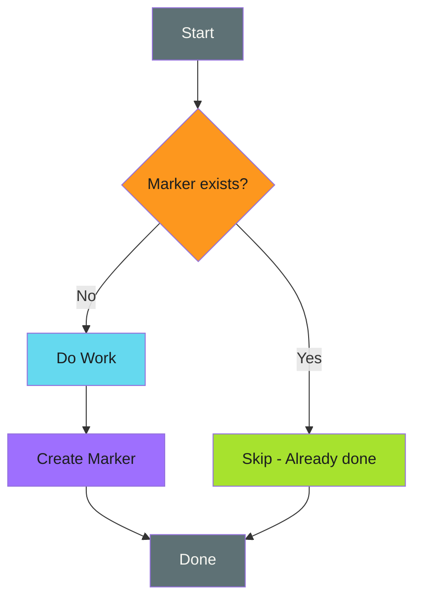

# Tombstone/Marker Files

Leave a trail so you know where you've been.

---

## The Pattern

```bash
MARKER=".completed-$OPERATION_ID"

if [ -f "$MARKER" ]; then
  echo "Already completed"
  exit 0
fi

# Do the work...

touch "$MARKER"
```

Create a marker file (or database record) when an operation completes. On rerun, check for the marker and skip if present.



!!! info "Universal Fallback"

    Tombstone markers work for any operation, even external API calls with no natural idempotency. If you can't use other patterns, markers are always an option.

---

## When to Use

!!! success "Good Fit"

    - Multi-step operations where each step should run once
    - Long-running processes that might be interrupted
    - Operations without natural idempotency (external API calls, emails)
    - Batch processing where items need individual tracking
    - Workflows spanning multiple runs or systems

!!! warning "Poor Fit"

    - Simple operations where check-before-act suffices
    - When marker storage is unreliable
    - High-frequency operations (marker overhead adds up)
    - When operation result changes over time (markers become stale)

---

## Examples

### Basic Marker File

```bash
MARKER="/tmp/.migration-completed-v2"

if [ -f "$MARKER" ]; then
  echo "Migration already completed"
  exit 0
fi

run_database_migration

touch "$MARKER"
echo "Migration completed"
```

### Run-Scoped Markers

```bash
# Unique per workflow run
MARKER=".done-${GITHUB_RUN_ID}-${GITHUB_RUN_ATTEMPT}"

if [ -f "$MARKER" ]; then
  echo "This run already completed"
  exit 0
fi

perform_deployment

touch "$MARKER"
```

### Operation-Scoped Markers

```bash
# Track each item in a batch
process_item() {
  local item="$1"
  local marker=".processed-$(echo "$item" | sha256sum | cut -c1-16)"

  if [ -f "$marker" ]; then
    echo "Skipping $item (already processed)"
    return 0
  fi

  do_work_on "$item"

  touch "$marker"
  echo "Processed $item"
}

for item in "${ITEMS[@]}"; do
  process_item "$item"
done
```

### Markers with Metadata

```bash
MARKER=".completed-$OPERATION"

if [ -f "$MARKER" ]; then
  echo "Completed at: $(cat "$MARKER")"
  exit 0
fi

perform_operation

# Store completion time and details
echo "$(date -Iseconds) by ${GITHUB_ACTOR:-unknown}" > "$MARKER"
```

### Directory-Based Markers

```bash
# Use directories for atomic marker creation
MARKER_DIR=".markers/$OPERATION_ID"

if [ -d "$MARKER_DIR" ]; then
  echo "Already completed"
  exit 0
fi

perform_operation

mkdir -p "$MARKER_DIR"
echo "$RESULT" > "$MARKER_DIR/result.json"
```

---

## In This Section

- [CI/CD Examples](ci-cd-examples.md) - GitHub Actions, artifacts, and caches
- [Edge Cases](edge-cases.md) - Gotchas, anti-patterns, and mitigations

---

## Comparison with Other Patterns

| Aspect | [Check-Before-Act](../check-before-act.md) | [Unique Identifiers](../unique-identifiers.md) | Tombstone Markers |
|--------|-----------------|-------------------|-------------------|
| Tracks completion | No | No | Yes |
| Works for any operation | No | No | Yes |
| Requires storage | No | No | Yes |
| Can track partial progress | No | No | Yes |
| Cleanup required | No | No | Yes |

---

## Summary

Tombstone markers are the universal fallback for idempotency.

!!! abstract "Key Takeaways"

    1. **Check marker first** - skip if present
    2. **Create marker last** - only after success
    3. **Include context** - operation ID, content hash, timestamp
    4. **Plan for cleanup** - markers accumulate without maintenance
    5. **Handle edge cases** - partial completion, stale markers, concurrent access
