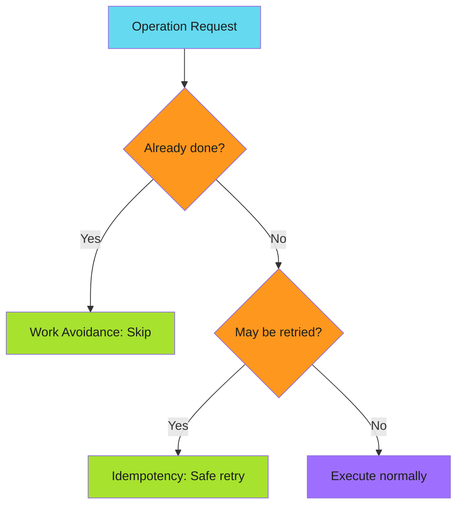

# Efficiency Patterns

Patterns for avoiding unnecessary work and ensuring safe retries.

!!! abstract "Two Strategies"
    Idempotency makes reruns safe. Work avoidance prevents reruns entirely. Use both together for maximum efficiency.

---

## Overview

Efficiency patterns optimize **what** your automation does and **whether** it needs to do it.

| Pattern | When to Use | Strategy |
|---------|-------------|----------|
| [Idempotency](idempotency/index.md) | Operations may be retried | Same input = same result |
| [Work Avoidance](work-avoidance/index.md) | Results can be cached | Skip if already done |

---

## Decision Flow

---

## Quick Reference

| Scenario | Pattern | Reasoning |
|----------|---------|-----------|
| Re-running same operation | Idempotency | Same result every time |
| Resource already exists | Idempotency | Create-or-update safely |
| Content unchanged | Work Avoidance | Skip unnecessary work |
| Build artifact cached | Work Avoidance | Reuse previous results |

---

## Key Difference

| Aspect | Idempotency | Work Avoidance |
|--------|-------------|----------------|
| Goal | Safe to retry | Avoid doing work |
| Mechanism | Deterministic result | Change detection |
| Trade-off | Complexity vs reliability | Cache invalidation vs speed |

---

*Idempotency makes retries safe. Work avoidance makes retries unnecessary.*
