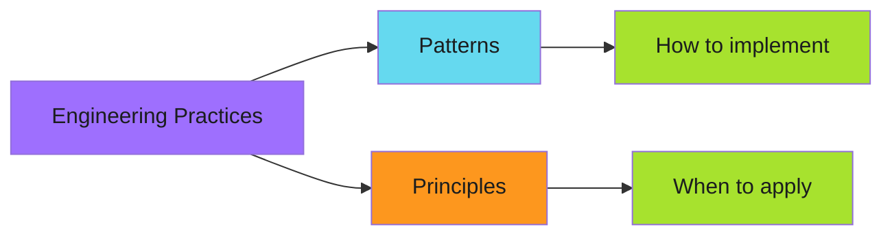

# Engineering Practices

Tactical patterns and strategic principles for building reliable automation.

---

## Overview

Engineering practices fall into two categories:

**Patterns** are concrete implementations. They answer "how do I make this idempotent?" with code.

**Principles** are decision frameworks. They answer "should I fail fast or degrade gracefully?" with trade-off analysis.

---

## Patterns

Implementation techniques with code examples.

| Pattern | Purpose | Key Technique |
|---------|---------|---------------|
| [Idempotency](patterns/index.md) | Safe retries | Check-before-act, upsert, force-overwrite |
| Caching | Avoid redundant work | Cache layers, invalidation strategies |
| Work Avoidance | Skip unnecessary ops | Change detection, conditional execution |

[:octicons-arrow-right-24: View all patterns](patterns/index.md)

---

## Principles

Architectural guidance and decision frameworks.

| Principle | Purpose | Trade-off |
|-----------|---------|-----------|
| Graceful Degradation | Fail to safer states | Complexity vs resilience |
| Fail Fast | Detect problems early | Speed vs safety |
| Prerequisite Checks | Validate before executing | Latency vs correctness |

[:octicons-arrow-right-24: View all principles](principles/index.md)

---

## How They Work Together

Principles guide *when* to apply patterns:

| Scenario | Principle | Pattern |
|----------|-----------|---------|
| Cache miss | Graceful degradation | Tiered fallback |
| Duplicate request | Fail fast | Idempotency key check |
| Missing permission | Prerequisite check | Early validation |
| Concurrent modification | Fail fast | Optimistic locking |

---

*Patterns are tools. Principles tell you which tool to pick.*
