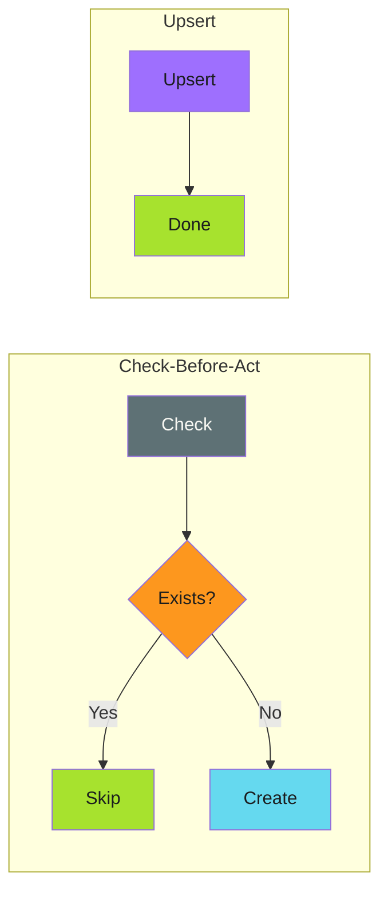

# Create-or-Update (Upsert)

Let the API handle idempotency for you.

---

## The Pattern

```bash
# Single operation that works whether resource exists or not
api_upsert "$RESOURCE_ID" "$NEW_STATE"
```

Upsert (update + insert) operations atomically create a resource if it doesn't exist, or update it if it does. No check required, no race conditions.



!!! info "Atomic by Design"

    Upsert eliminates race conditions because the check and action happen in a single atomic operation inside the API or database.

---

## When to Use

!!! success "Good Fit"

    - APIs that explicitly support upsert semantics
    - Database operations with `ON CONFLICT` clauses
    - Configuration management (desired state declarations)
    - High-concurrency scenarios where race conditions matter

!!! warning "Poor Fit"

    - APIs that only support separate create/update endpoints
    - Operations where create vs update have different side effects
    - When you need to know whether a resource was created or updated

---

## Examples

### GitHub CLI Fallback Pattern

When true upsert isn't available, simulate it with create-or-update:

```bash
# Try create first, fall back to update
gh release create v1.0.0 --notes "Release notes" --target main 2>/dev/null || \
gh release edit v1.0.0 --notes "Release notes"
```

### Git Config (Built-in Upsert)

```bash
# git config is inherently upsert - sets value regardless of prior state
git config user.email "bot@example.com"
git config --global core.autocrlf false
```

### GitHub Labels

```bash
# Create label, or update if exists (using error suppression)
gh label create "automated" --color "0366d6" --description "Bot-generated" 2>/dev/null || \
gh label edit "automated" --color "0366d6" --description "Bot-generated"
```

### Environment Variables in GitHub Actions

```yaml
# GITHUB_ENV is upsert - setting a var overwrites any previous value
- run: echo "VERSION=1.0.0" >> "$GITHUB_ENV"
```

### Kubernetes Apply (Declarative Upsert)

```bash
# kubectl apply is the canonical upsert pattern
kubectl apply -f deployment.yaml
```

Kubernetes compares desired state to current state and reconciles. Create if missing, update if different, no-op if same.

!!! tip "Declarative Tools Are Upsert"

    Tools like `kubectl apply`, Crossplane compositions, and Ansible playbooks are all built around upsert semantics. Declare desired state, let the tool reconcile.

### Crossplane (Infrastructure Upsert)

```yaml
# Crossplane compositions are declarative upsert for cloud resources
apiVersion: storage.gcp.crossplane.io/v1beta1
kind: Bucket
metadata:
  name: my-bucket
spec:
  forProvider:
    location: US
```

---

## Database Examples

### PostgreSQL ON CONFLICT

```sql
INSERT INTO settings (key, value)
VALUES ('theme', 'dark')
ON CONFLICT (key) DO UPDATE SET value = EXCLUDED.value;
```

### SQLite INSERT OR REPLACE

```sql
INSERT OR REPLACE INTO cache (key, data, expires)
VALUES ('user:123', '{"name":"test"}', datetime('now', '+1 hour'));
```

### Redis SET

```bash
# Redis SET is inherently upsert
redis-cli SET mykey "myvalue"
```

---

## GitHub Actions Examples

### Upsert GitHub Secret

```yaml
- name: Set repository secret
  run: |
    # gh secret set is upsert - creates or updates
    gh secret set API_KEY --body "${{ secrets.API_KEY }}"
```

### Upsert Repository Variable

```yaml
- name: Set repository variable
  run: |
    # gh variable set is upsert
    gh variable set DEPLOYMENT_ENV --body "production"
```

### Environment File Updates

```yaml
- name: Update .env values
  run: |
    # Using envsubst for idempotent config generation
    envsubst < .env.template > .env
```

---

## Simulating Upsert When Not Available

### Try-Create-Then-Update

```bash
upsert_pr_label() {
  local pr_number="$1"
  local label="$2"

  # Adding a label is idempotent in GitHub - no error if already present
  gh pr edit "$pr_number" --add-label "$label"
}
```

### Create-or-Skip-and-Update

```bash
upsert_branch() {
  local branch="$1"
  local target="$2"

  # Create branch (ignore error if exists)
  git branch "$branch" "$target" 2>/dev/null || true

  # Reset to target (idempotent update)
  git checkout -B "$branch" "$target"
}
```

### API with Separate Endpoints

```bash
upsert_webhook() {
  local url="$1"
  local events="$2"

  # Check if webhook exists
  existing=$(gh api repos/:owner/:repo/hooks --jq ".[] | select(.config.url==\"$url\") | .id")

  if [ -n "$existing" ]; then
    # Update existing
    gh api -X PATCH "repos/:owner/:repo/hooks/$existing" \
      -f "config[url]=$url" \
      -f "events[]=$events"
  else
    # Create new
    gh api -X POST repos/:owner/:repo/hooks \
      -f "config[url]=$url" \
      -f "events[]=$events"
  fi
}
```

---

## Edge Cases and Gotchas

### Different Create vs Update Semantics

Some APIs have different required fields for create vs update:

```bash
# Create requires all fields
gh issue create --title "Bug" --body "Description" --label "bug"

# Update only needs changed fields
gh issue edit 123 --add-label "priority"
```

**Mitigation**: Wrap in a function that normalizes the interface.

### Partial Updates Overwriting Data

Upsert might overwrite fields you didn't intend to change:

```bash
# This overwrites the entire release, not just notes
gh release edit v1.0.0 --notes "New notes"
# What if there were assets attached? Still there, but other metadata might reset.
```

**Mitigation**: Read-modify-write when partial updates aren't supported.

### Upsert with Side Effects

Creating a resource might trigger webhooks, notifications, or other side effects that don't fire on update:

```bash
# First run: creates issue, sends notification
# Second run: updates issue, no notification
gh issue create --title "Deploy failed" ...
```

**Consideration**: This is often desirable (no duplicate notifications), but be aware of it.

---

## Anti-Patterns

### Ignoring Return Values

```bash
# Bad: no idea if this created or updated
gh secret set API_KEY --body "$VALUE"

# Better: log what happened (if API supports it)
if gh secret set API_KEY --body "$VALUE" 2>&1 | grep -q "created"; then
  echo "Secret created"
else
  echo "Secret updated"
fi
```

### Using Upsert When Create-Only is Intended

```bash
# Bad: accidentally overwrites existing release
gh release create v1.0.0 ... || gh release edit v1.0.0 ...

# If v1.0.0 exists, you might not want to modify it!
# Better: check-before-act if overwriting is dangerous
```

### Assuming All APIs Are Upsert

```bash
# Dangerous assumption: not all create commands are idempotent
gh repo create my-repo  # Fails if exists, doesn't update
```

---

## Comparison with Other Patterns

| Aspect | [Check-Before-Act](check-before-act.md) | Upsert | [Force Overwrite](force-overwrite.md) |
|--------|-----------------|--------|-----------------|
| Race condition safe | No | Yes | Yes |
| Requires API support | No | Yes | Depends |
| Know if created vs updated | Yes | Sometimes | No |
| Complexity | Low | Low | Low |

---

## Summary

Upsert is the cleanest idempotency pattern when available.

!!! abstract "Key Takeaways"

    1. **Prefer native upsert** - `kubectl apply`, `git config`, `gh secret set`
    2. **Simulate when needed** - create-or-update fallback pattern
    3. **Watch for side effects** - create vs update may trigger different events
    4. **Don't assume** - verify your API actually supports upsert semantics
