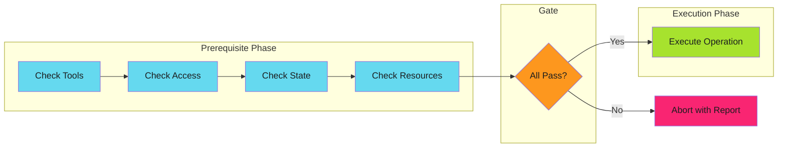
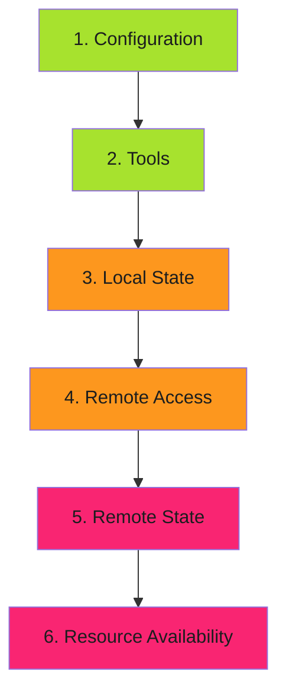

# Prerequisite Checks

Validate all preconditions before executing expensive or irreversible operations.

---

## Overview

Prerequisite checks are a structured approach to [fail fast](../fail-fast/index.md) validation. Instead of scattering validation throughout code, you consolidate all precondition checks into a dedicated phase that runs before any work begins.



The key insight: **check everything, then do everything**.

---

## Categories of Prerequisites

| Category | What to Check | Example |
|----------|---------------|---------|
| **Tools** | Required binaries exist | `kubectl`, `helm`, `jq` |
| **Access** | Permissions are granted | API tokens, RBAC roles |
| **State** | System is in expected state | Resource exists, not locked |
| **Resources** | Required resources available | Disk space, memory, quotas |
| **Configuration** | Config is valid and complete | Required fields, valid values |

For implementation examples, see [Examples](examples.md).

---

## Prerequisite Check Ordering

Order checks from cheapest to most expensive:



| Order | Category | Cost | Example |
|-------|----------|------|---------|
| 1 | Configuration | Free | Check required fields are set |
| 2 | Tools | Cheap | Check binaries exist |
| 3 | Local State | Cheap | Check local files exist |
| 4 | Remote Access | Medium | Test API authentication |
| 5 | Remote State | Medium | Check remote resources exist |
| 6 | Resources | Expensive | Check quotas, capacity |

Fail on cheap checks before running expensive ones.

---

## Anti-Patterns

### 1. Scattered Prerequisites

Checking prerequisites throughout the code instead of upfront.

```go
// Bad: prerequisites scattered
func Deploy(config Config) error {
    if config.Namespace == "" {
        return errors.New("namespace required")
    }
    client, err := NewClient()
    if err != nil {
        return err
    }
    if config.Image == "" {
        return errors.New("image required")  // Too late!
    }
    // ...
}

// Good: consolidated prerequisites
func Deploy(config Config) error {
    if err := config.Validate(); err != nil {
        return err
    }
    // All prerequisites passed, proceed
    client, err := NewClient()
    // ...
}
```

### 2. Silent Prerequisites

Not reporting which prerequisite failed.

```bash
# Bad: which check failed?
check_prerequisites() {
    command -v kubectl >/dev/null && \
    command -v helm >/dev/null && \
    kubectl auth can-i create deployments
}

# Good: report specific failure
check_prerequisites() {
    command -v kubectl >/dev/null || { echo "kubectl not found"; return 1; }
    command -v helm >/dev/null || { echo "helm not found"; return 1; }
    kubectl auth can-i create deployments || { echo "No deploy permission"; return 1; }
}
```

### 3. Incomplete Prerequisites

Missing critical checks.

```yaml
# Bad: doesn't check if image exists
- name: Deploy
  run: kubectl set image deployment/app app=$IMAGE

# Good: verify image exists first
- name: Check image exists
  run: |
    docker manifest inspect $IMAGE || {
      echo "Image $IMAGE not found in registry"
      exit 1
    }

- name: Deploy
  run: kubectl set image deployment/app app=$IMAGE
```

### 4. Prerequisites That Change State

Prerequisites should be read-only.

```go
// Bad: prerequisite creates resource
func checkNamespace(name string) error {
    _, err := client.GetNamespace(name)
    if err != nil {
        // Creates namespace as side effect!
        return client.CreateNamespace(name)
    }
    return nil
}

// Good: prerequisite only checks
func checkNamespace(name string) error {
    _, err := client.GetNamespace(name)
    if err != nil {
        return fmt.Errorf("namespace %s does not exist", name)
    }
    return nil
}
```

---

## Implementation Checklist

Before implementing prerequisite checks:

- [ ] **List all prerequisites** for the operation
- [ ] **Categorize by type** (tools, access, state, resources, config)
- [ ] **Order by cost** (cheapest first)
- [ ] **Make checks read-only** (no side effects)
- [ ] **Provide actionable errors** (what failed, how to fix)
- [ ] **Collect all errors** (don't stop at first failure)
- [ ] **Test prerequisite failures** explicitly
- [ ] **Document prerequisites** for operators

---

## Relationship to Other Patterns

| Pattern | How Prerequisite Checks Applies |
|---------|--------------------------------|
| [Fail Fast](../fail-fast/index.md) | Prerequisite checks are structured fail-fast validation |
| [Graceful Degradation](../graceful-degradation/index.md) | Prerequisites determine if graceful degradation is even possible |
| [Idempotency](../idempotency/index.md) | Check-before-act is a prerequisite pattern |
| [Work Avoidance](../work-avoidance/index.md) | Prerequisites can include "work already done" checks |

---

## Further Reading

- [Fail Fast](../fail-fast/index.md) - The underlying principle
- [Error Handling](../../../../operator-manual/github-actions/actions-integration/error-handling.md) - Reporting prerequisite failures in workflows
