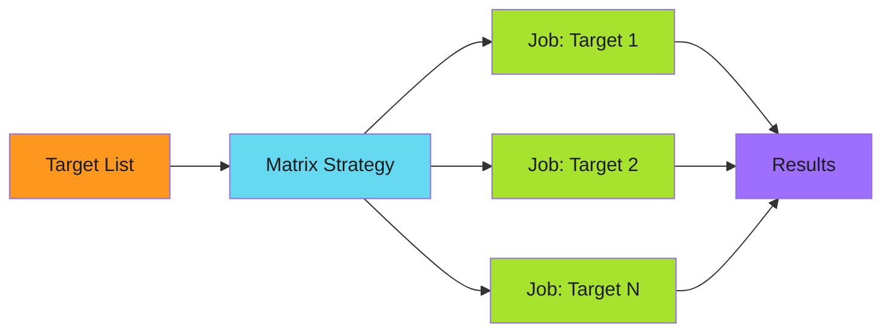

# Matrix Distribution

Parallelize operations across dynamic target lists.

---

## The Pattern

```yaml
strategy:
  matrix:
    target: ${{ fromJson(needs.discover.outputs.targets) }}
  fail-fast: false
  max-parallel: 10
```

Matrix distribution spawns parallel jobs for each target in a dynamically-generated list. Combined with [three-stage design](three-stage-design.md), it enables scalable workflows that process many targets efficiently.



---

## When to Use

!!! success "Good Fit"

    - Processing multiple repositories, files, or services
    - Operations that are independent and can run in parallel
    - Workloads that benefit from horizontal scaling
    - Batch operations with predictable per-target runtime

!!! warning "Poor Fit"

    - Sequential operations where order matters
    - Operations with shared state between targets
    - When total job count would exceed GitHub Actions limits (256)

---

## Core Configuration

### Dynamic Matrix

Generate the target list in a discovery stage:

```yaml
discover:
  outputs:
    targets: ${{ steps.query.outputs.targets }}
  steps:
    - name: Build target list
      id: query
      run: |
        TARGETS='[{"name": "repo-1"}, {"name": "repo-2"}]'
        echo "targets=$TARGETS" >> $GITHUB_OUTPUT

distribute:
  needs: discover
  strategy:
    matrix:
      target: ${{ fromJson(needs.discover.outputs.targets) }}
  steps:
    - run: echo "Processing ${{ matrix.target.name }}"
```

### Failure Isolation

Prevent one failure from canceling other jobs:

```yaml
strategy:
  matrix:
    target: ${{ fromJson(needs.discover.outputs.targets) }}
  fail-fast: false  # Critical: continue processing other targets
```

### Rate Limiting

Control concurrency to avoid API rate limits:

```yaml
strategy:
  matrix:
    target: ${{ fromJson(needs.discover.outputs.targets) }}
  max-parallel: 10  # Limit concurrent jobs
```

---

## Conditional Distribution

### Target Type Detection

Distribute different content based on target characteristics:

```yaml
- name: Detect target type
  id: detect
  run: |
    if [ -f "package.json" ]; then
      echo "type=nodejs" >> $GITHUB_OUTPUT
    elif [ -f "pom.xml" ]; then
      echo "type=java" >> $GITHUB_OUTPUT
    elif [ -f "go.mod" ]; then
      echo "type=go" >> $GITHUB_OUTPUT
    else
      echo "type=unknown" >> $GITHUB_OUTPUT
    fi

- name: Apply Node.js config
  if: steps.detect.outputs.type == 'nodejs'
  run: cp configs/node/.eslintrc.json target/

- name: Apply Java config
  if: steps.detect.outputs.type == 'java'
  run: cp configs/java/checkstyle.xml target/
```

### Include/Exclude Logic

Filter targets based on criteria:

```yaml
- name: Check if target should be processed
  id: check
  run: |
    # Skip archived repos
    if [ "${{ matrix.target.archived }}" == "true" ]; then
      echo "skip=true" >> $GITHUB_OUTPUT
    else
      echo "skip=false" >> $GITHUB_OUTPUT
    fi

- name: Process target
  if: steps.check.outputs.skip == 'false'
  run: |
    # Only runs for non-archived targets
```

### Topic-Based Filtering

Query targets with specific topics:

```yaml
- name: Query repos with topic
  run: |
    REPOS=$(gh api graphql -f query='
    {
      search(query: "org:my-org topic:needs-config", type: REPOSITORY, first: 100) {
        nodes {
          ... on Repository {
            name
            defaultBranchRef { name }
          }
        }
      }
    }' --jq '.data.search.nodes | map({name: .name, default_branch: .defaultBranchRef.name})')

    echo "targets=$REPOS" >> $GITHUB_OUTPUT
```

---

## Template Rendering

### Simple Substitution

```yaml
- name: Render template
  run: |
    sed "s/{{REPO_NAME}}/${{ matrix.target.name }}/g" template.txt > target/config.txt
```

### Multi-Variable Substitution

Use `envsubst` for multiple variables:

```yaml
- name: Render template
  env:
    REPO_NAME: ${{ matrix.target.name }}
    ORG_NAME: my-org
    TIMESTAMP: ${{ github.event.head_commit.timestamp }}
    BRANCH: ${{ matrix.target.default_branch }}
  run: |
    envsubst < templates/config.template > target/config.yaml
```

Template file (`templates/config.template`):

```yaml
# Auto-generated for ${REPO_NAME}
# Generated: ${TIMESTAMP}

repository:
  name: ${REPO_NAME}
  organization: ${ORG_NAME}
  default_branch: ${BRANCH}
```

### Complex Transformations

For complex rendering, use dedicated tools:

```yaml
- name: Render with jq
  run: |
    jq --arg name "${{ matrix.target.name }}" \
       --arg org "my-org" \
       '.repository.name = $name | .repository.org = $org' \
       template.json > target/config.json

- name: Render with yq
  run: |
    yq eval ".metadata.name = \"${{ matrix.target.name }}\"" \
       template.yaml > target/config.yaml
```

---

## Multi-File Distribution

### Copy Multiple Files

```yaml
- name: Copy configuration files
  run: |
    cp -r source/configs/* target/.github/
    cp source/templates/CODEOWNERS target/
    cp source/templates/SECURITY.md target/
```

### Directory Sync

```yaml
- name: Sync directory
  run: |
    # Remove old files, copy new ones
    rm -rf target/.github/workflows/shared/
    cp -r source/workflows/shared/ target/.github/workflows/shared/
```

### Selective Copy

```yaml
- name: Copy based on target type
  run: |
    # Always copy base config
    cp source/base/* target/

    # Copy type-specific configs
    if [ "${{ steps.detect.outputs.type }}" == "nodejs" ]; then
      cp source/nodejs/* target/
    fi
```

---

## File Transformations

### Format Conversion

```yaml
- name: Convert YAML to JSON
  run: |
    yq -o=json source/config.yaml > target/config.json

- name: Convert JSON to YAML
  run: |
    yq -P source/config.json > target/config.yaml
```

### Minification

```yaml
- name: Minify assets
  run: |
    # JavaScript
    terser source/script.js -o target/script.min.js

    # CSS
    cssnano source/style.css target/style.min.css

    # JSON (remove whitespace)
    jq -c '.' source/data.json > target/data.json
```

### Content Injection

```yaml
- name: Inject content into existing file
  run: |
    # Add header to existing README
    cat source/header.md target/README.md > target/README.tmp
    mv target/README.tmp target/README.md
```

---

## Anti-Patterns

### Hardcoded Target Lists

```yaml
# Bad: hardcoded, doesn't scale
strategy:
  matrix:
    repo: [repo-1, repo-2, repo-3]
```

Use dynamic discovery instead.

### Missing Fail-Fast Disable

```yaml
# Bad: one failure stops everything
strategy:
  matrix:
    target: ${{ fromJson(needs.discover.outputs.targets) }}
  # fail-fast defaults to true!
```

Always set `fail-fast: false` for distribution workflows.

### Unbounded Parallelism

```yaml
# Bad: may hit rate limits
strategy:
  matrix:
    target: ${{ fromJson(needs.discover.outputs.targets) }}
  # No max-parallel limit
```

Set `max-parallel` based on API rate limits.

### Ignoring Empty Lists

```yaml
# Bad: creates 1 job with null matrix
distribute:
  needs: discover
  strategy:
    matrix:
      target: ${{ fromJson(needs.discover.outputs.targets) }}
```

Guard against empty lists:

```yaml
distribute:
  needs: discover
  if: needs.discover.outputs.count > 0  # Skip if no targets
  strategy:
    matrix:
      target: ${{ fromJson(needs.discover.outputs.targets) }}
```

---

## Summary

!!! abstract "Key Takeaways"

    1. **Dynamic matrices** - Generate target lists in discovery stage
    2. **Isolate failures** - Always use `fail-fast: false`
    3. **Control concurrency** - Set `max-parallel` for rate limits
    4. **Conditional logic** - Detect target types, filter as needed
    5. **Template rendering** - Use `envsubst`, `jq`, `yq` for transformations
