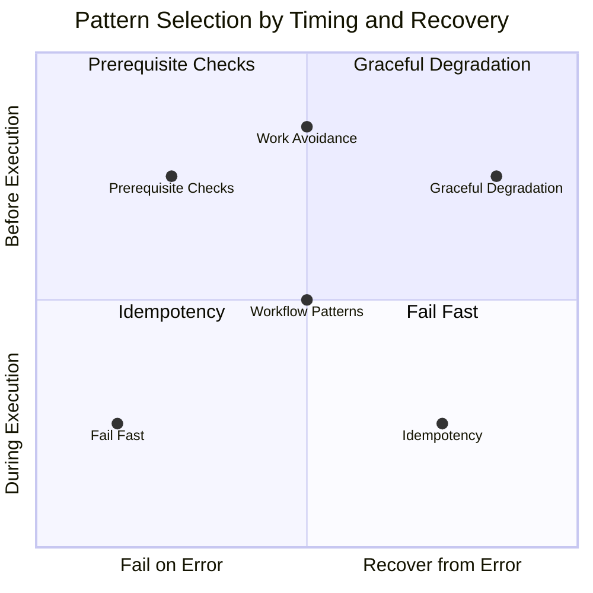

# Design Principles

Architectural guidance for building resilient automation.

Principles answer the *why* and *when* questions. For implementation details, see the linked pattern guides.

---

## Pattern Decision Matrix

**Reading the matrix:**

- **Y-axis**: When does the pattern apply? Before execution starts, or during execution?
- **X-axis**: What happens on error? Fail immediately, or attempt recovery?

---

## Pattern Selection Guide

| Scenario | Pattern | Reasoning |
|----------|---------|-----------|
| Invalid user input | [Fail Fast](../patterns/fail-fast/index.md) | User error, report immediately |
| Missing required config | [Fail Fast](../patterns/fail-fast/index.md) | Can't continue safely |
| Complex preconditions | [Prerequisite Checks](../patterns/prerequisite-checks/index.md) | Validate all upfront |
| Deployment requirements | [Prerequisite Checks](../patterns/prerequisite-checks/index.md) | Check tools, access, state |
| Cache miss | [Graceful Degradation](../patterns/graceful-degradation/index.md) | Expensive path still works |
| API timeout | [Graceful Degradation](../patterns/graceful-degradation/index.md) | Retry or use backup |
| Service unavailable | [Graceful Degradation](../patterns/graceful-degradation/index.md) | Fall back to alternatives |
| Re-running same operation | [Idempotency](../patterns/idempotency/index.md) | Same result every time |
| Resource already exists | [Idempotency](../patterns/idempotency/index.md) | Create-or-update safely |
| Content unchanged | [Work Avoidance](../patterns/work-avoidance/index.md) | Skip unnecessary work |
| Build artifact cached | [Work Avoidance](../patterns/work-avoidance/index.md) | Reuse previous results |
| Multi-repo operations | [Workflow Patterns](../patterns/workflow-patterns/index.md) | Coordinate parallel work |
| Matrix job orchestration | [Workflow Patterns](../patterns/workflow-patterns/index.md) | Fan-out/fan-in execution |

---

## Condition Matrix

| Condition | Fail Fast | Graceful Degradation | Prerequisite Checks | Idempotency | Work Avoidance | Workflow Patterns |
|-----------|:---------:|:--------------------:|:-------------------:|:-----------:|:--------------:|:-----------------:|
| Before execution starts | ✓ | | ✓ | | ✓ | |
| During execution | | ✓ | | ✓ | | ✓ |
| No fallback available | ✓ | | | | | |
| Fallback exists | | ✓ | | | | |
| Has preconditions | | | ✓ | | | |
| May be retried | | | | ✓ | | |
| Result is cacheable | | | | | ✓ | |
| Multi-step/parallel | | | | | | ✓ |
| Integrity critical | ✓ | | | | | |
| Availability critical | | ✓ | | | | |

---

## Quick Reference

| Pattern | When to Apply | Trade-off |
|---------|---------------|-----------|
| [Fail Fast](../patterns/fail-fast/index.md) | Early detection prevents cascading failure | Speed vs thoroughness |
| [Graceful Degradation](../patterns/graceful-degradation/index.md) | System has fallback options | Complexity vs availability |
| [Prerequisite Checks](../patterns/prerequisite-checks/index.md) | Operations have preconditions | Latency vs correctness |
| [Idempotency](../patterns/idempotency/index.md) | Operations may be retried | Complexity vs reliability |
| [Work Avoidance](../patterns/work-avoidance/index.md) | Results can be cached/reused | Cache invalidation vs speed |
| [Workflow Patterns](../patterns/workflow-patterns/index.md) | Complex multi-step automation | Maintainability vs flexibility |

---

*Principles are guardrails, not rules. Context determines which one wins.*
