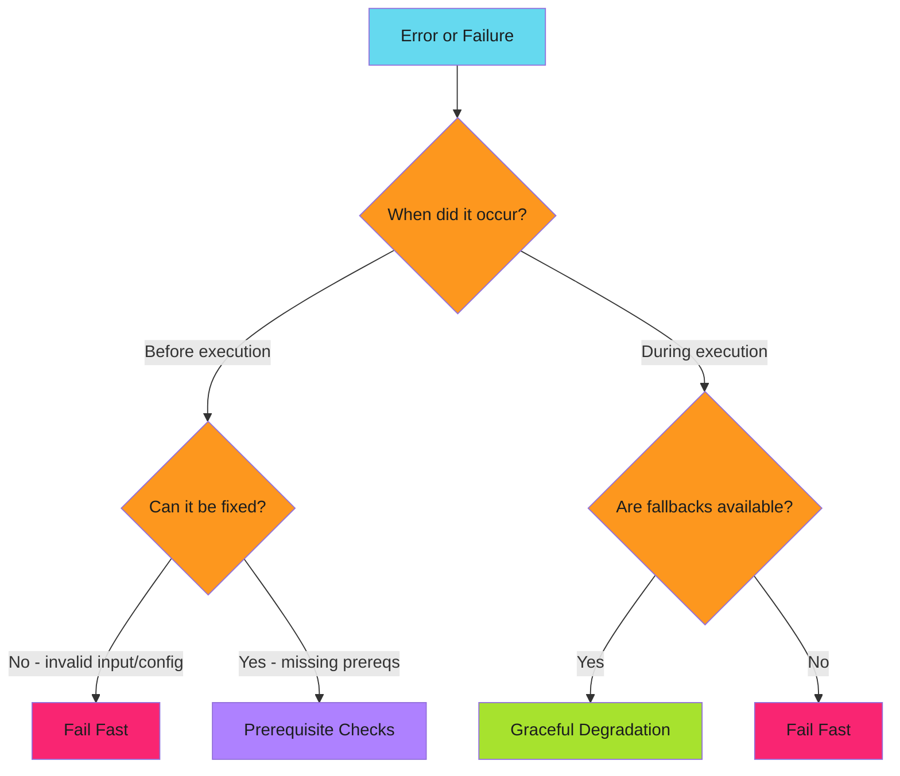

# Design Principles

Architectural guidance for building resilient automation.

Principles answer the *why* and *when* questions. For implementation details, see the linked pattern guides.

---

## Decision Matrix

---

## Pattern Selection Guide

| Scenario | Pattern | Reasoning |
|----------|---------|-----------|
| Invalid user input | [Fail Fast](../patterns/fail-fast/index.md) | User error, report immediately |
| Missing required config | [Fail Fast](../patterns/fail-fast/index.md) | Can't continue safely |
| Complex preconditions | [Prerequisite Checks](../patterns/prerequisite-checks/index.md) | Validate all upfront |
| Deployment requirements | [Prerequisite Checks](../patterns/prerequisite-checks/index.md) | Check tools, access, state |
| Cache miss | [Graceful Degradation](../patterns/graceful-degradation/index.md) | Expensive path still works |
| API timeout | [Graceful Degradation](../patterns/graceful-degradation/index.md) | Retry or use backup |
| Service unavailable | [Graceful Degradation](../patterns/graceful-degradation/index.md) | Fall back to alternatives |

---

## Principle Interactions

Principles sometimes conflict. Here's how to choose:

| Scenario | Choose | Because |
|----------|--------|---------|
| Recoverable error with fallback | [Graceful Degradation](../patterns/graceful-degradation/index.md) | Better UX than failing |
| Unrecoverable error | [Fail Fast](../patterns/fail-fast/index.md) | Prevent cascade |
| Expensive operation | [Prerequisite Checks](../patterns/prerequisite-checks/index.md) | Avoid wasted work |
| User-facing service | [Graceful Degradation](../patterns/graceful-degradation/index.md) | Availability matters |
| Data integrity operation | [Fail Fast](../patterns/fail-fast/index.md) | Consistency matters |

---

## Quick Reference

| Pattern | When to Apply | Trade-off |
|---------|---------------|-----------|
| [Graceful Degradation](../patterns/graceful-degradation/index.md) | System has fallback options | Complexity vs availability |
| [Fail Fast](../patterns/fail-fast/index.md) | Early detection prevents cascading failure | Speed vs thoroughness |
| [Prerequisite Checks](../patterns/prerequisite-checks/index.md) | Operations have preconditions | Latency vs correctness |

---

*Principles are guardrails, not rules. Context determines which one wins.*
